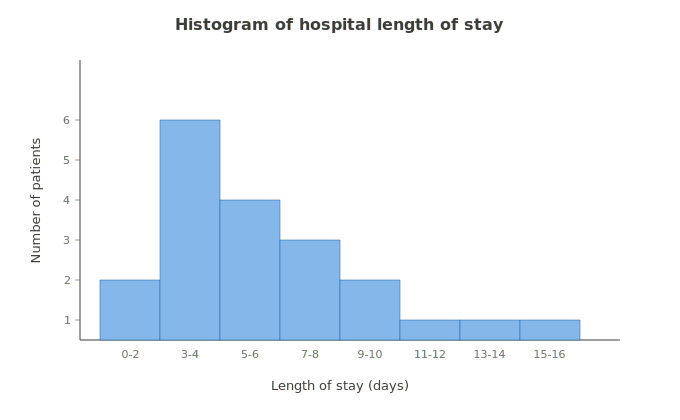
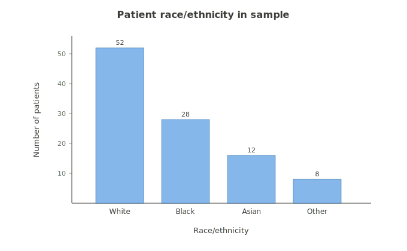
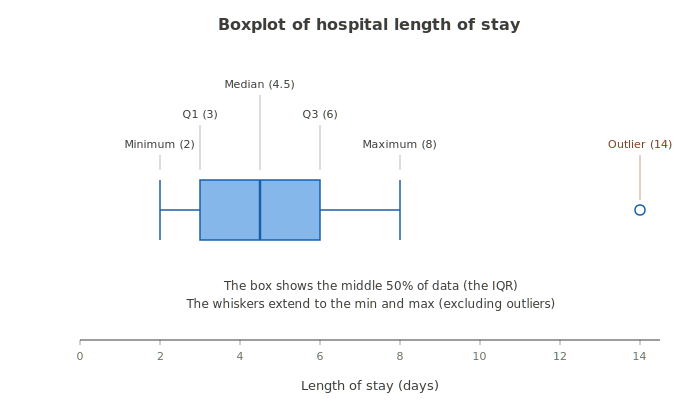
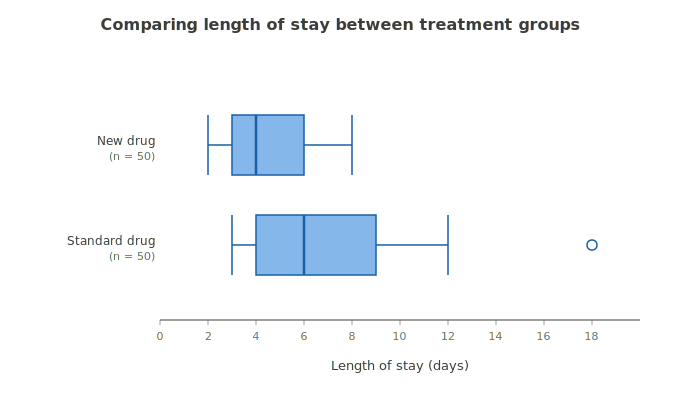
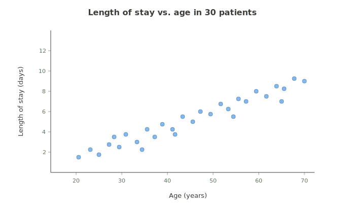
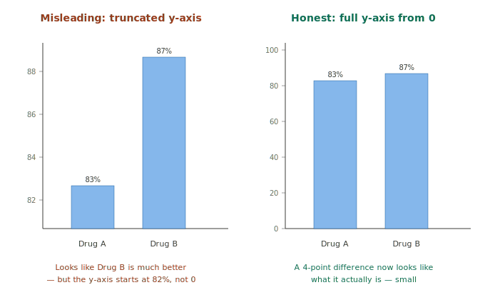
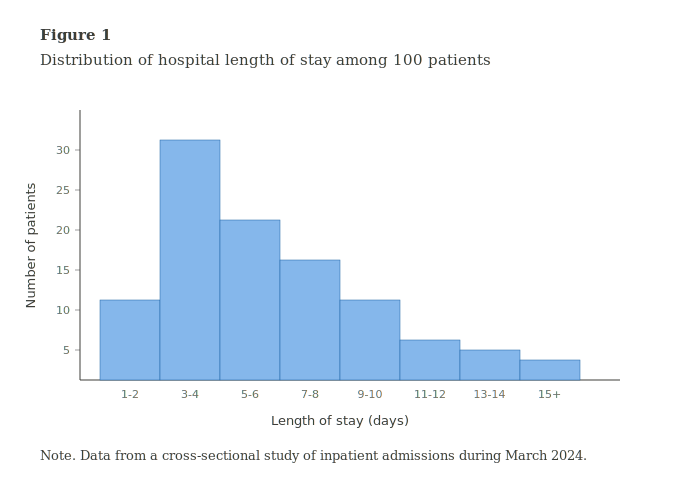

# Data Visualization

!!! abstract "Why this module exists"
    A bad chart hides patterns. A good chart reveals them. A misleading chart can convince readers of conclusions the data doesn't actually support. Choosing the right chart for your variable and your question — and presenting it cleanly — is a real skill, and it's a skill your students will be graded on in every paper for the rest of their academic career. This module covers both: how to pick the right chart, and how to present it like a professional.

## The pedagogical anchor: chart type follows variable type follows question

The single most important idea in this module:

**You don't pick a chart based on what looks nice. You pick it based on what kind of variable you have and what question you're asking.**

A bar chart for continuous data hides patterns. A histogram for categorical data is nonsense. A scatterplot for one variable doesn't even make sense. Match the chart to the data, or you'll mislead your reader — even if you don't mean to.

!!! important "The decision flow"
    Before you draw any chart, answer two questions:

    1. **What type of variable am I working with?** (See [Variable Types](../foundations/variable-types.md).)
    2. **What question am I trying to answer?** (Showing distribution? Comparing groups? Showing a relationship?)

    Those two answers determine which chart to use. Everything else — colors, fonts, dimensions — is just polish.

## The four core chart types

### 1. Histograms — for showing the distribution of a continuous variable

A **histogram** shows how a continuous variable is distributed across its range. It looks like a bar chart, but the bars represent ranges of values (called "bins"), not individual categories.

**Use a histogram when:**

- You have a continuous variable (age, blood pressure, length of stay, income)
- You want to see how the values are distributed — symmetric? skewed? bimodal?
- You want to spot outliers or unusual patterns

**What the histogram tells us:** Most patients stayed 3 to 6 days, with a few staying much longer. The shape is right-skewed (long tail to the right) — exactly the kind of distribution where the median is more honest than the mean.

!!! tip "Bin width matters"
    The number of bins (and their width) affects how the distribution looks. Too few bins (only 2 or 3) hides patterns. Too many (50 bins for 30 data points) creates noise. **JMP picks a reasonable default**, but if your histogram looks weird, try adjusting bin width.

### 2. Bar charts — for comparing counts or proportions across categories

A **bar chart** shows the count (or proportion) in each category of a categorical or dichotomous variable.

**Use a bar chart when:**

- You have a categorical or dichotomous variable
- You want to compare the size of different categories
- You want to show how many people are in each group

!!! important "Bar charts vs. histograms — don't confuse them"
    They look similar, but they're for different data types.

    - **Bar chart:** bars are separated by space (categories are discrete and unrelated). For categorical and dichotomous variables.
    - **Histogram:** bars are touching (the data is a continuous range, just binned into intervals). For continuous variables.

    Using a bar chart for continuous data fragments the picture into disconnected pieces. Using a histogram for categories implies an ordering or continuity that doesn't exist.

### 3. Boxplots — the graphical 5-number summary

A **boxplot** shows the [five-number summary](ch4-summary-stats.md) of a continuous variable visually. The box represents the middle 50% of the data (Q1 to Q3), the line in the middle shows the median, and the "whiskers" extend to the minimum and maximum (or to 1.5 × IQR, with anything beyond shown as outliers).

**Use a boxplot when:**

- You want a compact summary of a continuous variable's distribution
- You want to compare the distribution across two or more groups
- You want to spot outliers quickly

**What the boxplot tells us:** Same hospital length-of-stay data we used in Summary Statistics — the box (3 to 6 days) is the middle 50% of patients, the line at 4.5 is the median, the whiskers extend to the typical range (2 to 8 days), and the dot at 14 is flagged as an outlier.

### Side-by-side boxplots: where this chart really shines

The real power of boxplots is in comparing groups. Put two boxplots on the same axis — one for each group — and patterns that would take a paragraph to describe in text become visible at a glance.

Here's a comparison of hospital length of stay between two treatment groups in a hypothetical randomized controlled trial — patients receiving a **new drug** vs. patients receiving the **standard drug** currently used for this condition.

!!! important "What 'standard' means in a clinical trial"
    In medical research, the "standard" or "standard of care" refers to the existing approved treatment for a condition — *not* a placebo. We compare new drugs to standard drugs (not just to placebos) because the real question isn't "does this new drug work at all?" — it's "is this new drug *better than* what we're already using?" Comparing to standard treatment is how medicine moves forward.

**What this comparison shows:**

- The new drug group has a **shorter median stay** (4 days vs. 6 days)
- The new drug group has **less variability** — a narrower box and shorter whiskers
- The standard drug group has **a patient who stayed 18 days** — flagged as an outlier

All three of those observations come from a single chart, in seconds. The same conclusions presented as text would take a full paragraph and be harder to compare. **This is what boxplots are for.**

### 4. Scatterplots — for showing relationships between two continuous variables

A **scatterplot** shows the relationship between two continuous variables. Each point represents one observation; its position is determined by its values on the two variables.

**Use a scatterplot when:**

- You have two continuous variables
- You want to see whether they're related (correlated)
- You want to spot patterns, clusters, or outliers in two-dimensional data

**What the scatterplot tells us:** As age increases, length of stay tends to decrease — there's a downward trend, suggesting younger patients tend to stay longer (or older patients are discharged faster, depending on context). The relationship is roughly linear but not perfect — there's scatter around the trend.

!!! important "Correlation is not causation — be careful with scatterplots"
    A scatterplot showing a strong relationship between two variables does NOT mean one causes the other. Maybe both are caused by a third factor. Maybe the relationship is coincidence. The scatterplot shows you the pattern; figuring out *why* requires study design (see [Study Designs](ch2-study-designs.md)).

## Which chart for which question? — a decision guide

| What you want to show | Variable types | Chart |
|---|---|---|
| Distribution of one variable | Continuous | Histogram |
| Distribution of one variable | Categorical/dichotomous | Bar chart |
| Compact summary of one variable | Continuous | Boxplot |
| Compare distributions across groups | Continuous + categorical | Side-by-side boxplots |
| Compare counts/proportions across groups | Categorical + categorical | Grouped or stacked bar chart |
| Relationship between two variables | Two continuous | Scatterplot |
| Trend over time | Time + continuous | Line graph |

## Misleading visualizations — the gallery of don'ts

This is a topic worth taking seriously because misleading charts appear in news media, in business presentations, and (sadly) in academic papers all the time. Knowing how to spot them is a real public health skill.

### Truncated y-axes

The most common misleading chart trick: starting the y-axis somewhere other than zero. A tiny difference between groups gets visually exaggerated.

The left chart makes a 4-percentage-point difference look like a massive gap. The right chart shows the same data honestly — the difference is real, but it's small. **Bar charts should almost always start at zero.**

!!! warning "Other common misleading techniques"
    - **3D pie charts:** The 3D tilt distorts the visual size of each slice. Use plain 2D pie charts (or, better, bar charts).
    - **Unequal axis scales:** A logarithmic scale shown without labeling looks linear and misleads readers about the rate of change.
    - **Cherry-picked time ranges:** A "growth" chart that shows only the months when the metric went up.
    - **Comparing absolute counts when group sizes differ:** If one group has 500 people and another has 50, comparing raw counts is misleading. Use percentages.
    - **Color choices that signal value:** Coloring "your country" red and "comparison countries" gray invites emotional response over analysis.

## Getting your chart out of JMP cleanly — no screenshotting

This is a small section but a critical one.

!!! warning "Don't screenshot your output — copy it properly"
    Pressing Ctrl+PrintScreen or using the Snipping Tool to capture a JMP graph and paste it into your paper produces blurry, pixelated images with JMP's gray toolbar showing in the background. Readers (and graders) notice. Always.

    The right way to get a JMP graph into a document:

    1. **Right-click on the graph in JMP**
    2. Choose **Copy Picture**
    3. Switch to Word/Google Docs and paste (**Ctrl+V**)

    This produces a clean, sharp image of just the graph — no JMP interface, no pixelation. You can then resize and label it for your paper.

For tables, the same principle applies:

1. **Right-click the table** in JMP
2. Choose **Make into Data Table** (which puts the numbers into a Data Table format you can copy from)
3. Or **highlight the values you need and copy/paste** directly into your document

## How to label figures in APA 7th Edition

The American Psychological Association style manual (7th edition) sets the rules for how figures and tables should be labeled in most social science and public health papers. The rules are specific, and students lose points constantly because they don't know them.

### The structure of an APA figure

Every figure in APA style has the same components, in the same order:

1. **Figure number** — bold, format: `Figure 1` (or 2, 3, etc.)
2. **Figure title** — on the line below the number, italic, sentence case
3. **The figure itself**
4. **Note** (optional) — below the figure, starts with "Note." in italics, then the note text in regular type

All four elements except the figure itself are text — so they appear in the document, not embedded inside the image.

### Example

Notice three things about that example:

- **The number and title sit above the figure**, formatted as APA requires
- **Axis labels include units** ("Length of stay (days)", not just "days" or "stay")
- **The note at the bottom** explains the data source — useful context that doesn't belong in the title

!!! important "The most common APA figure mistakes"
    - **Title inside the figure:** APA wants the title in text above the figure, not built into the image. Remove any title bar JMP added.
    - **Missing axis units:** Always include units in parentheses on the axis label.
    - **No figure number:** Every figure needs a number, even if there's only one.
    - **Italic title without italic figure number:** The number is bold (not italic); the title is italic (not bold). They're different.

### A brief note on other styles

If your students go on to write for medical journals, they may encounter different style guides:

- **AMA (American Medical Association):** Used by JAMA and many medical journals. Figure labels appear above the figure; titles use sentence case but no italics.
- **Vancouver style:** Used by international biomedical journals. Figures are labeled "Fig. 1" and similar; less emphasis on title formatting.

The good news: most concepts (clear axis labels, no embedded titles, useful notes) transfer across styles. Knowing APA 7th well will make adopting other styles straightforward.

## How to build a useful table

Tables are how you present *precise values* — when the reader needs to look up a specific number, a table beats a figure every time. But a poorly designed table is harder to read than just listing numbers in prose. The difference between a useful table and a confusing one comes down to a handful of principles.

### Principles of a useful table

1. **One purpose per table.** Don't cram three different kinds of comparisons into one table. Split them.
2. **Descriptive column headings.** "Variable" is useless. "Patient characteristic" tells the reader what column they're looking at.
3. **Consistent precision.** Don't report some means to one decimal and others to three. Pick a sensible number of decimals (usually 1 or 2 for measurements, none for percentages over 10%) and stick to it.
4. **Include units.** Mean age "45.2" is incomplete. "45.2 years" is complete.
5. **Always report sample sizes (n).** A statistic without n is uninterpretable.
6. **Align numbers by decimal point.** This is how tables become scannable. Right-align numeric columns, or use decimal alignment if available.
7. **Minimize vertical lines.** APA explicitly forbids vertical lines in tables. Use horizontal lines only at the top, below the headers, and at the bottom.

### Example: A clean Table 1

Here's how a properly designed Table 1 might look for a study with two treatment groups:

**Table 1**

*Baseline characteristics of patients in the new drug and standard treatment groups*

| Characteristic | New drug (n = 50) | Standard (n = 50) |
|---|---|---|
| Age (years), mean (SD) | 45.2 (12.4) | 53.1 (14.2) |
| Female, n (%) | 28 (56%) | 24 (48%) |
| Hypertension, n (%) | 15 (30%) | 22 (44%) |
| Body mass index (kg/m²), mean (SD) | 27.4 (4.1) | 29.1 (5.2) |
| Insurance coverage, n (%) | 47 (94%) | 38 (76%) |

*Note.* Data collected at study enrollment.

What makes this table work:

- **Clear title and number** above the table
- **Sample sizes built into the column headers** so readers know exactly what each column is
- **Consistent format** — continuous variables as mean (SD), dichotomous variables as n (%)
- **Units included** for all continuous variables (years, kg/m²)
- **Sensible precision** — one decimal for ages and BMI, no decimals for percentages
- **Note** at the bottom explains context without cluttering the title

### Example: A clean results table

Here's a results table for a study comparing outcomes between two groups:

**Table 2**

*Length of hospital stay by treatment group*

| Outcome | New drug (n = 50) | Standard (n = 50) | Difference | p-value |
|---|---|---|---|---|
| Length of stay (days), median (IQR) | 4 (3–6) | 6 (4–9) | -2 | .003 |
| Length of stay > 7 days, n (%) | 8 (16%) | 21 (42%) | -26% | .005 |
| Hospital readmission within 30 days, n (%) | 5 (10%) | 12 (24%) | -14% | .055 |

*Note.* Continuous outcomes compared with Mann-Whitney U test; categorical outcomes compared with chi-square test.

Why this works:

- **Each row is one comparison** — readers can scan vertically
- **Skewed continuous data shown as median (IQR)** — appropriate for length-of-stay data (we know it's right-skewed from Summary Statistics)
- **Difference column** makes the magnitude of the effect explicit
- **p-values use the leading zero convention** for clarity (.003 not 0.003, which is APA standard)
- **Note explains the test used** — important for reproducibility

!!! tip "When to use a table vs. a figure"
    - **Table:** When you need precise values or want readers to look up specific numbers.
    - **Figure:** When you want to show a pattern, relationship, or distribution that readers should *see*, not read.

    If your reader will want to know "the exact mean for Drug B was..." — table. If your reader will want to know "Drug B looks roughly the same as Drug A" — figure. Often both work, and you choose based on what the reader most needs.

## ⚠️ Why students miss this

Four classic traps in this module.

!!! warning "Trap 1: Picking the prettiest chart instead of the right one"
    Students gravitate to 3D pie charts, gradient-colored bar charts, and other visual fluff. Always ask: *does this make the data clearer?* If the answer is no, simpler is better.

!!! warning "Trap 2: Forgetting to label axes"
    A graph without axis labels is just shapes. Always label your axes with what they represent AND the units (e.g., "Length of stay (days)," not just "stay").

!!! warning "Trap 3: Letting JMP's default labels stand"
    JMP labels columns whatever you named them. If your column is called "LOS" in the dataset, JMP will label the axis "LOS" — meaningless to your reader. **Always rewrite axis labels to be descriptive** before exporting the chart.

!!! warning "Trap 4: Comparing groups with different sample sizes using raw counts"
    "Group A had 30 cases; Group B had 25." If Group A has 500 people and Group B has 50, those numbers are wildly different. Always use percentages when comparing groups of different sizes.

## In JMP

JMP creates most of these charts automatically when you use the right platform.

| You want | JMP path |
|---|---|
| Histogram | Analyze → Distribution → Y, Columns: (continuous variable) |
| Bar chart | Analyze → Distribution → Y, Columns: (categorical variable) |
| Boxplot | Analyze → Distribution → red triangle by variable → Quantile Box Plot |
| Side-by-side boxplots | Analyze → Fit Y by X → Y: (continuous), X: (categorical) |
| Scatterplot | Analyze → Fit Y by X → Y: (continuous), X: (continuous) |

!!! important "Modeling types again"
    JMP picks the chart type based on the modeling type of your columns. If a column's modeling type is wrong, you'll get the wrong chart. **Always verify modeling types before charting** — see [Variable Types](../foundations/variable-types.md) and the [JMP Quick Reference](../foundations/jmp-quick-reference.md).

## What to do when you're stuck

When you have data and aren't sure what to show:

1. **What's the variable type?** (Continuous → consider histogram or boxplot. Categorical → consider bar chart.)
2. **What's the question?** (Distribution → histogram or boxplot. Comparison → side-by-side. Relationship → scatterplot.)
3. **Are you presenting precise values or showing a pattern?** (Precise values → table. Pattern → figure.)
4. **Is the chart honest?** (Does the y-axis start at zero? Are axes labeled clearly with units? Could a reader misread this?)
5. **Are you formatting it for a paper?** (Add APA number and title. Note source. Use Copy Picture, not screenshot.)

Answer those five and you'll produce charts your readers can trust and respect.

---

*See also: [Variable Types](../foundations/variable-types.md) · [Summary Statistics](ch4-summary-stats.md) · [JMP Quick Reference](../foundations/jmp-quick-reference.md)*