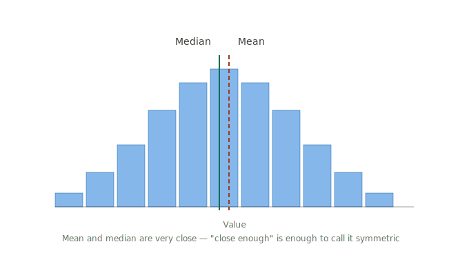
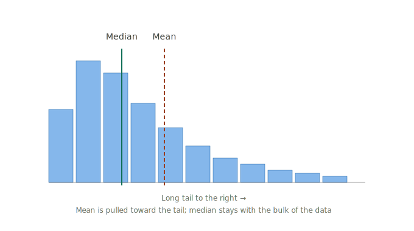
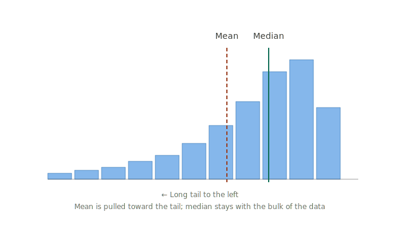
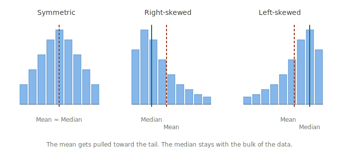

# Summary Statistics

!!! abstract "Why this module is more important than students think"
    Summary statistics get treated as boring throat-clearing before "the real analysis." They're not. Every result that comes later — every confidence interval, every hypothesis test, every regression — has summary statistics underneath it. If you don't know who's in your sample and what they look like, you can't trust any conclusion that follows. This module is about building that foundation.

## As you'll see it in published research and textbooks

A **summary statistic** is a single number (or small set of numbers) that describes a key feature of a dataset. The choice of which summary statistic to use depends on the **type of variable** being summarized: dichotomous, ordinal, categorical, or continuous. Together, summary statistics describe the sample without requiring the reader to look at every data point.

## Why every study starts with summary statistics

Every published study begins with what's commonly called **Table 1** — a table describing the characteristics of the people in the study. This is not optional and not decorative. It is doing four jobs at once:

!!! important "The four jobs of Table 1"
    1. **Identification.** Who were the participants? Age, sex, race, baseline health status. The reader needs to know who you actually studied.
    2. **Generalizability.** Do these results apply to *my* patient or my population? If your participants were all 18–22-year-old college students, your findings may not transfer to 70-year-olds.
    3. **Comparability.** If the study compares groups (treatment vs. control), were those groups similar at baseline? If yes, the comparison is fair. If no, the conclusion is in trouble.
    4. **Sanity check.** Does the data look reasonable? Mean age of 200 = you have a data problem. Standard deviation of 0 = something is broken.

### How summary statistics directly affect the conclusions of a study

This is the part students often skim past — but it's the part you'll need to remember later in the semester when you start interpreting confidence intervals and hypothesis tests.

Suppose a study reports: *"Patients on the new drug had better outcomes than patients on the standard treatment (p = 0.04)."* On its face, that sounds like good evidence.

But now look at the summary statistics in Table 1:

- The new-drug group was, on average, **8 years younger** than the standard-treatment group
- The new-drug group **weighed 15 pounds less**
- The new-drug group had **higher rates of insurance coverage**

None of those differences were adjusted for in the analysis. So the "better outcomes" might have nothing to do with the drug — it might just be that younger, healthier, better-insured people did better, *regardless of which treatment they got*.

!!! danger "Why this matters more than you think"
    Without Table 1, you'd believe the drug worked. With Table 1, you can see the conclusion is shaky.

    Every confidence interval, every p-value, every "the drug works" statement is built on top of summary statistics. **Summary statistics aren't preliminary to the analysis. They're how you decide whether to trust the analysis.** This is exactly why we start here.

## A running example: hospital length of stay

Throughout this module, we'll use a single small dataset to make every summary statistic concrete. Here are the hospital length-of-stay times (in days) for 10 patients:

> **2, 3, 3, 4, 4, 5, 5, 6, 8, 14**

We'll calculate every summary statistic in this module from this dataset, so by the end you can see how all these different measures describe the same data from different angles.

## Center and spread: the two questions you have to answer

When you summarize continuous data, you need to answer two questions:

**Where is the data clustered?** What number does the data tend to cluster around? This is **center**. The mean and median are different ways of answering this.

**How spread out is the data?** Are the values tightly bunched, or scattered widely? This is **spread**. The standard deviation, IQR, and range are different ways of measuring this.

A center alone doesn't describe a dataset. *"Mean blood pressure was 130"* tells you nothing about whether everyone was right around 130, or whether half the sample had blood pressure of 90 and the other half had blood pressure of 170. The center is only half the picture. **You always need spread to go with it.**

## Why dichotomous and continuous variables are reported differently

This is one of the most common student confusions in the course — and one of the most fixable. There are two parts to understanding it: the *reason behind the rule*, and an *analogy* to make the reason memorable.

### The reason behind the rule

A **dichotomous variable** is fully described by a single number (the proportion). A **continuous variable** requires two numbers (a center and a spread).

This isn't arbitrary convention. It's mathematically necessary. A dichotomous variable only has two states. Tell me what percentage is in one state, and the other state is automatically implied. There's nothing else to describe.

A continuous variable can take many values, and those values can be clustered tightly or scattered widely. One number — the center — doesn't tell you which. You always need both pieces.

### The analogy that makes this stick

Think of a **light switch** vs. a **dimmer**.

- A light switch is either ON or OFF. To describe it completely, you need exactly one number: *"It's on 62% of the time."* That tells you everything. The other 38% is implied (it's off). There's nothing else to report.
- A dimmer can be at any brightness from 0 to 100. To describe it, one number isn't enough. *"Average brightness was 50%"* tells you nothing about whether it was always at 50%, or swinging between 0% and 100%, or rapidly flickering. You need a **center** (mean or median) AND a **spread** (standard deviation or range).

**Dichotomous = light switch. Continuous = dimmer.** One number for the switch. Two numbers for the dimmer.

### The reporting rules — with reasons attached

For **dichotomous variables**: report n and percentage.

> Example: "62 of 100 patients (62%) had hypertension."

For **categorical (nominal) variables**: report n and percentage in each category.

> Example: "Race: White, 52 (52%); Black, 28 (28%); Asian, 12 (12%); Other, 8 (8%)."

For **ordinal variables**: report n and percentage in each category. Median is also useful.

> Example: "Cancer stage: I, 20 (20%); II, 35 (35%); III, 30 (30%); IV, 15 (15%). Median stage: II."

For **continuous variables, symmetric distribution**: report mean and standard deviation.

> Example: "Age: mean 45.2, SD 12.4 years."

For **continuous variables, skewed distribution**: report median and interquartile range (IQR).

> Example: "Hospital length of stay: median 5 days, IQR 3–9."

## What "symmetric" and "skewed" mean

When you plot a continuous variable, the **shape** of the distribution matters. Two shapes come up constantly in this course.

### Symmetric distribution

The data is evenly distributed around its center. Roughly the same number of values fall above the mean as below it. The shape looks like a bell — high in the middle, falling off equally on both sides.

The most famous symmetric shape is the **normal distribution** (the "bell curve"). Heights, IQ scores, and many lab values approximate a normal distribution.

!!! important "Mean and median don't need to be EXACTLY equal"
    In real data, the mean and median of a symmetric distribution are almost never *exactly* equal. Sample sizes are finite, and small differences happen by chance. What matters is whether they're **close to each other**.

    A mean of 24.3 and a median of 24.1? Symmetric — that small difference is normal sampling variation.

    A mean of 65 and a median of 42? Not symmetric — that's a big enough difference to indicate skew.

    "Close enough" is enough to call data symmetric. Don't get tripped up by tiny differences.

### Skewed distribution

The data is lopsided. Most values cluster on one side, with a long "tail" stretching to the other side.

**Right-skewed (positively skewed):** the long tail extends to the right (toward larger values). Income is the classic example — most people earn modest amounts, but a few people earn enormously high incomes that stretch the right side of the distribution.

**Left-skewed (negatively skewed):** the long tail extends to the left (toward smaller values). Less common but possible — for example, age at death in a healthy population.

### Why the difference matters

The **mean gets pulled toward the tail**. The **median stays with the bulk of the data**.

- In a right-skewed distribution, the mean is higher than the median.
- In a left-skewed distribution, the mean is lower than the median.
- In a symmetric distribution, they're close to each other.

### Why this choice matters — a concrete example

Suppose nine people in a room earn between $30,000 and $50,000 per year. The mean income of the room is about $40,000 — sensible, matches what people actually earn.

Now Jeff Bezos walks in. His income is roughly $200,000,000 per year.

The new mean income of the room is about **$20 million**. By the mean, *"everyone in this room is a multimillionaire."* Obviously absurd.

The median of the room is still around $40,000 — because the median ignores extreme values and focuses on the middle of the data.

!!! important "This is why the choice matters"
    When you read a statistic like *"average household income in the US is $X,"* and that number feels too high — this is exactly why. The mean is being dragged by a small number of extreme values at the top.

    For skewed data, the median tells you what's typical. The mean tells you something less useful (and sometimes misleading).

## Measures of central tendency (where the data clusters)

For continuous and ordinal variables, three measures describe where the "middle" of the data is.

### Mean

**What it tells you:** The arithmetic average — add everything up and divide by how many values there are.

**When to use it:** When the data is symmetric (no extreme values pulling it sideways).

**The formula:**

$$\bar{x} = \frac{\sum x_i}{n}$$

**In plain English:** *Add up all the values, then divide by the number of values.*

**Worked out with our hospital data (2, 3, 3, 4, 4, 5, 5, 6, 8, 14):**

$$\bar{x} = \frac{2 + 3 + 3 + 4 + 4 + 5 + 5 + 6 + 8 + 14}{10} = \frac{54}{10} = 5.4 \text{ days}$$

**Interpretation:** On average, patients in this sample stayed 5.4 days. But notice — 7 of the 10 patients actually stayed *shorter* than 5.4 days. The 14-day stay is dragging the mean up. This is why mean alone can be misleading.

### Median

**What it tells you:** The middle value when the data is sorted.

**When to use it:** When the data is skewed or has outliers — the median ignores extreme values and shows what's typical.

**How to calculate it:** Sort the values. The median is the middle one. If there's an even number of values, average the two middle ones.

**Worked out with our hospital data:**

Sorted values: 2, 3, 3, 4, **4, 5**, 5, 6, 8, 14

There are 10 values (an even number), so the median is the average of the 5th and 6th values:

$$\text{Median} = \frac{4 + 5}{2} = 4.5 \text{ days}$$

**Interpretation:** Half the patients stayed less than 4.5 days, half stayed more. The 14-day stay doesn't pull the median around — that's the median's main advantage over the mean.

### Mode

**What it tells you:** The value that appears most often.

**When to use it:** For categorical data (you can't average ice cream flavors, but you can identify the most common one). Sometimes useful for continuous data too.

**Worked out with our hospital data:**

Values 3, 4, and 5 each appear twice. All other values appear once. So this dataset is **multimodal** — it has more than one mode.

**Interpretation:** Mode tells you about the *most common* outcome. It's less useful for continuous data than for categorical, but it can flag interesting patterns (like a dataset with two peaks instead of one).

### Comparing mean and median in our data

| Measure | Value | What it tells us |
|---|---|---|
| Mean | 5.4 days | The average is pulled up by the 14-day stay |
| Median | 4.5 days | Half of patients stayed less, half stayed more — the typical experience |

Mean is *greater than* median, which tells us the data is **right-skewed** — there's a long tail toward longer stays. For this dataset, **the median is the better summary** because it tells us what's typical rather than what an extreme case is dragging the average toward.

!!! important "How to spot a misleading mean"
    Always compare the mean and median. If they're close, the mean is fine. If they're noticeably different — like our 5.4 vs. 4.5 — that's a signal that one or more extreme values are pulling the mean around. In that case, the median is more honest.

## Measures of spread (how much variability there is)

A center isn't enough by itself. You also need to know how spread out the data is. Multiple measures exist because each one is suited to different situations.

### Why we have multiple measures of spread

Each measure answers the same question (*"how spread out is the data?"*) but in a different way:

- **Range** is the simplest — just maximum minus minimum. Quick to calculate, but one outlier ruins it.
- **Variance** measures the average *squared* distance from the mean. Useful mathematically, but in weird units (squared) that are hard to interpret directly.
- **Standard deviation** is the square root of the variance — same idea as variance, but in the *original units* of your data, so we can actually understand it.
- **Interquartile range (IQR)** focuses on the middle 50% of the data, ignoring extreme values. The right choice when the data is skewed or has outliers.

Which one to use depends on the data, not personal preference.

### Range

**What it tells you:** The total spread of the data — the difference between the largest and smallest value.

**The formula:**

$$\text{Range} = \text{Maximum} - \text{Minimum}$$

**Worked out with our hospital data:**

$$\text{Range} = 14 - 2 = 12 \text{ days}$$

**Interpretation:** The longest stay was 12 days longer than the shortest. Useful, but a single outlier (the 14-day stay) is doing a lot of the work here. If we removed that one patient, the range would drop to $8 - 2 = 6$ days — half as much.

### Variance and Standard Deviation: what each one does to the data

These two are tightly related and easy to confuse — but they tell us different things.

**Variance** measures the average *squared distance* from the mean. Squaring is mathematically necessary so that values above and below the mean don't cancel each other out (positive numbers squared are positive, negative numbers squared are also positive).

**Standard deviation** is the square root of the variance. Taking the square root *undoes* the squaring — which brings the value back to the original units of the data.

**Why we care about the difference:**

In our hospital data, the variance comes out to about **14.7 squared days**. But *"14.7 squared days"* is meaningless — nobody experiences time in squared units.

The standard deviation is the square root of that: $\sqrt{14.7} \approx 3.83$ days. *That* we can interpret. It tells us patients typically stayed about 3.83 days away from the mean stay of 5.4 days.

!!! important "The takeaway: variance and standard deviation are the same idea in different forms"
    - **Variance** is in squared units (squared days, squared years, squared dollars) — useful in formulas, hard to interpret directly.
    - **Standard deviation** is in original units (days, years, dollars) — interpretable, which is why it's almost always what gets reported in published research.

    When you see "SD" in a paper, that's standard deviation. You'll rarely see variance reported directly except in technical/methods sections.

### Standard deviation, worked out

**The formula:**

$$s = \sqrt{\frac{\sum (x_i - \bar{x})^2}{n - 1}}$$

**In plain English:** *Take each value, subtract the mean, square the difference, add those all up, divide by (n − 1), and take the square root.*

**Worked out with our hospital data** (mean = 5.4):

Step 1 — for each value, calculate (value − mean), then square it:

| Value | (Value − 5.4) | Squared |
|---|---|---|
| 2 | −3.4 | 11.56 |
| 3 | −2.4 | 5.76 |
| 3 | −2.4 | 5.76 |
| 4 | −1.4 | 1.96 |
| 4 | −1.4 | 1.96 |
| 5 | −0.4 | 0.16 |
| 5 | −0.4 | 0.16 |
| 6 | 0.6 | 0.36 |
| 8 | 2.6 | 6.76 |
| 14 | 8.6 | 73.96 |

Step 2 — sum the squared differences: $11.56 + 5.76 + 5.76 + 1.96 + 1.96 + 0.16 + 0.16 + 0.36 + 6.76 + 73.96 = 108.40$

Step 3 — divide by (n − 1) = 9:

$$\text{Variance} = \frac{108.40}{9} = 12.04 \text{ squared days}$$

Step 4 — take the square root:

$$s = \sqrt{12.04} \approx 3.47 \text{ days}$$

**Interpretation:** Patients in this sample typically stayed about 3.47 days *away from* the mean of 5.4 days. So most stays were roughly between 5.4 − 3.47 = 1.93 days and 5.4 + 3.47 = 8.87 days.

!!! tip "You will not compute SD by hand in real life"
    JMP and every other statistics tool calculate this for you instantly. The reason to walk through it once is to understand what the number means — not to memorize the steps. **What matters is being able to read "SD = 3.47 days" and know what that's telling you about the data.**

### Interquartile range (IQR)

**What it tells you:** The range of the middle 50% of the data.

**The idea:** Instead of describing the whole spread (which can be misled by outliers), the IQR ignores the bottom 25% and top 25% and focuses only on the middle half — the "typical" range of values.

**Why we ignore the smallest 25% and largest 25%:**

The extremes are often *unrepresentative*. The longest hospital stay or the shortest one may exist because of unusual cases — a patient in critical condition, a patient transferred to another facility, an extremely simple case. Those numbers aren't wrong — but they don't tell us about *typical* patients.

The middle 50% of the data, by contrast, describes the typical experience. If you want to know what most patients went through, focus on the middle half — that's exactly what the IQR captures.

> **The range tells you the *whole* spread (including extremes).**
> **The IQR tells you the *typical* spread (ignoring extremes).**
> Both are valid — you choose based on which question you're answering.

**How to calculate it:**

1. Sort the data
2. Find Q1 (the 25th percentile) — the value below which 25% of the data falls
3. Find Q3 (the 75th percentile) — the value below which 75% of the data falls
4. IQR = Q3 − Q1

**Worked out with our hospital data:**

Sorted: 2, 3, 3, 4, 4, 5, 5, 6, 8, 14

- Q1 (25th percentile) ≈ 3 (a quarter of the way through)
- Q3 (75th percentile) ≈ 6 (three-quarters of the way through)
- IQR = 6 − 3 = 3 days

**Interpretation:** The middle 50% of patients stayed between 3 and 6 days — a range of 3 days. The 14-day outlier doesn't change this number at all.

!!! tip "What 'robust to outliers' means"
    Statisticians often describe the IQR as "robust to outliers" or "robust to extreme values." That's professional jargon. **In plain English, it means: not easily fooled by weird values.**

    The IQR ignores the smallest 25% and the largest 25% of the data — it just describes the middle 50%. That means one extreme value at the top or bottom barely affects it. That's what "robust" means: the measure doesn't get pushed around by a few unusual values.

### When to use SD vs. IQR

- **Standard deviation** pairs with the **mean**. Use both for symmetric continuous data.
- **IQR** pairs with the **median**. Use both for skewed continuous data or when outliers are present.

Reporting "mean ± SD" or "median (IQR)" is the standard format. Mixing them — like "mean ± IQR" — is wrong and signals to readers that something is off.

## The five-number summary

A common way to describe continuous data: five numbers that together describe the distribution.

For our hospital data:

| Number | Value | What it is |
|---|---|---|
| Minimum | 2 days | Smallest value |
| Q1 | 3 days | Value below which 25% of data falls |
| Median | 4.5 days | Middle value |
| Q3 | 6 days | Value below which 75% of data falls |
| Maximum | 14 days | Largest value |

This is the basis of a **boxplot** — the graphical version of the five-number summary. You'll meet boxplots in Data Visualization.

## ⚠️ Why students miss this

Four classic traps in this module.

!!! warning "Trap 1: Reporting mean ± SD for everything"
    Students learn the mean ± SD format and apply it to every variable, including dichotomous ones. *"Mean pregnancy status was 0.34 ± 0.47"* — pregnancy isn't a 0.34. 34% of the sample was pregnant. **Always match the summary statistic to the variable type.**

!!! warning "Trap 2: Ignoring skew"
    Students plug data into JMP, get the mean, and report it — without checking whether the mean is appropriate. If the data is skewed (income, hospital length of stay, time to recovery), the mean misleads. **Look at a histogram or compare mean to median before reporting.**

!!! warning "Trap 3: Confusing standard deviation with standard error"
    These are different concepts that get mixed up constantly.

    - **Standard deviation (SD)** describes how spread out your *data* is.
    - **Standard error (SE)** describes how much your sample *statistic* would vary if you repeated the study.

    SD is about the spread of values. SE is about the precision of an estimate. They're related (SE = SD / √n) but mean different things. We'll meet SE again in Confidence Intervals.

!!! warning "Trap 4: Reporting too many decimal places"
    A mean of 45.83472 years is silly. Your data isn't precise to five decimal places. Round to a sensible level — usually one decimal place for continuous variables, no decimals for percentages over 10%, one decimal for percentages under 10%. **Precision in numbers should reflect the precision of measurement.**

## In JMP

Summary statistics live in JMP's **Distribution** platform.

**Steps:**

1. **Analyze → Distribution**
2. Move your variables to **Y, Columns**
3. Click **OK**

JMP gives you back:

- For **continuous variables**: histogram, Summary Statistics (mean, std dev, min, max), Quantiles (median, quartiles)
- For **nominal or ordinal variables**: bar chart, Frequencies (counts and percentages in each category)

!!! important "Match your modeling type to your variable type"
    JMP's output depends on the modeling type of each column. If you have a dichotomous variable but JMP imported it as Continuous, you'll get a misleading "mean" instead of a useful percentage breakdown. **Always check modeling types before running Distribution** — see [Variable Types](../foundations/variable-types.md) and the [JMP Quick Reference](../foundations/jmp-quick-reference.md).

### Getting more from JMP's output

A few practical tips:

- **Click the gray triangle next to "Summary Statistics"** to expand or collapse that panel.
- **Right-click in the output** to add additional statistics (skewness, kurtosis, confidence intervals for the mean) or remove panels you don't need.
- **Hover over a histogram bar** to see the count and range for that bar.
- **Right-click on a graph → Edit → Copy Picture** to paste it into Word or PowerPoint.

## What to do when you're stuck

When you have a variable and aren't sure how to summarize it, ask in order:

1. **What type of variable is this?** (See [Variable Types](../foundations/variable-types.md).)
2. **Based on the type:**
    - Dichotomous → report n and %
    - Categorical → report n and % in each group
    - Ordinal → report n and % in each group; median if useful
    - Continuous → check whether it's symmetric or skewed. If symmetric, mean ± SD. If skewed, median (IQR).
3. **Round sensibly.** Don't report 8 decimal places.
4. **Include sample size (n).** Always. A summary statistic without a sample size is incomplete.

---

*See also: [Variable Types](../foundations/variable-types.md) · [Study Designs](ch2-study-designs.md) · [Data Visualization](ch12-data-viz.md) · [JMP Quick Reference](../foundations/jmp-quick-reference.md)*