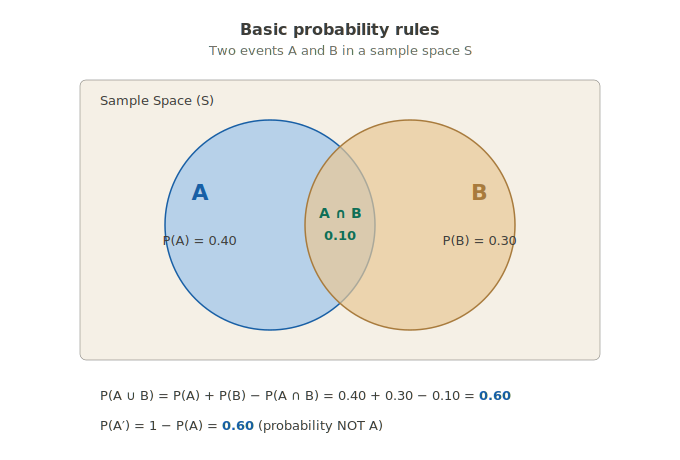
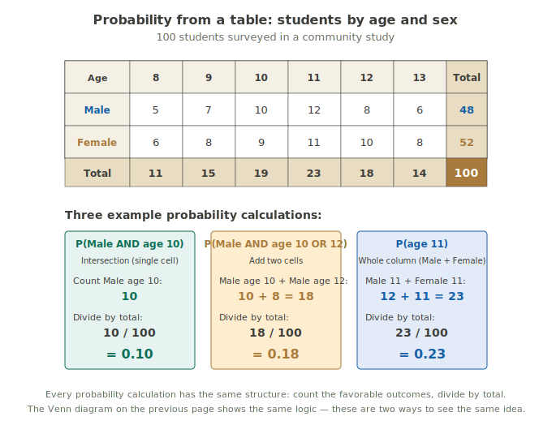
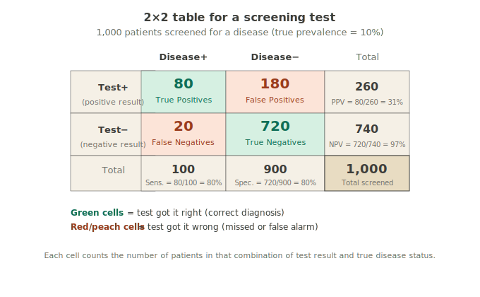
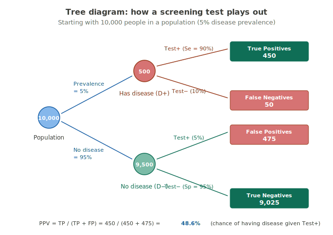
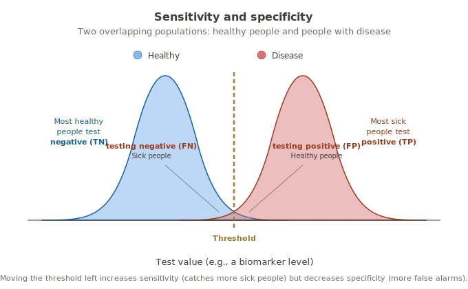
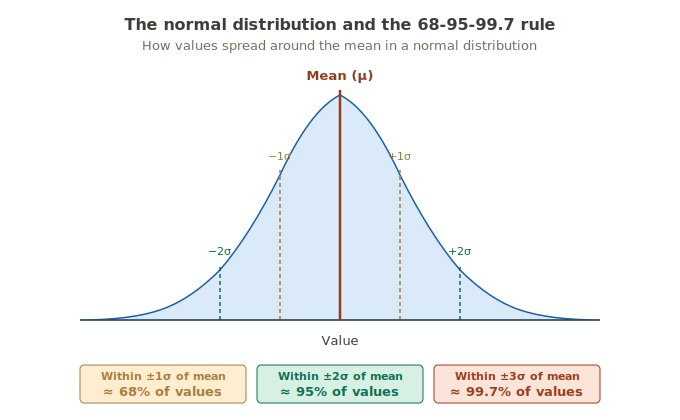
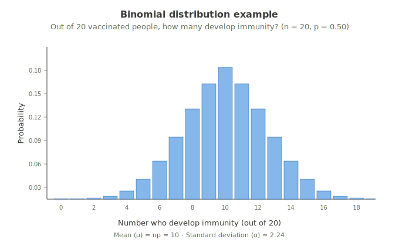
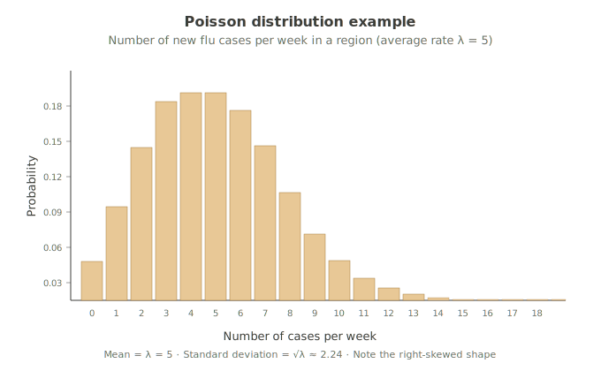

# Probability

!!! abstract "Why this module matters more than students think"
    Probability feels abstract — coins, dice, "what's the chance of...?" Students often see it as math homework, not public health. But every confidence interval, every hypothesis test, every "is this difference real or random?" question in the rest of the course is built on probability. Without probability, the statistics later in the course would just be arithmetic with no meaning. This module is the bridge between describing data (Track 1) and drawing conclusions about populations (Track 3).

## As you'll see it in published research and textbooks

**Probability** is the branch of mathematics that quantifies uncertainty. A probability is a number between 0 and 1 that describes how likely an event is — where 0 means impossible, 1 means certain, and values in between represent everything else. Probability theory provides the formal rules for combining, comparing, and reasoning about events, and underlies all of inferential statistics.

## What probability really is — in plain words

Probability is just a number between 0 and 1 (or 0% and 100%) that tells you how likely something is to happen.

- **Probability = 0:** the event never happens.
- **Probability = 1:** the event always happens.
- **Probability = 0.5:** the event happens about half the time.
- **Probability = 0.05:** the event happens about 1 time in 20.

That's the entire concept. Everything else in this module is *how to calculate* probabilities and *how to reason about combinations* of them.

!!! important "The single sentence that connects this whole module to the rest of the course"
    Every confidence interval, every p-value, and every "statistically significant" finding in this course is fundamentally answering one probability question: **"how likely is this result if there's actually nothing real going on?"** The number we report (often as a p-value) is just a probability. Probability is the language of statistical inference. Master it here, and the rest of the course makes sense.

## Why probability is hard at first

Students struggle with probability for predictable reasons. If you find yourself confused, you're in good company — this is the most counterintuitive topic in the course. Three reasons it feels harder than it is:

1. **Notation looks scarier than it is.** $P(A)$, $P(A \cup B)$, $P(A | B)$ — these symbols are just shorthand. We'll translate every one.
2. **Word problems are landmines.** Translating *"What's the probability that a patient who tests positive actually has the disease?"* into a probability statement is a skill that takes practice.
3. **Your intuitions will mislead you.** Common probability problems have answers that *feel* wrong but are correct. We'll cover the most famous traps later in this module.

The good news: once you've worked through a handful of public-health-relevant examples, the patterns click. This isn't a topic you have to memorize — it's a topic you have to *think through* once or twice, after which it makes sense.

## Basic probability rules

For two events A and B in some sample space (the set of all possible outcomes), four key quantities matter:

| Notation | What it means | Plain words |
|---|---|---|
| $P(A)$ | Probability of A | How likely is A to happen? |
| $P(A')$ | Probability of "not A" | How likely is A NOT to happen? Equals $1 - P(A)$. |
| $P(A \cap B)$ | Probability of A AND B (intersection) | How likely is it that BOTH A and B happen? |
| $P(A \cup B)$ | Probability of A OR B (union) | How likely is it that AT LEAST ONE of A or B happens? |

The two key formulas you'll see most often:

$$P(A') = 1 - P(A)$$

$$P(A \cup B) = P(A) + P(B) - P(A \cap B)$$

That second formula is called the **addition rule**. The reason we subtract $P(A \cap B)$ is that when we add P(A) + P(B), we count the overlap (where both happen) twice. We have to subtract it once to avoid double-counting.

**Example using the diagram:** If P(A) = 0.40 and P(B) = 0.30 and P(A ∩ B) = 0.10, then $P(A \cup B) = 0.40 + 0.30 - 0.10 = 0.60$. Sixty percent of the time, at least one of the two events happens.

!!! tip "Want to play with these values?"
    The [ProbHealth interactive probability tool](https://probhealth.netlify.app/#/) lets you slide P(A), P(B), and P(A ∩ B) and watch the Venn diagram and calculations update in real time. Great for building intuition.

    ### Another way to see the same idea: a table of counts

The Venn diagram is one way to picture probability. Another way — often more useful when you actually have data in front of you — is a **table of counts**.

Suppose you survey 100 students in a community study and record each one's age and sex. A simple table shows how many fall into each combination:

The three worked examples show how every probability calculation has the same underlying structure:

The three worked examples show two different kinds of probability:

**The first two examples (green and orange)** are unconditional probabilities — the kind we've been discussing. They follow the same structure:

1. **Identify the relevant cell(s) in the table** — the favorable outcomes
2. **Add them up** — count the favorable outcomes
3. **Divide by the grand total (100)** — convert the count to a probability

**The third example (purple) is a conditional probability** — and it's a different beast. Instead of asking *"what fraction of all 100 students is age 10 AND female?"* (which would be a joint probability), we're asking *"among only the female students, what fraction is age 10?"*

The denominator changes. We're no longer dividing by 100 (all students). We're dividing by 52 (only females). That single change is the heart of conditional probability — **restricting the sample space to a specific subgroup.**

This is exactly the concept we'll explore in detail in the next section.

!!! important "Two views, one concept"
    The Venn diagram and the contingency table are two ways to look at the same probability concept. Venn diagrams are great for visualizing the *relationships* between events. Tables are great when you have *actual count data* and need to do calculations. Most real public health data starts as a table — so getting comfortable reading probabilities from tables is a foundational skill.

## Independence — when does one event affect another?

Two events are **independent** if knowing one happened doesn't change the probability of the other.

- **Independent:** Flipping heads on a coin doesn't change the probability of rain tomorrow. They're unrelated.
- **NOT independent (dependent):** Being a smoker DOES change the probability of getting lung cancer. The two events are linked.

If two events are independent, multiplying probabilities works:

$$P(A \cap B) = P(A) \times P(B) \quad \text{(only if A and B are independent)}$$

If they're NOT independent, you need conditional probability (next section).

!!! warning "Independence is often assumed but rarely verified"
    Many statistical methods assume independence — for example, the assumption that one patient's outcome doesn't affect another's. This assumption is reasonable in many cases but breaks down in others (e.g., infectious disease outbreaks, where one person's illness affects their family members). Always ask: *"Is independence a reasonable assumption here?"* If not, special methods are needed (covered in Track 4).

## Conditional probability — the heart of the module

**Conditional probability** is the probability of one event happening *given that* we already know another event happened.

Notation: $P(A | B)$ — read "the probability of A given B."

The vertical bar `|` is read as "given." It's NOT division.

**The formula:**

$$P(A | B) = \frac{P(A \cap B)}{P(B)}$$

**Plain words:** *"The probability of A given B equals the probability that both A and B happen, divided by the probability of B."*

**A concrete example:** Say we know that 30% of patients have hypertension, 40% have diabetes, and 10% have both. What's the probability that a patient has hypertension *given* that they have diabetes?

$$P(\text{HTN} | \text{Diabetes}) = \frac{P(\text{HTN and Diabetes})}{P(\text{Diabetes})} = \frac{0.10}{0.40} = 0.25 \text{, or } 25\%$$

So among patients with diabetes, 25% also have hypertension — even though only 30% of the general patient population has hypertension. The diabetes "filters" the population, changing the relevant denominator.

!!! important "Why this concept underlies all of medicine"
    Almost every clinical question is a conditional probability question:

    - *"Given a positive test result, what's the probability of disease?"* — that's $P(\text{Disease} | \text{Test}+)$, called the **positive predictive value**
    - *"Given a negative test result, what's the probability of no disease?"* — that's $P(\text{No disease} | \text{Test}-)$, the **negative predictive value**
    - *"Given that someone smokes, what's the probability of lung cancer?"* — a conditional probability

    Whenever you see the word "given" in a medical question, conditional probability is the answer.

## The 2×2 table — probability's most useful tool

In public health, you'll encounter the 2×2 table constantly. It organizes data into two rows and two columns — typically test result (positive or negative) crossed with true disease status (present or absent). From a single 2×2 table, you can calculate all the key probabilities of screening and diagnostic testing.

**The four cells of a 2×2 screening test table:**

- **True Positives (TP):** People who have the disease AND test positive. The test got it right.
- **False Positives (FP):** People who do NOT have the disease but test positive anyway. False alarm.
- **False Negatives (FN):** People who have the disease but test negative. The test missed them.
- **True Negatives (TN):** People who do NOT have the disease AND test negative. The test got it right.

From these four numbers, we calculate four key probabilities:

### Sensitivity (Se) — how well does the test catch sick people?

$$\text{Sensitivity} = P(\text{Test}+ | \text{Disease}+) = \frac{TP}{TP + FN}$$

**Plain words:** *Of all the people who actually have the disease, what proportion did the test correctly identify?*

In our example: $80 / 100 = 80\%$. The test catches 80% of sick people. A high-sensitivity test rarely misses cases.

### Specificity (Sp) — how well does the test correctly clear healthy people?

$$\text{Specificity} = P(\text{Test}- | \text{Disease}-) = \frac{TN}{TN + FP}$$

**Plain words:** *Of all the people who don't have the disease, what proportion did the test correctly clear?*

In our example: $720 / 900 = 80\%$. The test correctly clears 80% of healthy people. A high-specificity test rarely raises false alarms.

### Positive predictive value (PPV) — if I test positive, do I have it?

$$\text{PPV} = P(\text{Disease}+ | \text{Test}+) = \frac{TP}{TP + FP}$$

**Plain words:** *Of all the people who test positive, what proportion actually have the disease?*

In our example: $80 / 260 = 31\%$. Only 31% of positive tests indicate actual disease.

### Negative predictive value (NPV) — if I test negative, am I clear?

$$\text{NPV} = P(\text{Disease}- | \text{Test}-) = \frac{TN}{TN + FN}$$

**Plain words:** *Of all the people who test negative, what proportion are actually disease-free?*

In our example: $720 / 740 = 97\%$. A negative test result strongly suggests no disease.

!!! danger "The most counterintuitive insight in this module"
    **Sensitivity and specificity describe the test itself.** They're properties of the test that don't change with the population.

    **PPV and NPV describe what a test result MEANS for an individual patient.** They depend on how common the disease is in the population being tested.

    For a rare disease (low prevalence), even a very good test will produce mostly false positives. PPV will be low. This is why we don't screen everyone for everything — screening tests work best when applied to populations where the disease is reasonably common (high pre-test probability).

## Bayes' theorem — the formal logic behind PPV

What we just calculated — PPV from a 2×2 table — is essentially **Bayes' theorem** applied to a clinical scenario. Bayes' theorem is the formal rule for updating a probability when you receive new information.

The formula (don't memorize this — focus on what it does):

$$P(A | B) = \frac{P(B | A) \times P(A)}{P(B)}$$

**Plain English version:**

$$\text{Probability of disease given a positive test} = \frac{\text{Sensitivity} \times \text{Prevalence}}{\text{Probability of a positive test}}$$

The key insight: **a positive test result updates your belief about whether the disease is present.** Before the test, your belief is just the prevalence (how common the disease is in the population). After a positive test, your belief shifts upward — but how much it shifts depends on how accurate the test is AND how common the disease was to begin with.

### Visualizing Bayes' theorem with a tree diagram

A tree diagram makes Bayes' theorem concrete. Start with a population, branch on disease status, then branch again on test result. Count what falls into each of the four end states.

In this example:
- 10,000 people, 5% have the disease → 500 have disease, 9,500 don't
- Of the 500 with disease, 90% test positive (sensitivity) → 450 true positives, 50 false negatives
- Of the 9,500 without disease, 95% test negative (specificity) → 9,025 true negatives, 475 false positives

**Now we can calculate PPV:** $P(\text{Disease} | \text{Test}+) = 450 / (450 + 475) = 48.6\%$

Even though sensitivity was 90% and specificity was 95%, a positive test only means 48.6% chance of actual disease. Why? Because the disease was rare (5% prevalence) to begin with — so the test produced lots of false positives just from screening healthy people.

!!! tip "Want to explore Bayes' theorem interactively?"
    The [ProbHealth Bayes' Theorem Calculator](https://probhealth.netlify.app/#/) lets you adjust prevalence, sensitivity, and specificity with sliders and instantly see PPV and NPV update. Try slider-ing prevalence very low and watch PPV crash — that's why universal screening for rare conditions is rarely a good idea.

## The sensitivity-specificity tradeoff

Most diagnostic tests don't give a simple yes/no answer. They produce a numeric value (a biomarker level, a tumor size, an antibody concentration), and someone has to pick a **cutoff** above which the test calls it "positive."

Moving the cutoff trades off sensitivity vs. specificity:

- **Lower the threshold** → catch more sick people (higher sensitivity) BUT also flag more healthy people as positive (lower specificity). More false positives.
- **Raise the threshold** → fewer false alarms (higher specificity) BUT miss more cases (lower sensitivity). More false negatives.

### What the threshold really is — and why it's a hard choice

A diagnostic test usually doesn't give a yes/no answer. It produces a *number* — a biomarker level, a tumor size, an antibody concentration, a blood glucose reading. Somebody has to pick a **threshold** above which the test calls it "positive."

That choice is more consequential than it first appears.

**What the threshold is doing.** The two bell curves in the picture above represent two real populations measuring the same thing. Healthy people have a *range* of values for the test — most low, but some naturally higher than average. People with disease also have a *range* — most high, but some naturally lower than average. The two ranges **overlap** in the middle.

When you place a threshold, you're drawing a vertical line through that overlap and saying: *"Everyone above this line, we'll call positive. Everyone below, we'll call negative."* The threshold is essentially the **decision rule** for the test.

**Why the choice is hard.** Because of the overlap, no threshold can be perfect. Wherever you place the line:

- Some healthy people will fall above it (false positives — they don't have the disease but the test says they do)
- Some sick people will fall below it (false negatives — they have the disease but the test missed them)

You can reduce one only by accepting more of the other. **This is the fundamental tradeoff.**

**What moving the threshold actually does in plain terms:**

- **Move the threshold LOWER (to the left):**
    - You catch more sick people. Sensitivity goes UP.
    - You also flag more healthy people incorrectly. Specificity goes DOWN.
    - Result: fewer missed cases, more false alarms.

- **Move the threshold HIGHER (to the right):**
    - You stop flagging as many healthy people. Specificity goes UP.
    - You also miss more sick people. Sensitivity goes DOWN.
    - Result: fewer false alarms, more missed cases.

**Why this matters in real public health decisions.**

The "right" threshold depends on what you're trying to accomplish.

- **For a deadly, treatable disease** (like cancer screening or early sepsis detection), missing a case is catastrophic. We'd rather have lots of false alarms — those just lead to additional testing — than miss a real case. We choose a LOW threshold to maximize sensitivity.
- **For a condition with risky follow-up** (where a positive test leads to an invasive procedure, like a biopsy), false alarms create real harm. We'd rather miss a few cases than subject many healthy people to dangerous procedures. We choose a HIGHER threshold to maximize specificity.
- **For a condition that's both common and not-very-dangerous** (like routine cholesterol screening), we balance somewhere in between.

There is no single "correct" threshold for any test. Whoever designs the test makes a value judgment about which kind of error is worse for their use case, then picks a threshold accordingly. That's why the same biomarker might have different cutoff values in different clinical contexts.

!!! important "The takeaway about thresholds"
    A test result of "positive" doesn't mean the test detected a clear, undeniable signal. It means **the value crossed an arbitrary line that someone drew through an overlap zone**. Understanding this is what separates students who memorize sensitivity and specificity from students who actually understand diagnostic testing.

!!! tip "Want to see the tradeoff in action?"
    The [ProbHealth Sensitivity & Specificity tool](https://probhealth.netlify.app/#/) shows two overlapping distributions with a draggable threshold. Move the slider and watch how sensitivity and specificity trade off in real time.

## Probability distributions — a brief introduction

A **probability distribution** is a description of how probability is spread across all possible outcomes of a random variable. For each possible outcome, the distribution tells you how likely that outcome is.

We won't go deep into distributions in this module — they get fuller treatment when we need them later (in Confidence Intervals and Hypothesis Testing). But three distributions show up often enough that you should know what they look like.

### The normal distribution

The **normal distribution** (the "bell curve") is the most important probability distribution in statistics. Many natural measurements approximate a normal distribution — heights, IQ scores, blood pressure, and most lab values.

The normal distribution has one critical property: values cluster around the mean according to specific percentages.

This is called the **68-95-99.7 rule** (or **empirical rule**) — and it's the foundation of confidence intervals. Almost every value in a normally distributed population falls within 3 standard deviations of the mean. This fact powers most of the inferential statistics we'll meet in Track 3.

### The binomial distribution

The **binomial distribution** describes the probability of getting a certain number of "successes" in a fixed number of independent yes/no trials.

**Used for:** Counting outcomes in dichotomous data over a fixed number of trials. *"Out of 20 vaccinated people, how many will develop immunity?"*

When n is moderately large, the binomial distribution looks approximately bell-shaped — a fact that lets us use normal-distribution tools to handle dichotomous data later (Confidence Intervals for proportions).

### The Poisson distribution

The **Poisson distribution** describes the probability of a certain number of events occurring in a fixed time interval — when events happen at a known average rate and independently of each other.

**Used for:** Counting events over time. *"How many flu cases per week will this clinic see?"*

Notice the right-skewed shape. The Poisson distribution appears whenever you're counting rare events — disease cases, accidents, errors, occurrences — over a defined time window.

!!! tip "Want to explore probability distributions interactively?"
    The [ProbHealth Probability Distributions tool](https://probhealth.netlify.app/#/) lets you adjust the parameters of the binomial (n, p), normal (μ, σ), and Poisson (λ) distributions with sliders and watch the shapes change. Really useful for seeing how the parameters control the distribution.

## ⚠️ Why students miss this

Four classic traps in probability.

!!! warning "Trap 1: Base rate neglect — forgetting how rare a disease is"
    Students see "test is 95% accurate" and assume a positive result means 95% chance of disease. This is wrong. The accuracy of the test only matters in combination with the prevalence of the disease. For a rare disease, even a very accurate test produces mostly false positives. **Always ask: how common is the disease in this population?**

!!! warning "Trap 2: Confusing P(A | B) with P(B | A)"
    These are not the same thing. "Probability of disease given a positive test" (PPV) is very different from "probability of a positive test given disease" (sensitivity). Mixing them up is one of the most common errors in clinical reasoning. **Remember: $P(A | B)$ and $P(B | A)$ are different conditional probabilities — the order matters.**

!!! warning "Trap 3: The gambler's fallacy"
    A coin flipped 10 times in a row has all landed heads. What's the probability the next flip is tails? Many students say "much higher — it's due." Wrong. If the coin is fair, the probability is still 50%. Each flip is independent. **Past results don't affect future independent events.** This applies to medicine too: rare conditions don't become "more likely" just because they haven't happened recently.

!!! warning "Trap 4: Assuming independence when events are linked"
    Many calculations assume two events are independent (e.g., two infections in the same hospital). But they may be linked (a shared bacterial source, a common procedure). Assuming independence when it doesn't hold leads to wrong conclusions. **Always ask: could these events be related?**

## In JMP

JMP doesn't have a dedicated "probability" platform — probability concepts show up across other tools.

For **2×2 tables and screening test calculations:**

- **Analyze → Fit Y by X**, with both variables as Nominal — gives you a contingency table and chi-square test
- JMP's output will include sensitivity, specificity, PPV, and NPV if you select the right options under the red triangle

For **probability distributions:**

- JMP can compute probabilities and draw distribution plots — go to **DOE → Sample Size and Power** or use formula columns with built-in probability functions (Normal Distribution, Binomial Distribution, Poisson Distribution).

!!! important "When you need probability in this course"
    Most of the probability you'll actually compute in this course happens within tools later (confidence intervals, hypothesis tests, regression). The point of this module isn't to memorize formulas — it's to understand what those tools are doing under the hood. Once you understand probability, the rest of biostatistics has a logic to it.

## What to do when you're stuck

When facing a probability problem:

1. **Identify the events.** What are the things that might or might not happen? Write them out clearly.
2. **What are you trying to find?** $P(A)$? $P(A | B)$? $P(A \cap B)$?
3. **Set up a 2×2 table or a tree diagram.** Even imaginary numbers help. Concrete counts make conditional probabilities visible.
4. **Check independence.** Are the events truly independent, or are they linked?
5. **Translate "given" into a conditional probability.** Any time you see "given that X" or "if X" in a problem, you're being asked $P(\text{something} | X)$.

If you can do those five things, you can solve almost any probability problem in this course.

---

*See also: [Variable Types](../foundations/variable-types.md) · [Summary Statistics](../track-1-studies-and-data/ch4-summary-stats.md) · [Stats Vocabulary](../foundations/stats-vocabulary.md)*