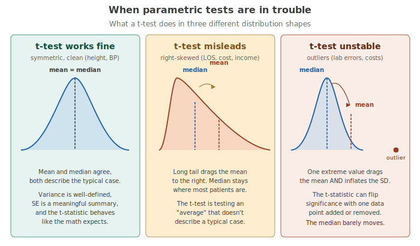
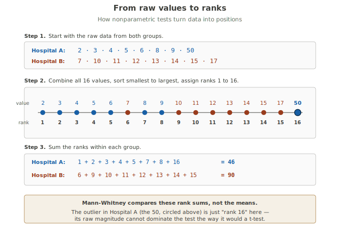
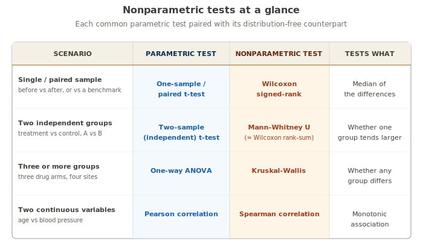

# Nonparametric Tests

!!! abstract "The three-layer take"
    **Expert:** Nonparametric tests are inferential procedures that do not require the data to come from a specified parametric distribution — most commonly, they relax the normality assumption underlying t-tests and ANOVA. They achieve robustness through rank-based or sign-based transformations of the original data. Their asymptotic relative efficiency compared to parametric tests is typically 0.86 to 0.95 under normality, with substantial advantages under heavy tails, skew, or contamination by outliers.

    **Textbook:** When the assumptions behind a t-test or ANOVA fail — when your data are skewed, have outliers, or come from a distribution you can't characterize — nonparametric tests give you a valid alternative. They work by replacing each data value with its rank (its position when all values are sorted), then running the test on the ranks instead of the raw numbers. This makes them resistant to outliers and applicable to nearly any distribution shape. The most common examples in public health are the Wilcoxon signed-rank test (replaces the paired t-test), the Mann-Whitney U test (replaces the two-sample t-test), and the Kruskal-Wallis test (replaces one-way ANOVA).

    **Plain language:** When your data are weird — skewed, full of outliers, or just don't look like a clean bell curve — the usual tests can give you misleading answers. Nonparametric tests solve this by ignoring the actual numbers and just looking at their positions when you line them up smallest to largest. The biggest value gets the highest rank whether it's 17 or 1,700. That makes these tests harder to fool with weird data — at the cost of giving up a little statistical horsepower when the data ARE well-behaved.

---

## When the math gives up

The t-test is a remarkable invention. Given a sample of numbers, it tells you whether the mean is plausibly different from some reference, or whether two groups of numbers have plausibly different means. Most of the inferential statistics you'll do in public health is some variation on this.

But the t-test has a catch. It works because of an assumption: that the data come from a roughly normal (bell-curve-shaped) distribution. When that's true — or when your sample is large enough that the Central Limit Theorem rescues you — the math behind the t-test is honest. When it isn't, the math starts lying.

There are three particularly common ways data violate the parametric assumption in real public health work.

**The data are skewed.** Hospital length-of-stay, costs, income, blood lead levels, time-to-event variables — these are almost always right-skewed. A long thin tail of high values stretches off to the right. In a skewed distribution, the mean is no longer in the middle of where most observations live; it gets dragged toward the tail. So the "average length of stay" isn't representing the typical patient anymore, and the t-test, which is a test about means, becomes a test about a quantity that doesn't represent typical experience.

**There are outliers.** One impossibly high lab value, one billing record off by a factor of 100, one unusual patient who stayed for months. The t-test treats outliers as data, the same as every other value. But the mean and standard deviation are both extremely sensitive to outliers — one stray point can change them substantially. So can the t-statistic, which is built from them. Outliers can flip a t-test from significant to non-significant or vice versa with a single data point.

**The sample is small.** With large samples, the Central Limit Theorem makes the t-test work even on non-normal data, because the *sampling distribution of the mean* becomes normal even when the underlying data aren't. But with small samples (say, fewer than 30, and especially fewer than 15), you don't get that rescue. You're stuck with whatever shape the data actually have.



In all three cases, you're asking your t-test to do something it wasn't designed to do. Sometimes it'll still give you a reasonable answer. Sometimes it'll lie. The problem is that the t-test itself doesn't tell you which.

---

## The fix: ranks

Here's the whole idea behind nonparametric tests in one sentence: **if you don't trust the numbers, work with their positions instead.**

When you have a list of values — say, hospital lengths-of-stay — you can sort them from smallest to largest and assign each one a rank. The smallest value gets rank 1. The next gets rank 2. And so on. The biggest value gets the highest rank.

Look at what this does. The actual magnitudes of the values disappear; only their ORDER survives. A length-of-stay of 50 days and a length-of-stay of 17 days are very different in raw terms. But in rank terms, one is "the biggest of 16" and the other is "the second biggest" — a difference of just one rank position. The outlier doesn't get to dominate anymore.



The trick is now this: once you've converted to ranks, you can compute statistics on the RANKS instead of the raw values, and those statistics have known distributions even when the underlying data are weird. The Mann-Whitney test, for example, just looks at the SUM of ranks within each group. If one group's rank-sum is unusually large compared to the other's, that group tends to have larger values. That's all the test is doing.

This is an elegant trade. We've given up some information (the exact magnitudes) for robustness (we're no longer at the mercy of outliers or distribution shape). For data that already looks normal-ish, this trade isn't worth it — the parametric test will be more powerful. For data that doesn't, the trade is a steal.

---

## The tests at a glance

Most of the parametric tests you'll encounter in undergrad biostats have a nonparametric counterpart that handles the same general scenario without requiring normality. Here's the map:



You won't memorize this all at once. The rest of the card walks through the three most common in detail, and you'll come back to the table when you need to look one up.

---

## Walking through Mann-Whitney (a.k.a. Wilcoxon rank-sum)

The Mann-Whitney U test is the nonparametric counterpart to the two-sample independent t-test. It's the same test as the Wilcoxon rank-sum test — two names, one procedure, depending on which textbook or field you learned it in. JMP calls it "Wilcoxon" in the menus. Many epidemiology papers say "Mann-Whitney." Both refer to the same thing.

You use it when you want to compare two independent groups but the assumptions a t-test would need are shaky.

**H₀:** the two groups are drawn from the same distribution — neither tends to be larger than the other.

**H₁:** one group tends to produce larger values than the other.

### The example

Suppose you're comparing length-of-stay at two hospitals. From a sample of 8 patients at each:

- **Hospital A:** 2, 3, 4, 5, 6, 8, 9, 50 days
- **Hospital B:** 7, 10, 11, 12, 13, 14, 15, 17 days

Hospital A has one patient who stayed 50 days. Maybe a complicated surgical case, maybe a billing error. Either way, that outlier is going to wreck any t-test you might run, because the standard deviation of group A is dominated by that one point. We'll come back to this.

### Step 1: Rank everything

Combine all 16 values, sort them smallest to largest, and assign ranks 1 through 16. The rank transformation SVG above shows the full table. The key numbers:

- **Hospital A ranks:** 1, 2, 3, 4, 5, 7, 8, 16 → sum = **46**
- **Hospital B ranks:** 6, 9, 10, 11, 12, 13, 14, 15 → sum = **90**

Notice that the 50 in Hospital A is just rank 16. In raw form it dominated the mean. In rank form it's "the largest of 16" — nothing more dramatic than that.

### Step 2: Compute U

The Mann-Whitney U statistic has a couple of equivalent formulas. The most common one is:

```
U_A = R_A − n_A(n_A + 1) / 2
```

Where R_A is the rank sum for group A and n_A is the sample size of group A. Plugging in:

```
U_A = 46 − 8(9)/2 = 46 − 36 = 10
```

You can compute U_B the same way (or just use the identity that U_A + U_B = n_A × n_B = 64):

```
U_B = 90 − 36 = 54
```

The test statistic typically reported is the smaller of U_A and U_B — in this case, **U = 10**.

### Step 3: Compute the p-value

For samples large enough (rule of thumb: at least 8 per group), the distribution of U under H₀ is approximately normal with:

- mean = n_A × n_B / 2 = 32
- standard deviation = √(n_A × n_B × (n_A + n_B + 1) / 12) = √(64 × 17 / 12) ≈ 9.52

So the z-score for our observed U is:

```
z = (10 − 32) / 9.52 = −2.31
```

A two-sided p-value for z = −2.31 is approximately **0.021**.

**Conclusion:** since p < 0.05, we reject H₀. The two hospitals' length-of-stay distributions are significantly different.

### Why the t-test would have failed

This is the punchline of the example. If you'd run a two-sample t-test on the same data, here's what you'd find:

- Hospital A: mean = 10.9 days, SD ≈ 16.0 days (the 50 inflates the SD enormously)
- Hospital B: mean = 12.4 days, SD ≈ 3.1 days

The difference in means is just 1.5 days. The standard error on that difference is dominated by Hospital A's variability — which is itself dominated by the outlier. You'd end up with t ≈ −0.26 and a p-value north of 0.7. **Wildly non-significant.**

But that "non-significance" is an artifact. Look at the actual data: seven of Hospital A's eight values are *smaller* than the smallest value in Hospital B. There's a clear pattern — Hospital A tends to be shorter, Hospital B tends to be longer. The outlier is hiding this from the t-test. Mann-Whitney sees right through it.

!!! tip "The recurring lesson"
    Nonparametric tests don't fix bad data. They fix the right question being answered by the wrong statistic. When a t-test fails because one observation hijacks the mean, the underlying signal is often still there — you just need a test that looks at it through a different lens. Ranks are that lens.

---

## Briefly: Wilcoxon signed-rank (paired data)

The Wilcoxon signed-rank test is the nonparametric counterpart to the paired t-test. You use it when you have paired measurements — the same subjects measured twice, or matched subjects measured once each — and you want to know if there's been a change.

The procedure:

1. Compute the difference (after − before) for each pair.
2. Drop any zero differences. Take the *absolute value* of the rest.
3. Rank those absolute differences from smallest to largest.
4. Reattach the original signs: positive differences get positive ranks, negative differences get negative ranks.
5. Sum the positive ranks (call it W⁺). Sum the negative ranks (call it W⁻).
6. Compare the smaller of these to a tabled critical value, or compute a p-value via the normal approximation.

The intuition: if the "after" measurements really are no different from the "before" measurements, then positive and negative differences should be about equally common and equally large — so W⁺ and W⁻ should be similar. A big imbalance means there's been a systematic change.

A typical use case: you measure 12 patients' systolic blood pressure before and after a 12-week intervention. The differences are skewed because a couple of patients showed dramatic drops and the rest showed modest ones. Wilcoxon signed-rank handles this gracefully where the paired t-test would lean too heavily on the dramatic drops.

---

## Briefly: Kruskal-Wallis (three or more groups)

The Kruskal-Wallis test is the nonparametric counterpart to one-way ANOVA. You use it when you have three or more independent groups and you want to know if any of them differs from the others. It's a direct generalization of Mann-Whitney.

The procedure:

1. Combine all observations across groups and rank them from smallest to largest, just as you would for Mann-Whitney.
2. Sum the ranks within each group.
3. Compute the test statistic H (sometimes called the K-W statistic), which compares each group's average rank to the overall average rank.
4. Compare H to a chi-square distribution with k − 1 degrees of freedom, where k is the number of groups.

Kruskal-Wallis tells you whether *at least one* group differs from the others — not which specific groups differ. To find out which, you'd run Mann-Whitney tests pairwise after a significant Kruskal-Wallis, with a correction for multiple comparisons (Bonferroni, for example).

A typical use case: comparing length-of-stay across four hospital sites where you suspect some sites have skewed data and you don't want to assume normality.

!!! note "Friedman test"
    For *repeated measures* across three or more time points (the same subjects measured at each time), use the **Friedman test** — the nonparametric counterpart to repeated-measures ANOVA. It works analogously to Kruskal-Wallis but accounts for the within-subject correlation. JMP supports this through **Analyze → Fit Model** with a mixed-effects setup.

---

## What you give up

There's a real tradeoff here, and you should know what it is before defaulting to nonparametric for everything.

**Nonparametric tests have less statistical power than parametric tests when the parametric assumptions are met.** Specifically, the Mann-Whitney test has about 95% the power of a t-test when the data are truly normal. The Wilcoxon signed-rank has similar relative efficiency. The Kruskal-Wallis vs. ANOVA comparison is similar.

That doesn't sound like much, and it isn't, in practice. But it means: if the data ARE clean and normal, you'd need slightly larger samples with nonparametric tests to detect the same effect. For most real-world problems, that's a fair price for the protection against assumption violations.

The bigger considerations:

**Nonparametric tests work with ranks, so they discard information about exact magnitudes.** A difference of 1 unit and a difference of 100 units might be ranked identically if everything else in your data falls in between. For some questions, that's fine. For others — predicting the magnitude of an effect, or estimating the SIZE of a treatment benefit — you really want the parametric framework, because it actually models the magnitudes.

**Nonparametric tests are not "assumption-free."** They do assume independence between observations, and most assume similar shapes between the groups you're comparing (for Mann-Whitney, the strict "test of medians" interpretation requires this). What they don't assume is normality. People sometimes call them "distribution-free," which is technically accurate but a bit misleading — they make *fewer* distributional assumptions, not zero of them.

**"Always use nonparametric to be safe" is wrong.** When your data ARE well-behaved and normality is plausible, parametric tests are slightly more powerful AND give you direct estimates of means and mean differences (which are often what you actually want to report). The right rule is: use the test that matches your data and your question. Nonparametric for weird data; parametric for clean data and clean questions.

---

## JMP walkthroughs

JMP labels its nonparametric options consistently across menus — they live under the **Nonparametric** submenu inside the red triangle of whatever analysis you've started. Once you know that pattern, finding any of these is fast.

### Mann-Whitney (Wilcoxon rank-sum)

1. **Analyze → Fit Y by X**
2. Drop your continuous outcome into the **Y** role (e.g., length of stay)
3. Drop your two-level categorical predictor into the **X** role (e.g., hospital A vs. B)
4. Click **OK**. JMP recognizes this as a oneway analysis.
5. Click the **red triangle** next to "Oneway Analysis of [Y] by [X]"
6. Choose **Nonparametric → Wilcoxon Test**
7. JMP reports the test statistic, the z-approximation, and a two-sided p-value.

### Wilcoxon signed-rank

1. First, compute a difference column in your data table (e.g., **After − Before**) using **Cols → New Columns → Formula**
2. **Analyze → Distribution**
3. Drop the difference column into the Y role. Click **OK**.
4. Click the **red triangle** next to the difference column
5. Choose **Test Mean...**, then check the box for **"Wilcoxon Signed Rank"**
6. Enter the hypothesized median (usually 0, if you're testing for any change)
7. JMP reports the signed-rank statistic and a p-value

### Kruskal-Wallis

The setup is identical to Mann-Whitney; JMP auto-detects that you have 3+ groups instead of 2.

1. **Analyze → Fit Y by X**
2. Drop your continuous outcome into the Y role
3. Drop your **categorical predictor with 3+ levels** into the X role
4. Click **OK**
5. Click the **red triangle**
6. Choose **Nonparametric → Wilcoxon Test**
7. JMP labels the resulting statistic "Approximation, ChiSquare" with df = k − 1, and reports a p-value

The same menu item runs Mann-Whitney for two groups and Kruskal-Wallis for three or more. JMP figures out which based on how many levels your X variable has.

---

## Why students miss this

**"Nonparametric means no parameters."** No. It means no assumption about the *form* of the population distribution. There are still parameters being estimated (medians, for example) — you're just not assuming the population is normal or any other specific shape.

**"Nonparametric tests are tests of medians."** Approximately true, but not exactly. Mann-Whitney, strictly speaking, tests whether one group tends to produce larger values than the other — which is identical to "different medians" only when the two distributions have the same shape. When they have different shapes (one skewed, one symmetric, for example), Mann-Whitney can return a significant result even when the medians are the same, because it's actually responding to a difference in the whole distributions. In practice, most people treat it as a median test, which is fine as long as you remember that this requires the same-shape assumption.

**"I should always use nonparametric to be safe."** No. You give up real power, and you lose the direct interpretability of means and mean differences. Use nonparametric when you have a reason to think parametric will mislead you — small samples with skewed data, outliers you can't explain or remove, ordinal data.

**"Rank-based tests ignore the actual numbers."** Partly. They use the order of the numbers, not the magnitudes. So 50 and 17 become "rank 16" and "rank 15" — the distance shrinks. This is GOOD when you want robustness, but BAD when you actually need to characterize how big a difference is. Use confidence intervals on the medians (or the Hodges-Lehmann estimator, which JMP can produce) to get magnitude information back.

**"If my sample is big, I have to use a t-test."** No. You CAN use a t-test, and the Central Limit Theorem will rescue you on the means even for skewed data. But you don't HAVE to. With a large skewed sample, you might still prefer nonparametric because the median is more meaningful than the mean for skewed data, even when the mean is technically valid.

**"Mann-Whitney and Wilcoxon rank-sum are different tests."** Same test, two names. Wilcoxon developed the rank-sum version; Mann and Whitney developed the U version. The math is equivalent. JMP says "Wilcoxon" in its menus; many textbooks and papers say "Mann-Whitney." Both refer to the same procedure for comparing two independent groups using ranks.

---

## Vocabulary recap

**Nonparametric test** — A hypothesis test that doesn't assume the data follow a specific parametric distribution (most commonly: doesn't assume normality). Most operate on ranks instead of raw values.

**Rank** — A value's position when all observations are sorted from smallest to largest. The smallest value gets rank 1, the next gets rank 2, and so on. Ties are handled by averaging the ranks they would otherwise occupy (e.g., two values tied for what would be ranks 4 and 5 both get rank 4.5).

**Wilcoxon signed-rank test** — Nonparametric counterpart to the paired t-test. Tests whether the median of paired differences is zero.

**Mann-Whitney U test** (= Wilcoxon rank-sum test) — Nonparametric counterpart to the two-sample independent t-test. Tests whether one group tends to produce larger values than the other.

**Kruskal-Wallis test** — Nonparametric counterpart to one-way ANOVA. Tests whether at least one of three or more groups differs from the others.

**Friedman test** — Nonparametric counterpart to repeated-measures ANOVA. Tests for differences across three or more matched conditions or time points.

**Spearman correlation** — Nonparametric counterpart to Pearson correlation. Measures the strength of a *monotonic* association (not necessarily linear) by computing Pearson's correlation on the ranks rather than the raw values.

**Asymptotic relative efficiency (ARE)** — A measure of how much information you lose by using a nonparametric test versus its parametric counterpart when the parametric assumptions ARE met. For Mann-Whitney versus the t-test on normal data, ARE ≈ 0.95 — meaning nonparametric uses about 95% of the information that parametric would. The loss is small.

**Distribution-free** — Synonym for nonparametric. Means the test doesn't rely on assuming a specific distribution shape. NOT the same as "no assumptions"; the tests still require things like independence between observations.
