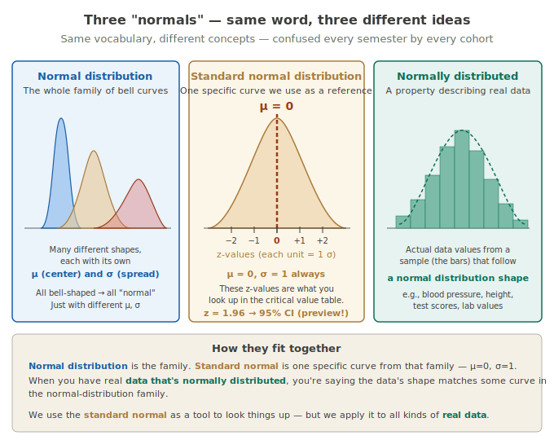
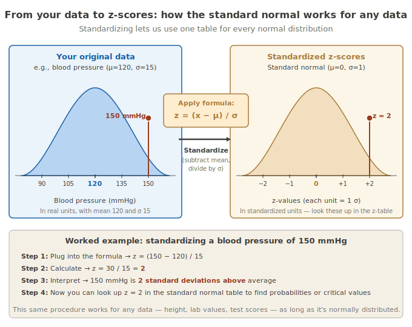
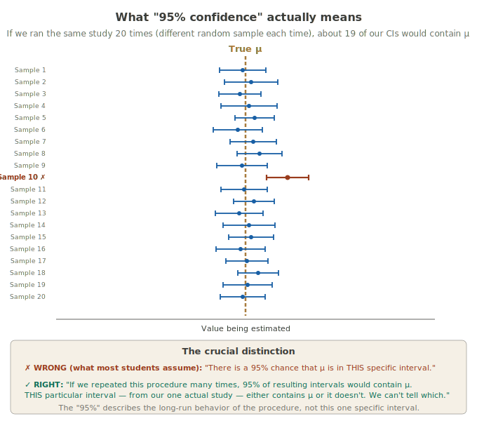
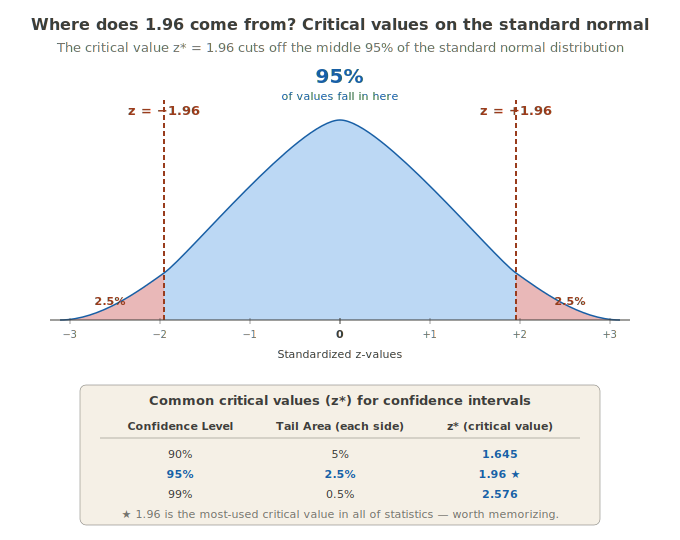
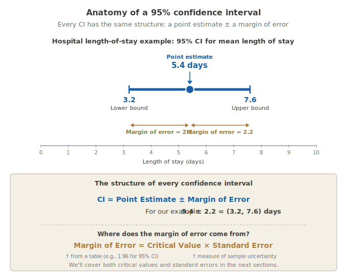
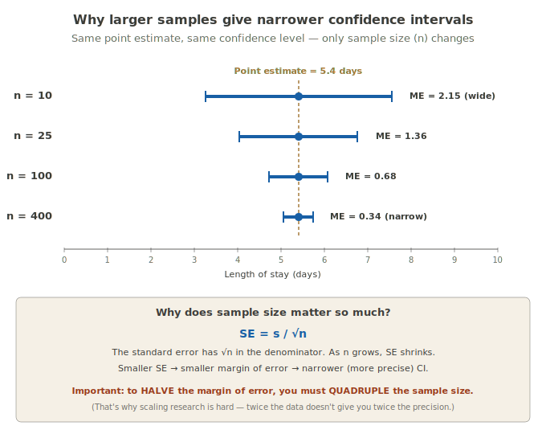
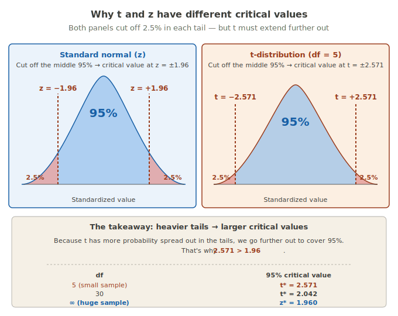

# Confidence Intervals

!!! abstract "Confidence Intervals in one card"
    A **confidence interval (CI)** is a range of plausible values for a population parameter, built from sample data. Instead of saying "we think the average is 5.4," a CI says "we think the average is somewhere between 2.9 and 7.9, and we used a procedure that captures the true value 95% of the time."
    
    **Expert version:** A 95% CI for μ is the interval $\bar{x} \pm t^* \cdot \frac{s}{\sqrt{n}}$, constructed so that 95% of such intervals (over hypothetical repeated sampling) contain μ.
    
    **Analogy:** A point estimate is a dart throw at the truth. A confidence interval is a circle around your dart — wider when you're less sure, narrower when you have more data.
    
    **Plain words:** When you can't measure everyone, you measure some people and report a range of values the true answer is likely to be in.

---

## Why a single number isn't enough

When researchers sample patients to estimate the average hospital length of stay, they don't usually report a single number like "5.4 days." A single number — a **point estimate** — gives no sense of how much wiggle room there is.

Two studies could both report 5.4 days as the sample mean, but:

- Study A used 10 patients
- Study B used 1,000 patients

Both studies give the same point estimate. But Study B is far more trustworthy. The CI captures that difference. Study A's CI might be (2.9, 7.9) — wide and uncertain. Study B's CI might be (5.2, 5.6) — narrow and confident.

!!! important "The core insight"
    A point estimate without a measure of uncertainty is **incomplete information**. The CI is how we communicate uncertainty quantitatively.

---

## The point estimate (and its many names)

Before we build a CI, let's nail down its center — the **point estimate**.

A **point estimate** is a single number computed from your sample that estimates a population parameter.

### A vocabulary warning

Here's the trap: the same concept goes by many names. You'll see it called different things in your textbook, in a JMP output, and in a published paper — and students often don't realize they're all pointing to the same thing.

Below is each name with **where you'll actually run into it**, so you can recognize it in the wild.

#### "Point estimate" — most stats textbooks

> "The **point estimate** for the average length of stay was 5.4 days, with a 95% CI of (2.9, 7.9)."

This is the textbook-and-classroom version. When you see "point estimate," it's almost always followed by a CI. They're a pair.

#### "Statistic" — when contrasting with "parameter"

> "The sample **statistic** $\bar{x}$ = 5.4 estimates the population parameter μ."

Used when an author wants to emphasize the population-vs-sample distinction. Statistic = from the sample. Parameter = from the population.

#### "Estimate" — regression output and software

In JMP output for a regression, you'll see a column literally labeled **Estimate**:

| Term | Estimate | Std Error | t Ratio | Prob > t |
|------|----------|-----------|---------|----------|
| Intercept | 2.10 | 0.45 | 4.67 | < 0.001 |
| Age | 0.08 | 0.02 | 4.00 | < 0.001 |

Each number in that "Estimate" column is a point estimate — for the intercept, for the slope, etc. When a software output says "Estimate," that's the same thing as "point estimate."

#### "Sample estimate" — epidemiology papers

> "The **sample estimate** of disease prevalence was 12% (95% CI: 9%–15%)."

You'll see this phrasing constantly in journals like *American Journal of Epidemiology* or *MMWR*. It just means "the value we calculated from our sample."

#### "Observed value" — reporting and meta-analyses

> "The **observed value** of the relative risk was 1.34 (95% CI: 1.12–1.61)."

Used when comparing what was *seen* in a study against what was *expected* (e.g., the observed/expected ratio in standardized mortality calculations). When you see "observed" in a paper, the author is saying "this is what our data showed."

#### $\bar{x}$ (x-bar) — math notation for the sample mean

When a formula uses $\bar{x}$, it specifically means the sample mean (a point estimate for μ). Not a generic point estimate — specifically the average. The bar (overline) means "average of."

#### $\hat{p}$ (p-hat) — math notation for the sample proportion

When the parameter you're estimating is a proportion (like the fraction of patients who recovered), the point estimate is written $\hat{p}$. Specifically for proportions, not means.

#### $\hat{\theta}$ (theta-hat) — generic "the estimate" in theory

In statistical theory writing, when the author doesn't want to commit to mean-vs-proportion-vs-anything-else, they'll write $\hat{\theta}$. Read it as "the estimate of whatever-the-thing-is."

!!! tip "Read 'hat' as 'estimated'"
    Any time you see a variable with a hat — $\hat{p}$, $\hat{\beta}$, $\hat{\mu}$, $\hat{\theta}$ — read it out loud as "the estimated version of." The hat literally means "this came from a sample, not from the true population."
    
    So when a paper writes $\hat{\beta} = 0.08$, read it as "our sample estimate of the slope is 0.08" — and remember that the true slope β is unknown.

!!! important "What this means in practice"
    When you're reading a paper or a JMP output and you see any of these terms — *estimate, statistic, observed value, $\bar{x}$, $\hat{\beta}$, sample mean, point estimate* — you're looking at the same conceptual thing: **a single number from a sample that estimates an unknown population value**.
    
    The CI tells you how much that single number could plausibly be off by.
|------|---------------------|
| Point estimate | Most stats textbooks |
| Statistic | When contrasting with "parameter" |
| Estimate | Regression output, software |
| Sample estimate | Epidemiology papers |
| Observed value | Reporting and meta-analyses |
| $\bar{x}$ (x-bar) | Math notation for sample mean specifically |
| $\hat{p}$ (p-hat) | Math notation for sample proportion specifically |
| $\hat{\theta}$ (theta-hat) | General "the estimate" notation |

!!! tip "Read 'hat' as 'estimated'"
    Whenever you see a variable with a hat — $\hat{p}$, $\hat{\beta}$, $\hat{\mu}$ — read it as "the estimated version of." The hat means "this is from a sample, not the true population value."

---

## Background: three things called "normal"

CIs are built on the normal distribution — but "normal" gets used three different ways. This trips up nearly every student, so let's separate them clearly.

### 1. The Normal distribution family

A family of bell-shaped curves where **every member follows the same mathematical rule** but with its own specific mean (μ) and standard deviation (σ).

That single rule is this equation:

$$f(x) = \frac{1}{\sigma\sqrt{2\pi}} \, e^{-\frac{1}{2}\left(\frac{x-\mu}{\sigma}\right)^2}$$

You don't need to memorize it. The point is: **plug in different values of μ and σ, and you get different curves — all from the same equation.**

- Plug in μ = 0, σ = 1 → you get the standard normal
- Plug in μ = 120, σ = 15 → you get the curve describing blood pressure
- Plug in μ = 70, σ = 4 → you get the curve describing resting heart rate

All three look different. All three are Normal — because all three came from the same rule.

#### Why they're all "Normal" even though they look different

A useful analogy: think of all rectangles. A square is a rectangle. A long thin door is a rectangle. A wide flat phone screen is a rectangle. They look very different — but they all obey the same rule: **four right angles, opposite sides equal**. That shared underlying rule is what makes them rectangles.

Normal curves are the same. The rule that makes them all "Normal" is the equation above. The μ shifts the curve **left or right** (where the peak is). The σ stretches or squishes it **wider or narrower** (how spread out the curve is). But the underlying shape — symmetric, single-peaked, decaying tails — is dictated by the formula.

#### Properties every Normal curve shares (no matter the μ and σ)

This is what makes "Normal" a real category, not just a label:

| Property | What it means |
|----------|---------------|
| Symmetric around the mean | Left half mirrors right half |
| Mean = median = mode | The peak, the middle value, and the average all coincide |
| Defined by exactly 2 numbers | μ and σ — that's all you need |
| 68-95-99.7 Empirical Rule applies | About 68% within 1σ of μ, 95% within 2σ, 99.7% within 3σ |
| Total area under curve = 1 | It's a probability distribution |
| Tails extend forever | Approach but never touch zero |

When someone says "Y is normally distributed with μ = 100 and σ = 15" (like IQ scores), they are naming **the specific member of the family Y belongs to** — and committing to all the properties above.

---

### 2. The Standard Normal distribution

ONE specific member of the Normal family — the one with μ = 0 and σ = 1.

We pick this one out for special attention because:

- It's the simplest case to work with mathematically
- **Any** Normal curve can be converted to it using the z-score transformation (we covered this just above)
- Tables, software, and critical values are all pre-computed for the standard normal — so we don't need a separate table for every possible (μ, σ) combination

Think of it as the "universal translator" of the Normal family. Convert your data to z-scores, look things up on the standard normal, get your answer.

The 68-95-99.7 (Empirical) Rule that you saw in the Probability chapter is **literally** the standard normal in action — and it's what motivates the critical values (like z* = 1.96) we'll use to build confidence intervals.

---

### 3. "Normally distributed" data

This phrase describes **real data you've collected** — not a curve. Data are "normally distributed" if a histogram of them looks **roughly bell-shaped, symmetric, and single-peaked**.

#### Real examples — what looks normal in practice

**Approximately normally distributed (yes):**

- Adult heights within a single sex (e.g., adult women in the US, μ ≈ 64 inches, σ ≈ 2.7)
- Body temperatures of healthy adults (μ ≈ 98.2 °F)
- Birth weights of full-term babies
- Errors in repeated careful measurements
- IQ scores (designed this way: μ = 100, σ = 15)
- Many physiological measurements (especially after log transformation)

**NOT normally distributed (skewed or otherwise non-bell):**

- **Hospital length of stay** — heavily skewed right. Most people stay a few days, a few stay weeks. (This is why our worked example has a mean of 5.4 but a value of 14 — that 14 is the long right tail.)
- **Annual income** — extremely skewed right
- **Reaction times** — skewed right (can't be negative)
- **Number of doctor visits per year** — skewed right, can't be negative
- **Age at death** — skewed left (most people live long lives, a smaller number die young)

#### How to check if your data is normally distributed

1. **Plot a histogram.** Does it look roughly bell-shaped? Symmetric? Single peak? This is the first thing to do.
2. **Plot a Q-Q plot** (quantile-quantile plot — JMP makes this with one click). Points should fall along a straight line if the data is normal.
3. **Formal tests** (Shapiro-Wilk, Kolmogorov-Smirnov) — but these are oversensitive with large samples and undersensitive with small samples. Use them, but don't worship the p-value.

#### Why it matters

Many statistical methods you're about to learn — confidence intervals, t-tests, ANOVA, regression — **assume your data (or the sample mean of your data) is roughly normally distributed**.

If your data is severely skewed AND your sample is small, these methods may give unreliable results. There are two escape hatches:

1. **The Central Limit Theorem** rescues us when sample size is large enough — even non-normal data produces a sample mean that's approximately normal. (More on this in a later card.)
2. **Nonparametric methods** don't require normality. We cover these in the Nonparametric Tests card later in Track 3.

!!! tip "How perfect does it need to look?"
    Real data is never *perfectly* normal. We're looking for "approximately bell-shaped, mostly symmetric, single peak." Mild deviations are fine. Severe right-skew (like our hospital length-of-stay example), multiple peaks, or strong outliers are when you'd reach for an alternative method.

---

!!! warning "Don't conflate the three"
    These get mixed up constantly. Keep them straight:
    
    - **Normal distribution family** — the whole collection of bell curves with different μ and σ. Like saying "all rectangles."
    - **Standard normal** — ONE specific member of that family (μ = 0, σ = 1). Like saying "a 1×1 square."
    - **Normally distributed** — describes the shape of REAL DATA. Like saying "this table is rectangular."
    
    Common student mistake: writing "z-distribution = normal distribution." Wrong. The z-distribution (standard normal) is **one specific normal curve**, not the whole family.

---

## Standardizing: the z-score

To use a single universal reference (the standard normal), we convert any raw value to a **z-score**.

$$z = \frac{x - \mu}{\sigma}$$

In plain words: subtract the mean, divide by the standard deviation. The result tells you "how many standard deviations above or below the mean is this value?"

### Worked example

Suppose adult systolic blood pressure has μ=120 mmHg and σ=15 mmHg.

A reading of 150 mmHg → $z = \frac{150 - 120}{15} = \frac{30}{15} = 2$

That patient is **2 standard deviations above the mean**.

The Empirical Rule tells us that only about 2.5% of healthy adults have BP this high or higher — so we'd flag this as elevated.

!!! tip "Why we standardize"
    Once a value is converted to a z-score, we can use the **same universal table** (the standard normal table) regardless of the original units. Blood pressure in mmHg, height in cm, test scores from 0-100 — all become z-scores in the same comparable scale.

---

## The hardest concept: coverage probability

This is the conceptual cliff students fall off. Read it slowly.

A 95% CI does **not** mean "there's a 95% chance the true mean is inside this interval."

It means: **if you repeated the entire study many times — drawing a fresh sample, computing a fresh CI each time — about 95% of those intervals would contain the true population mean.**

The 95% describes the *procedure*, not any single CI.

!!! tip "A fair question students ask"
    Before the next image — "Wait. The diagram shows the true mean as a fixed vertical line. But in real research, we **don't know** μ. So how does this diagram work?"
    
    Excellent question. The diagram is a **thought experiment**. We're saying: *imagine* we somehow knew μ. *Then* if we drew many samples and made many CIs, about 95% would contain that true μ.
    
    In real life, you have ONE study, ONE interval. You'll never know whether yours is one of the 95% that captured μ or one of the 5% that missed. The 95% is a property of the **method**, not your single result.

The diagram shows 20 hypothetical studies, each producing its own CI. The amber dashed line is the (unknown-in-real-life) true mean. Sample 10's interval missed — its CI is entirely below the true mean. The other 19 captured it.

Over many repetitions, this proportion stabilizes at 95% (or whatever confidence level you chose).

!!! danger "The hardest leap in inferential statistics"
    Many students — and many researchers, honestly — *want* to say "I'm 95% sure the true mean is between 3.2 and 7.6." That is **not** what the CI tells you.
    
    What it tells you: "I used a procedure that produces intervals containing the true mean 95% of the time. This is one of those intervals."
    
    The true mean is either in your interval or it isn't. There's no probability *about your single interval*. The probability is about the long-run behavior of the procedure.
    
    Most introductory students never fully internalize this. That's okay — but at minimum, never write "95% probability that μ is in (3.2, 7.6)" on an exam.

---

## Critical values

To build a CI, you need a **critical value** — the multiplier that determines how wide your interval has to be to achieve your desired confidence level.

For a 95% CI built from the standard normal, the critical value is $z^* = 1.96$. This number is not arbitrary — it's exactly the value that cuts off the middle 95% of the standard normal distribution.

For other confidence levels, the critical value changes. Higher confidence → wider interval → bigger critical value.

| Confidence Level | Tail area (each side) | $z^*$ |
|------------------|----------------------|------|
| 90% | 5% | 1.645 |
| 95% | 2.5% | **1.96** ⭐ |
| 99% | 0.5% | 2.576 |

!!! important "Memorize 1.96"
    This is the most-used number in introductory inferential statistics. You'll see it constantly in research papers, in JMP output, on exams. Know it cold.

!!! tip "Need a full table?"
    JMP will look up critical values for you automatically when you request a confidence interval. But if you need to look them up yourself, most statistics textbooks include a critical values table inside the back cover, or you can search online for "t-distribution critical values table."

---

## The anatomy of a confidence interval

Every CI, no matter how complicated the underlying math, has the same structure:

$$\text{CI} = \text{Point Estimate} \pm \text{Margin of Error}$$

Where:

$$\text{Margin of Error} = \text{Critical Value} \times \text{Standard Error}$$

The **standard error (SE)** is a measure of how much sample-to-sample variability you'd expect in your point estimate. For a sample mean: $SE = s/\sqrt{n}$.

!!! note "About the numbers in this diagram"
    The diagram above uses **rounded numbers** (margin of error = 2.2, CI = 3.2 to 7.6) to keep the visual clean. The actual computation with the real t-distribution gives slightly different precise values — let's work through that now.

### Full worked example — hospital length of stay

Using the dataset from the [Summary Statistics card](../track-1-studies-and-data/ch4-summary-stats.md):

**Data:** 10 patients with lengths of stay (days): 2, 3, 3, 4, 4, 5, 5, 6, 8, 14

- $\bar{x} = 5.4$ days (sample mean — our point estimate)
- $s = 3.47$ days (sample standard deviation)
- $n = 10$ patients (sample size)

**We want:** A 95% confidence interval for the true population mean μ — the average length of stay for *all* hospital patients like these.

**Step 1: Identify the point estimate.**

$$\bar{x} = 5.4 \text{ days}$$

**Step 2: Calculate the standard error.**

$$SE = \frac{s}{\sqrt{n}} = \frac{3.47}{\sqrt{10}} = \frac{3.47}{3.162} \approx 1.10$$

The standard error tells us how much our sample mean would typically vary if we drew different samples of 10 patients.

**Step 3: Find the critical value.**

With $n = 10$ and unknown population σ, we use the **t-distribution** instead of the standard normal — and we need to know our **degrees of freedom** to look up the right critical value.

For a one-sample CI for the mean: $df = n - 1 = 10 - 1 = 9$

(*What degrees of freedom actually means* — and why we subtract 1 — is explained in detail in the t-distribution vs z-distribution section just below. For now, take it on faith: df = 9.)

Look up the critical value for a 95% CI at df = 9: $t^* \approx 2.262$

You can get this value three ways: (1) JMP looks it up automatically when you request a CI, (2) your textbook's t-table appendix, or (3) the embedded t-table later in this card.

**Step 4: Calculate the margin of error.**

$$ME = t^* \times SE = 2.262 \times 1.10 \approx 2.49$$

**Step 5: Build the interval.**

$$\text{95% CI} = \bar{x} \pm ME = 5.4 \pm 2.49 = (2.91, 7.89)$$

### Interpretation

> "We are 95% confident that the true average hospital length of stay falls between approximately **2.9 and 7.9 days**."

Reminder from the coverage probability section: this doesn't mean there's a 95% chance the true mean is in *this* interval. It means we used a procedure that contains μ 95% of the time over many repetitions.

!!! warning "What to NEVER say"
    - ❌ "There's a 95% probability the true mean is between 2.9 and 7.9."
    - ❌ "95% of hospital patients have a length of stay between 2.9 and 7.9 days."
    - ❌ "If we took another sample, 95% of the time the new sample mean would be between 2.9 and 7.9."
    
    **All three are wrong.** Only this is right:
    
    - ✅ "We are 95% confident the true *population mean* is between 2.9 and 7.9."

---

## Sample size: bigger samples → narrower intervals

Sample size has a huge effect on CI width. The bigger your sample, the more precisely you've pinned down the true mean.

Notice the pattern: each time we **quadruple** the sample size, the margin of error gets cut roughly in **half**.

| Sample size | Margin of error |
|-------------|----------------|
| n = 10 | 2.15 |
| n = 25 | 1.36 |
| n = 100 | 0.68 |
| n = 400 | 0.34 |

!!! important "The √n relationship"
    Because $SE = s/\sqrt{n}$, the margin of error scales with $1/\sqrt{n}$ — not $1/n$.
    
    To **halve** your margin of error, you must **quadruple** your sample size.
    
    This is one of the most important practical lessons in statistics. It's also a major reason studies are expensive — you can't just double your sample size and get twice the precision.

!!! tip "Practical implication"
    When designing a study, the question "how many people do I need?" depends on how narrow you want your CI. This is the foundation of **power analysis**, covered in the Power & Sample Size card.

---

## The t-distribution vs. the z-distribution

Up to now, we've been a bit casual about which distribution provides the critical value. Here's the careful version.

**Use the z-distribution (standard normal)** when:

- You know the population standard deviation σ (rare in real practice)
- OR the sample size is very large (n in the several hundreds), so t and z give nearly identical results

**Use the t-distribution** when:

- You don't know σ, and have to estimate it with the sample SD (s)
- Especially important when n is small (n < 30)

The t-distribution looks similar to the standard normal but has **heavier tails** — more probability spread out in the extreme regions. This is the distribution's way of saying "you've estimated σ from a small sample, so there's extra uncertainty — give yourself more cushion."

### Why heavier tails mean larger critical values

If a distribution has heavier tails, you have to go **further out** from the center to cut off the same 2.5% of probability in each tail. That's why $t^* > z^*$ for the same confidence level — and the smaller your sample, the bigger the difference.

---

## Degrees of freedom — what they actually are

The t-distribution doesn't have just one shape — it has a different shape **for every sample size**. The parameter that tells the t-distribution which shape to use is called **degrees of freedom (df)**.

So before we can look up a critical value $t^*$, we have to know our df. For a one-sample CI for the mean, the rule is:

$$df = n - 1$$

This always confuses students because no one ever explains what df actually *is*. Let's fix that.

### Plain-words version: how many values are "free to vary"

Suppose I tell you: "I have 5 numbers, and their average is 10."

You instantly know the sum must equal 50 (because mean × n = total).

Now I tell you the values one at a time:

- Number 1 is 8 → Number 2 is still free. Could be anything.
- Number 2 is 12 → Number 3 is still free.
- Number 3 is 15 → Number 4 is still free.
- Number 4 is 6 → Number 5 is **forced** to be 9 (because 8 + 12 + 15 + 6 + 9 must equal 50).

Out of 5 numbers, **4 were free choices and 1 was constrained**.

You have **4 degrees of freedom** — the number of values that could have varied independently.

### The general principle

> Every time you calculate a statistic from data, you "spend" some of the information in the data. The leftover free pieces of information = degrees of freedom.

For the sample mean: you calculate $\bar{x}$ from your n data points. That's one statistic computed from the data. You've "used up" one piece of information. So when you then calculate the standard deviation (which uses $\bar{x}$ in its formula), you have only n − 1 truly free pieces of data left.

That's where "df = n − 1" comes from. **You always lose 1 degree of freedom every time you use a previously-estimated statistic to compute the next one.**

### Why it matters: the t-distribution depends on df

When df is **small** (small sample), you have very little information about σ, so the t-distribution is more uncertain — heavier tails, bigger critical values.

When df is **large** (big sample), you have lots of information about σ, so the t-distribution sharpens up and approaches the standard normal.

As df → ∞, the t-distribution becomes identical to the standard normal. Look at the bottom row of the table below — t* and z* converge at infinite df.

### df rules for different tests (preview)

You'll see different df formulas in different tests later. The principle is always the same: count up data, subtract however many statistics you've already computed.

| Test | Formula for df |
|------|----------------|
| **One-sample t (this card)** | n − 1 |
| Two-sample t (next card) | usually n₁ + n₂ − 2 |
| ANOVA | k − 1 (between groups) and N − k (within) |
| Chi-square (later) | (rows − 1) × (columns − 1) |
| Linear regression | n − number of predictors − 1 |

For now, just remember: **for a one-sample CI for the mean, df = n − 1.**

!!! tip "Don't panic about the formulas"
    JMP computes df automatically every time you run a test. You almost never need to calculate it by hand. But you DO need to understand what it represents — because when you read a paper that says "t(28) = 2.14, p = 0.04", you need to know the (28) is the df, which tells you the sample size was about 29.

---

## Tables you'll actually use

You can always let JMP look up critical values for you — that's the default workflow. But sometimes you'll need a table for homework, exams, or to verify what JMP gave you. Here are two embedded tables for the most common values.

### Quick z-table — area beyond z (right tail)

Use this when you need to find the probability that a standard normal value exceeds some z. Useful for the empirical rule, hypothesis testing, and quick sanity checks.

| z | P(Z > z) — probability beyond z |
|------|------------|
| 0.50 | 0.3085 |
| 1.00 | 0.1587 |
| 1.28 | 0.1000 (10% in tail) |
| 1.645 | 0.0500 (5% in tail) |
| 1.96 | 0.0250 (2.5% in tail) ⭐ |
| 2.00 | 0.0228 |
| 2.33 | 0.0100 (1% in tail) |
| 2.576 | 0.0050 (0.5% in tail) |
| 3.00 | 0.0013 |

For symmetric two-tail use (like a 95% CI), double the tail probability. So z = 1.96 cuts off 2.5% × 2 = 5% total → leaves the middle 95%.

### Critical values t-table — for confidence intervals

This is the table you'll use most often in this course. Find your df in the left column, then read across to the column for your desired confidence level.

| df | 90% CI ($t^*$) | 95% CI ($t^*$) | 99% CI ($t^*$) |
|------|---------|---------|---------|
| 1 | 6.314 | 12.706 | 63.657 |
| 2 | 2.920 | 4.303 | 9.925 |
| 5 | 2.015 | 2.571 | 4.032 |
| 9 | 1.833 | **2.262** ⭐ | 3.250 |
| 10 | 1.812 | 2.228 | 3.169 |
| 15 | 1.753 | 2.131 | 2.947 |
| 20 | 1.725 | 2.086 | 2.845 |
| 25 | 1.708 | 2.060 | 2.787 |
| 30 | 1.697 | 2.042 | 2.750 |
| 40 | 1.684 | 2.021 | 2.704 |
| 50 | 1.676 | 2.009 | 2.678 |
| 100 | 1.660 | 1.984 | 2.626 |
| ∞ (= z*) | 1.645 | **1.960** | 2.576 |

⭐ The 95% CI at df = 9 is the value we used in the hospital length-of-stay worked example (t* = 2.262).

!!! important "Watch what happens as df grows"
    Look at the **95% CI column** as df increases from 1 down to ∞:
    
    12.706 → 4.303 → 2.571 → 2.262 → 2.228 → ... → 1.984 → 1.960
    
    Each row gets closer to z* = 1.96. By df = 100, you're already within 0.024 of z. **That's why "use z when n is large" is a reasonable shortcut** — once your sample is in the hundreds, t and z give essentially the same answer.

!!! tip "Where to get a full table"
    For df values not shown above (especially df between 30 and 100), most introductory statistics textbooks include a complete t-table inside the back cover. Or just let JMP look it up.

---

## In practice

You will almost always use the **t-distribution**. Why? Because in real research, you almost never know the population σ. You estimate it with s. JMP defaults to the t-distribution for confidence intervals on means — which is correct.

The z-distribution shows up in:

- Quality-control problems where σ is known from long historical records
- Large-sample approximations (where t ≈ z anyway)
- Confidence intervals for proportions (a different formula structure)

Otherwise: **t-distribution.**

---

## Doing this in JMP

JMP makes confidence intervals trivially easy. Here's the full path:

### Path

1. Open your data file in JMP
2. **Analyze → Distribution**
3. Cast your continuous variable (e.g., "Length of Stay") into the **Y, Columns** box
4. Click **OK**
5. In the output, look for the **Summary Statistics** panel — JMP automatically displays:
    - Mean (the point estimate, $\bar{x}$)
    - Std Dev (the sample SD, s)
    - Std Err Mean (the standard error, $s/\sqrt{n}$)
    - Upper 95% Mean (upper bound of 95% CI)
    - Lower 95% Mean (lower bound of 95% CI)

That's it. No formulas, no critical value tables.

### To change the confidence level

1. Click the **red triangle** next to "Distribution"
2. Hover over **Confidence Interval** in the dropdown
3. Choose 90%, 95%, 99%, or **Other** to type any value (e.g., 92.5%)

### To copy the output for a report

Right-click on the Summary Statistics table → **Copy Graph**. (Not "Copy Picture" — that gives you a pixelated version. Always use **Copy Graph**.)

!!! warning "Read the JMP labels carefully"
    JMP labels the CI bounds as "Upper 95% Mean" and "Lower 95% Mean." The word **Mean** there refers to "this is the CI *for the mean*" — NOT "the upper/lower mean of your data." Confusion on this is the #1 mistake students make reading JMP output.

---

## Why students miss this

A running list of where students lose points on CI questions:

!!! danger "Misinterpreting confidence"
    Writing "there's a 95% chance the true mean is in this interval" — the most common mistake. The 95% refers to the long-run behavior of the procedure, not your specific interval.

!!! danger "Confusing CI with prediction interval"
    A CI is for the **population mean μ**. A **prediction interval** is for an individual observation. These are different and have different widths (prediction intervals are wider).
    
    "95% of patients have length of stay between 3.2 and 7.6" is talking about individuals → wrong. The CI is about the *average*.

!!! danger "Using z when you should use t"
    For small samples with unknown σ, using $z^* = 1.96$ instead of $t^*$ gives an interval that's *too narrow* — you'll claim more precision than you actually have. Almost always use t.

!!! danger "Forgetting that CI width depends on sample size"
    Two studies with the same point estimate but different sample sizes will have very different CIs. A "significant" result in a study with n=1000 can be a meaningless effect; a "not significant" result in a study with n=20 can hide a real effect. Always look at the CI width, not just the point estimate.

!!! warning "Reading 'Upper 95% Mean' wrong"
    In JMP output, "Upper 95% Mean" = upper bound of the 95% CI for the mean. NOT "the upper mean of the data" or anything like that. Read it slowly.

!!! warning "Confusing SD and SE"
    These are different!
    
    - **Standard Deviation (SD)** describes the variability in your *data*.
    - **Standard Error (SE)** describes the variability of your *sample mean* from sample to sample.
    
    $SE = SD / \sqrt{n}$. Don't use SD where you need SE in CI calculations.

---

## Quick vocabulary recap

| Term | Symbol | Meaning |
|------|--------|---------|
| Point estimate | $\bar{x}$, $\hat{p}$, etc. | Single number from sample estimating a parameter |
| Population parameter | μ, σ, p | True (usually unknown) population value |
| Standard error | SE | Variability of sample statistic across hypothetical samples |
| Critical value | $z^*$, $t^*$ | Multiplier setting CI width to match confidence level |
| Margin of error | ME | Critical value × Standard error |
| Confidence interval | CI | Point estimate ± Margin of error |
| Confidence level | 90%, 95%, 99% | Proportion of CIs (over many samples) that capture μ |
| Degrees of freedom | df | n − 1 for one-sample t |
| Coverage probability | — | The "true" meaning of confidence — long-run capture rate |

---

## What's next

In the next card — **Hypothesis Testing** — we'll use the same ideas (sampling distributions, critical values, standard errors) for a different goal: deciding whether observed data are consistent with a specific claim about the population.

There's a deep duality: a 95% CI and a hypothesis test at α = 0.05 are two sides of the same coin. Cards 6 and 7 together form the core of statistical inference.

[Next: Hypothesis Testing →](./ch7-hypothesis-testing.md)