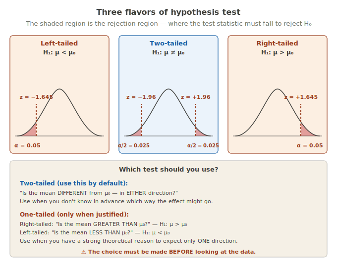
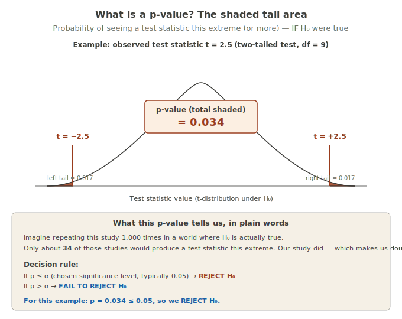
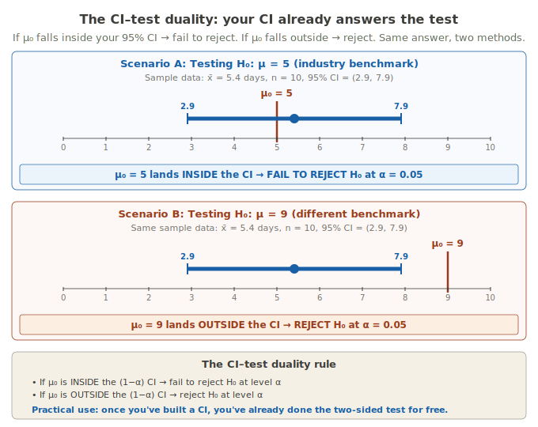
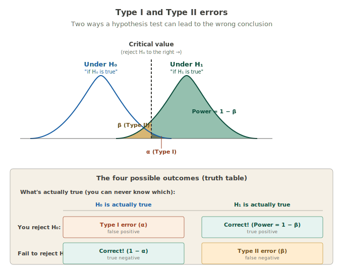

# Hypothesis Testing

!!! abstract "Hypothesis Testing in one card"
    A **hypothesis test** is a procedure for deciding whether your sample data is consistent with a specific claim about a population — or whether the data is so inconsistent with that claim that you have to reject it.
    
    **Expert version:** A hypothesis test computes a test statistic from sample data, compares it to a reference distribution (assuming H₀ is true), and yields a p-value used to decide whether to reject H₀ at a pre-specified significance level α.
    
    **Analogy:** When a friend says "I'm 5 minutes away" and they arrive 45 minutes later, you stop believing the claim. A hypothesis test does the same thing with data: it specifies how surprising the data has to be before you stop believing a claim.
    
    **Plain words:** You have a claim. You have data. The test tells you whether the data is consistent with the claim — or so far off that the claim probably isn't true.

---

## Why hypothesis tests exist

A confidence interval (from the previous card) gives you a *range* of plausible values for a population parameter. That's useful. But sometimes you have a **specific value** in mind — like an industry benchmark, a manufacturer's claim, a prior research finding — and you want to ask: "is our sample consistent with that value, or does it provide evidence against it?"

That's what a hypothesis test does. It's the formal procedure for taking a claim about a population, comparing it against sample data, and making a decision: keep believing the claim, or reject it.

!!! important "The good news"
    Hypothesis testing uses the **same underlying machinery** as confidence intervals — sampling distributions, standard errors, critical values, t-distributions. If you understood the CI card, you're already 80% of the way there. We're just using the same tools for a different question.

---

## The texting analogy: how rejection works in everyday life

Skip the textbook for a minute. Here's the everyday version of what hypothesis testing does.

A friend texts you: **"I'm 5 minutes away!"** That's their claim.

You wait. Time passes. At what point do you decide they weren't really 5 minutes away?

- **They arrive in 4 minutes:** ✓ Fine. They said 5; 4 is close enough.
- **They arrive in 8 minutes:** ✓ Annoying, but still believable.
- **They arrive in 15 minutes:** 🤔 Now you're questioning the claim.
- **They arrive in 45 minutes:** ✗ They were not 5 minutes away when they said that.
- **They arrive in 2 hours:** ✗✗ Obviously not.

Somewhere between "8 minutes" and "2 hours," there's a threshold. Below it: you still buy the claim. Past it: you decide they were wrong (or lying). That threshold and everything beyond it is your **rejection region** for the claim "5 minutes away."

You've been doing this kind of reasoning your whole life. You take in data (actual wait time), compare it to a claim, and at some point decide the data is *too inconsistent* with the claim to keep believing it. That decision happens automatically — you don't write down formulas — but the logic is identical to a formal hypothesis test.

### Translate that to stats vocabulary

Stats just gives this everyday process a more rigorous structure and some specific names. Here's the dictionary, with each term re-explained right next to it:

| Everyday version | Stats version (and what the jargon means) |
|------------------|--------------------------------------------|
| The claim ("5 min away") | **Null hypothesis (H₀)** — the specific claim about a population value being tested |
| Your friend's actual arrival time | **Test statistic** — a single number from your sample that summarizes how the data compares to the claim |
| The threshold past which you stop believing | **Critical value** — the boundary number |
| All wait times past the threshold | **Rejection region** — the set of test statistic values that would lead you to reject H₀ |
| How strict you are about evidence | **Significance level (α)** — typically 0.05; the proportion of times you're willing to wrongly reject a true claim |

If your test statistic lands **inside** the rejection region → reject H₀.
If your test statistic stays **outside** the rejection region → fail to reject H₀.

---

## The 6-step framework

Every formal hypothesis test follows the same six steps. Once you learn this skeleton, every test you'll ever do is just a variation on it.

1. **State your hypotheses** — H₀ (the claim) and H₁ (what you'd believe instead)
2. **Choose your significance level α** — typically 0.05
3. **Compute your test statistic** — a single number summarizing your data
4. **Find the p-value** — how rare is your test statistic if H₀ is true?
5. **Make a decision** — reject H₀, or fail to reject H₀
6. **Interpret in context** — write the conclusion in plain language

Let's walk through each step.

---

## Step 1: State your hypotheses

Every test has two hypotheses:

- **Null hypothesis (H₀)** — the claim being tested. Usually a statement of "no effect," "no difference," or a specific benchmark value. Example: H₀: μ = 5 (the average hospital stay is 5 days).
- **Alternative hypothesis (H₁ or Hₐ)** — what you'd believe instead if you rejected H₀. Example: H₁: μ ≠ 5 (the average stay is *not* 5 days).

The alternative hypothesis can take three forms, corresponding to three types of tests.

### The vocabulary you need: "rejection region"

Before looking at the image of the three test types, nail down this one word: **rejection region**.

> The rejection region is the part of the distribution where, if your test statistic lands there, you reject the null hypothesis.

That's the whole definition. It's a zone on a number line. The location and shape of that zone is what makes a test one-tailed or two-tailed.

#### How big is the rejection region?

The size is set by your chosen significance level (α):

- α = 0.05 → rejection region is **5% of the distribution** (the 5% farthest from center)
- α = 0.01 → rejection region is **1% of the distribution** (only the 1% most extreme)
- α = 0.10 → rejection region is **10% of the distribution** (a larger, easier-to-hit target)

Smaller α → smaller rejection region → harder to reject → you're demanding stronger evidence.

#### Where is the rejection region located?

This is where one-tailed vs two-tailed actually differs. The location of the rejection region tells you what KIND of difference you're looking for:

- All on the **left side** of the distribution → left-tailed test (looking for evidence the mean is LESS than μ₀)
- All on the **right side** → right-tailed test (looking for evidence the mean is GREATER than μ₀)
- **Split between both sides** → two-tailed test (looking for evidence the mean is DIFFERENT from μ₀ in any direction)

The image below shows all three scenarios. The **coral shaded zones** are rejection regions. The **dashed lines** are the critical values — the boundaries where the rejection region begins.

Notice what's the same in all three panels: the **null distribution** (the bell curve) and the **total rejection probability** (α = 0.05 in each case — same total shaded area). What's different is just **where** the rejection region sits on the number line.

That's it. That's all the difference between one-tailed and two-tailed tests: where you've drawn the rejection region, which depends entirely on what H₁ you wrote down before looking at the data.

!!! danger "The choice must be made BEFORE looking at the data"
    Picking a one-tailed test AFTER seeing that your data goes in a particular direction is a form of data dredging. It artificially inflates your chance of rejecting H₀ and isn't honest research practice. Default to two-tailed unless you have a strong theoretical reason to expect deviation in only one direction.

---

## Step 2: Choose your significance level (α)

The **significance level α** (the chosen threshold for rejecting H₀) is the probability you're willing to wrongly reject a true H₀. Typical values:

- **α = 0.05** — the default in most fields. "I'll wrongly reject true claims 5% of the time."
- **α = 0.01** — stricter. Used when false alarms are costly (e.g., approving a drug).
- **α = 0.10** — more lenient. Used in exploratory work or pilot studies.

You **must** pick α before looking at the data. Changing α after seeing your result is academic dishonesty.

---

## Step 3: Compute your test statistic

The **test statistic** (a single number summarizing how your sample compares to H₀) for a one-sample t-test for a mean is:

$$t = \frac{\bar{x} - \mu_0}{s / \sqrt{n}}$$

Where:

- $\bar{x}$ = sample mean (your point estimate)
- $\mu_0$ = the hypothesized value from H₀
- $s$ = sample standard deviation
- $n$ = sample size
- $s/\sqrt{n}$ = standard error (the variability of $\bar{x}$ from sample to sample)

In plain words: the test statistic measures **how many standard errors away from μ₀** your sample mean is. A big test statistic means your sample mean is far from μ₀. A small test statistic means it's close.

---

## Step 4: Find the p-value

This is the step where students lose their footing more than any other. Take it slowly.

### What a p-value actually is

The **p-value** answers ONE specific question:

> **"If the null hypothesis really were true, how often would I see data this extreme — or more extreme — just by random chance?"**

That's it. The p-value is the answer to that question, expressed as a probability (a number between 0 and 1).

- **SMALL p-value (like 0.01 = 1%)** → "This kind of data would be very rare if H₀ were true. Maybe H₀ ISN'T true." → reject H₀.
- **LARGE p-value (like 0.40 = 40%)** → "This kind of data happens all the time even when H₀ is true. No reason to doubt H₀." → fail to reject.

### Use the texting analogy again

Your friend says "I'm 5 minutes away" (H₀). 

**Scenario A: They show up in 45 minutes.**

- Question: If "5 minutes away" were really true, how often would the actual arrival time be 45 minutes or more?
- Answer: Very rarely. Maybe 1% of the time (extreme traffic, etc.).
- p-value ≈ 0.01 — **small** → reject the claim.

**Scenario B: They show up in 7 minutes.**

- Question: If "5 minutes away" were really true, how often would the actual arrival time be 7 minutes or more?
- Answer: Pretty often. Traffic varies. Maybe 40% of the time.
- p-value ≈ 0.40 — **large** → no reason to doubt the claim.

### The visual: p-value is the shaded tail area

The image shows what the p-value looks like geometrically. The **bell curve** is the null distribution (the shape your test statistic would follow IF H₀ were true). The **vertical red lines** are the observed test statistic. The **shaded tails** beyond the observed value — that area IS the p-value.

### Common student misconceptions

The p-value is **NOT**:

- ❌ The probability that H₀ is true. (No — it ASSUMES H₀ is true and asks how surprising the data is.)
- ❌ The probability that your data is "due to chance." (No — it's the probability of seeing data this extreme IF chance alone were operating.)
- ❌ The probability that you'll be wrong if you reject. (Related but not the same.)

The p-value IS just one thing: the answer to "how often would I see data this extreme if H₀ were true?"

---

## Step 5: Make a decision

Compare your p-value to α:

- If **p ≤ α** → **REJECT H₀.** Your data is too extreme to be plausibly consistent with the null.
- If **p > α** → **FAIL TO REJECT H₀.** Your data is consistent with what we'd expect under H₀.

!!! danger "Fail to reject ≠ Accept H₀"
    "Failing to reject" the null hypothesis is NOT the same as "proving" or "accepting" it. It just means you didn't have enough evidence to reject it.
    
    **Courtroom analogy:** A criminal verdict of "not guilty" doesn't mean the defendant is *innocent* — it means the prosecution didn't meet the burden of proof. The defendant might still be guilty; we just couldn't prove it beyond a reasonable doubt.
    
    Same idea here. "Fail to reject H₀" means "we couldn't prove H₀ wrong" — NOT "we proved H₀ right." The truth remains unknown.

---

## Step 6: Interpret in context

The hardest skill in statistics isn't the math — it's writing a conclusion a non-statistician can understand. A good interpretation has three parts:

1. **The decision** (reject or fail to reject) in plain language.
2. **The connection to the real-world question.**
3. **A statement about uncertainty.**

A bad interpretation says: "We rejected H₀."

A good interpretation says: "We have strong evidence that the average hospital length of stay differs from the industry benchmark of 5 days (p = 0.034)."

A bad interpretation says: "We accept H₀."

A good interpretation says: "We do not have sufficient evidence to conclude that the average length of stay differs from 5 days (p = 0.73). Note that this does not mean the true mean is exactly 5 — only that our data is consistent with that value."

---

## Worked example: hospital length of stay

Let's run a complete one-sample t-test using the dataset from earlier cards.

### Setup

**Research question:** Does our hospital's average length of stay differ from the industry benchmark of 5 days?

**Data:** 10 patients with lengths of stay (days): 2, 3, 3, 4, 4, 5, 5, 6, 8, 14.

- $\bar{x} = 5.4$ days
- $s = 3.47$ days
- $n = 10$
- Industry benchmark: $\mu_0 = 5$ days

### Step 1: Hypotheses

We have no prior reason to expect our hospital is shorter OR longer — we just want to know if it's *different* from the benchmark. So we use a two-tailed test:

- **H₀:** μ = 5 (average length of stay equals the industry benchmark)
- **H₁:** μ ≠ 5 (average length of stay differs from the industry benchmark)

### Step 2: Significance level

We'll use the standard **α = 0.05.**

### Step 3: Test statistic

$$t = \frac{\bar{x} - \mu_0}{s / \sqrt{n}} = \frac{5.4 - 5}{3.47 / \sqrt{10}} = \frac{0.4}{1.10} \approx 0.36$$

Our sample mean is only 0.36 standard errors away from the benchmark. That's barely off-center — the data is very consistent with H₀ so far.

### Step 4: p-value

With df = n − 1 = 9 and a two-tailed test:

$$p\text{-value} = P(|T| \geq 0.36 \text{ given } df = 9) \approx 0.727$$

In plain words: if H₀ were true, we'd see a test statistic this far from zero about **73% of the time** by random chance alone. Our t = 0.36 is completely unremarkable under H₀.

### Step 5: Decision

p = 0.727 > α = 0.05 → **fail to reject H₀.**

### Step 6: Interpretation

**Textbook version:** We fail to reject H₀ at α = 0.05 (t = 0.36, df = 9, p = 0.727). Our sample data is consistent with the industry benchmark.

**Plain language version:** Our 10 patients averaged 5.4 days, slightly above the industry benchmark of 5 days. But this difference is small enough that it could easily be due to random sampling — it doesn't provide convincing evidence that our hospital's true average is different from 5. We can't conclude that we're doing better or worse than the benchmark.

!!! tip "Why this conclusion matters"
    With n = 10, we have very little statistical power. A true difference of 1 or 2 days might exist and we'd still fail to reject. The conclusion isn't "the hospital is at the benchmark" — it's "this small sample doesn't tell us either way." If we cared about this question, we'd need a larger sample.

---

## The CI–test duality

Here's the beautiful payoff: **a confidence interval and a two-sided hypothesis test answer the same question.**

If you've built a 95% confidence interval, you've already done a two-sided hypothesis test at α = 0.05 — for free. You just have to look at whether μ₀ is inside the CI.

### Why this works

A 95% CI gives you the range of values that are "plausible" for the population parameter, given your data. If your hypothesized μ₀ is in that range, your data is consistent with that value of μ₀ — so you fail to reject. If μ₀ is outside the range, your data is NOT consistent with that value — so you reject.

In our worked example, our 95% CI was (2.9, 7.9). The benchmark μ₀ = 5 falls inside that interval. So we fail to reject H₀: μ = 5 — same conclusion as the formal t-test gave us.

If the benchmark had been μ₀ = 9 (outside the CI), we would have rejected. No t-statistic needed.

!!! important "Practical implication"
    When you read a paper that reports a CI, you can perform any two-sided test at the matching α level just by looking at the CI. Want to test H₀: μ = 0? Check whether 0 is in the CI. Want to test H₀: μ = 10? Check whether 10 is in the CI.
    
    This is why journals increasingly favor reporting CIs over reporting p-values alone — the CI carries more information and lets readers do their own tests.

---

## Type I and Type II errors

A hypothesis test ends with one of two decisions: reject H₀, or fail to reject H₀. But "the test made a decision" isn't the same as "the test was right." There are **two different ways** a test can be wrong — with different consequences. Confusing the two is one of the most common stats mistakes.

### Textbook version

When you run a hypothesis test, four outcomes are possible depending on (a) what your test decided and (b) what's actually true in the population (which you'll never know for sure):

- **Type I error (α)** — rejecting H₀ when H₀ is actually true. Also called a *false positive*. The rate is controlled directly by your chosen significance level α (typically 0.05).
- **Type II error (β)** — failing to reject H₀ when H₁ is actually true. Also called a *false negative*. The rate depends on your sample size, the true effect size, your α, and population variability σ.
- **Power (1 − β)** — the probability of correctly rejecting H₀ when H₁ is actually true. The "hit rate" of your test. By convention, researchers aim for power ≥ 0.80.

### Plain language version: medical screening tests

You already saw this framework in [Probability](../track-2-probability/ch5-probability.md) under sensitivity and specificity. Type I and Type II errors are the same idea applied to hypothesis testing — just with different vocabulary attached.

Imagine a screening test for a disease.

- **H₀ (the "null hypothesis"):** "This patient does NOT have the disease."
- **H₁ (the "alternative"):** "This patient DOES have the disease."
- **Test says POSITIVE** = reject H₀ (we have evidence of disease)
- **Test says NEGATIVE** = fail to reject H₀ (no evidence of disease)

Now the four scenarios, mapped to what we already know:

| Truth | Test says... | Outcome | Probability |
|-------|--------------|---------|-------------|
| Has disease | POSITIVE | ✓ Correct — the test caught it | Power = 1 − β (this is **sensitivity**) |
| No disease | NEGATIVE | ✓ Correct — clean negative | 1 − α (this is **specificity**) |
| **No disease** | **POSITIVE** | ✗ **Type I error** (false positive) | α |
| **Has disease** | **NEGATIVE** | ✗ **Type II error** (false negative) | β |

So **specificity = 1 − α** and **sensitivity = 1 − β**. The framework you already learned for screening tests IS the hypothesis testing framework.

### Which error is worse? Depends on context.

| Setting | Which error is worse | Why |
|---------|---------------------|-----|
| Cancer screening | Type II (missed cases) | Missing cancer can cost a life. False positives sort out with follow-up tests. |
| Court trial ("innocent until proven guilty") | Type I (wrongful conviction) | Convicting an innocent person is widely viewed as worse than letting a guilty person go free. |
| Approving a new drug | Type I (approving a bad drug) | Exposes millions to a possibly harmful drug if you got it wrong. |
| Spam filter | Depends on you | Type I = real emails in spam folder. Type II = spam in inbox. |

The traditional statistical convention: **fix α first** (usually at 0.05 — limiting Type I errors to 5%), then **choose a large enough sample size to make β small** (target power ≥ 0.80 — limiting Type II errors to 20%).

### The α–β tradeoff — and why sample size matters

Here's the inconvenient truth: **for a fixed sample size, you cannot reduce α and β simultaneously.** Tightening one loosens the other.

A smoke detector intuition makes this concrete:

- Make the detector MORE sensitive → fewer missed fires (smaller β), but more false alarms from burnt toast (bigger α)
- Make it LESS sensitive → fewer false alarms (smaller α), but more missed fires (bigger β)

The ONLY way to reduce both error rates at the same time is to **collect more data.** That's why power analysis — calculating how big a sample you need to achieve a target power — is essential for serious research. We cover it in the next card.

---

## Other tests you'll see (preview)

The one-sample t-test we just walked through is the simplest case. Real research uses variations:

### Two-sample t-test

Compares the means of **two independent groups** (e.g., treatment vs. control).

- **H₀:** μ₁ = μ₂ (the two group means are equal)
- **H₁:** μ₁ ≠ μ₂ (they differ)

Same framework. Different formula for the test statistic. Covered in detail in a later card.

### Paired t-test

Compares two measurements on the **same subjects** (e.g., before vs. after treatment).

- **H₀:** μ_difference = 0 (no average change)
- **H₁:** μ_difference ≠ 0 (there is a change)

Essentially a one-sample t-test applied to the *differences* between paired measurements.

### One-sample z-test for a proportion

Tests whether a sample proportion (e.g., the fraction of patients who recovered) differs from a hypothesized value.

- **H₀:** p = p₀
- **H₁:** p ≠ p₀

Same framework, different test statistic, uses z instead of t.

---

## Doing this in JMP

JMP makes one-sample t-tests easy. The path:

1. Open your data file in JMP
2. **Analyze → Distribution**
3. Cast your continuous variable into the **Y, Columns** box
4. Click **OK**
5. In the output, click the **red triangle** next to the variable name
6. Choose **Test Mean**
7. In the dialog, enter the hypothesized value (your μ₀, e.g., 5) and click **OK**

JMP will display:

- Test statistic (t)
- Degrees of freedom (df)
- Three p-values: two-tailed and both one-tailed versions

Use the **two-tailed p-value** by default, unless you specifically chose a one-tailed test in advance.

!!! warning "JMP shows all three p-values"
    JMP outputs the p-value for testing μ ≠ μ₀ (two-tailed), μ > μ₀ (right-tailed), AND μ < μ₀ (left-tailed) — all three at once. Pick the one matching the test you decided on **before** looking at the data. Picking the smallest of the three after the fact is academic dishonesty.

### To copy output for a report

Right-click on the test output table → **Copy Graph**. Paste into your document.

---

## Why students miss this

A running list of where students lose points on hypothesis testing questions:

## Why everything has to be decided beforehand (a priori)

You'll see this phrase a lot: **"a priori"** (Latin for "from before"). It means decided BEFORE looking at the data. Every choice in a hypothesis test — your α level, your test direction (one-tailed vs two-tailed), your specific hypothesized value μ₀ — has to be made a priori. The reason isn't stuffy formality. It's that picking these AFTER seeing the data literally breaks the math of the p-value.

### Why this matters: the p-value depends on what you committed to in advance

When we say "p = 0.034 means 3.4% chance of seeing data this extreme under H₀," we're making a specific claim about long-run behavior:

> Out of many studies done with the **exact procedure you committed to**, only 3.4% would yield a result this extreme by chance alone.

That number only holds if you committed to the procedure beforehand. If you change the procedure AFTER seeing the data, you've changed the math, and your "p-value" isn't actually a p-value anymore. It's a number that looks like one but doesn't carry the same meaning.

### The most common ways students (and researchers) cheat

#### 1. Picking the direction of a one-tailed test after looking at the data

Suppose you run a study and observe that the sample mean is GREATER than μ₀. You think: "I'll do a right-tailed test, since the data already suggests μ > μ₀." Your p-value comes out to 0.04 — significant!

But here's what really happened: you implicitly checked BOTH directions. You looked at the data, and IF the mean had been LESS than μ₀ you would have done a left-tailed test instead. By doing this, your true Type I error rate is more like 10%, not 5% — because you were giving yourself two shots at significance. **The "p = 0.04" you reported is not a real p-value.** It's a number that's been inflated by your post-hoc choice.

Default to **two-tailed**. It's the honest version of "I'm not sure which direction the effect goes."

#### 2. Changing α after seeing the data

You committed to α = 0.05. Your p-value comes out to 0.08. You think: "Well, 0.08 is close to 0.05. Let me just say α = 0.10 was my threshold all along." Now p = 0.08 is "significant."

That's not how it works. **α is your threshold of evidence committed to in advance.** Changing it after the fact isn't analysis — it's storytelling.

#### 3. Running multiple tests and reporting only the significant ones

You run 20 tests on the same dataset, each with α = 0.05. Just by chance, you'd expect about 1 of them to come up "significant" even if none of the effects are real (because 1 in 20 = 5%). If you only report the one that "worked," you're not being honest about the procedure that generated it.

This is called **p-hacking**, and it's responsible for a huge amount of misleading research in the social sciences. The fix: when running multiple tests, you have to **adjust your α downward** (e.g., Bonferroni correction: α/k where k is the number of tests).

#### 4. Adding/dropping subjects until you get significance

Some researchers continue collecting data, peeking at the p-value as they go, and stop when p crosses below 0.05. Or they drop "outlier" subjects to nudge p below the threshold. Both are forms of cheating. The p-value math assumes a fixed sample size committed to in advance.

### The plain-language version

It's the same as picking the rules of a coin-flip bet AFTER seeing the flip.

- "I'll pay you $10 if heads." (committed beforehand) → fair game, 50/50 outcome.
- "I'll pay you $10 if... [looks at coin] ... uh, if tails." → not a real bet. You've cheated.

The p-value is meaningful BECAUSE you committed to the procedure beforehand. If you didn't, the number doesn't mean what we say it means. It's been corrupted by your knowledge of the data.

### How honest researchers handle this

- **Pre-register your study.** Submit your hypotheses, α, sample size, and analysis plan to a public registry (like OSF.io or ClinicalTrials.gov) BEFORE collecting data. Then everyone knows you committed in advance.
- **Default to two-tailed** unless you have a documented theoretical reason for one-tailed.
- **Report ALL the tests you ran**, not just the significant ones.
- **Decide sample size in advance** using power analysis (covered in the next card).
- **Be explicit** in your methods section about what was planned a priori vs. what was exploratory.

!!! tip "What if you do exploratory analysis?"
    Exploratory analysis is fine — and important — but it has to be labeled honestly. If you ran 20 tests and found one "significant" relationship, that's an interesting hypothesis to test in a *future* study with proper a priori planning. It is NOT a confirmed finding. The phrase that goes with exploratory results is "hypothesis-generating," not "hypothesis-confirming."

!!! danger "Misinterpreting the p-value"
    The p-value is NOT the probability that H₀ is true. It's the probability of seeing data this extreme IF H₀ were true. Different question. Different answer.

!!! danger "Saying 'we accept H₀' or 'we proved H₀'"
    You never "accept" the null. You only "fail to reject" it. Absence of evidence ≠ evidence of absence.

!!! danger "Confusing statistical significance with practical significance"
    With a large enough sample, you can get p < 0.05 for a tiny, meaningless effect. Statistical significance just means "the effect is detectable" — not that it's important. Always report the effect size and CI alongside the p-value.

!!! warning "Confusing Type I and Type II errors"
    Type I = false positive = rejecting a true H₀. Type II = false negative = failing to reject a false H₀. They're different. The first is controlled by α; the second depends on sample size and effect size.

!!! warning "Forgetting that p-value depends on direction"
    For a two-tailed test, you double the one-tailed p-value. For a one-tailed test, you don't. Mixing these up will give you wrong conclusions.

!!! warning "Reading JMP's three p-values wrong"
    JMP shows two-tailed, right-tailed, and left-tailed p-values all at once. Use the one corresponding to the test you decided on in advance.

---

## Quick vocabulary recap

| Term | Symbol | Meaning |
|------|--------|---------|
| Null hypothesis | H₀ | The claim being tested (usually "no effect" or a specific benchmark) |
| Alternative hypothesis | H₁ or Hₐ | What you'd believe instead if you rejected H₀ |
| Test statistic | t, z, F, χ² | A single number summarizing how your sample compares to H₀ |
| Significance level | α | The chosen threshold for rejection; typically 0.05 |
| p-value | p | Probability of seeing data this extreme (or more) if H₀ were true |
| Critical value | t*, z* | The boundary value at which you'd reject H₀ |
| Rejection region | — | Range of test statistic values that lead to rejecting H₀ |
| Type I error | α | False positive: rejecting a true H₀ |
| Type II error | β | False negative: failing to reject a false H₀ |
| Power | 1 − β | Probability of correctly rejecting a false H₀ |
| One-tailed test | — | Tests for difference in one direction only |
| Two-tailed test | — | Tests for difference in either direction (default) |
| Degrees of freedom | df | For one-sample t: n − 1 |

---

## What's next

The next card — **[Power & Sample Size](ch8-power-sample-size.md)** — answers the natural follow-up question: "how big should my sample be?" That ties together CIs, hypothesis tests, and the α–β tradeoff we just introduced into a single decision-making framework for designing studies.

[Next: Power & Sample Size →](ch8-power-sample-size.md)