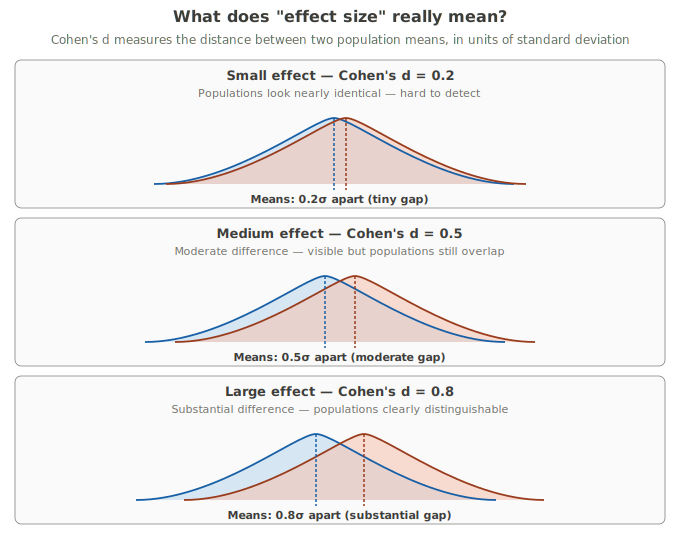
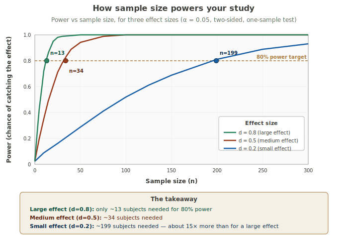

# Power & Sample Size

!!! abstract "The three-layer take"
    **Expert:** Statistical power is the probability of correctly rejecting H₀ when H₁ is true — of catching a real effect when there is one. Power depends on four things: the true effect size, the sample size, the significance level (α), and the variability in the data (σ). *A priori* power analysis answers the practical question every researcher faces before collecting data: **how many subjects do I need to give myself a fair chance of finding what I'm looking for?**

    **Analogy:** Imagine fishing in a pond that may or may not have fish. If you fish for five minutes and catch nothing, you don't know whether the pond is empty or you just didn't fish long enough. Power tells you, *before* you start fishing, how long you'd need to fish to feel confident about either answer.

    **Plain words:** If something real is going on, what are the chances your study actually catches it? And how many people do you need to study to make those chances reasonable?

---

## The trap we just walked into

In the previous card, we ran a one-sample t-test on hospital length-of-stay. We had ten patients, an average stay of 5.4 days, and a benchmark of 5 days. The t-statistic came out to 0.36, the p-value to 0.73, and we failed to reject H₀: μ = 5.

The natural thing to say at that point is *"so the hospital's average really is 5 days."* But that's not what the test said. The test said *"we don't have enough evidence to claim the hospital's average is different from 5."* Those two statements sound similar. They aren't.

Here are two possibilities the test cannot tell apart:

- **Option A:** The hospital really is averaging 5 days. We correctly didn't reject H₀.
- **Option B:** The hospital really is averaging 6 days — or 7, or some meaningfully different number. We missed it because our sample was tiny. That's a **Type II error** — failing to detect a real effect.

The whole point of power analysis is to handle this trap before it gets us. We ask, *before* running the study: if the truth is Option B, what's the chance our study will catch it? If the answer is "10%," that's a study that was always going to come back inconclusive. If the answer is "80%," we have a real shot.

!!! warning "Fail to reject ≠ accept H₀"
    A non-significant p-value never proves H₀ is true. It only says you didn't have enough evidence to rule it out. With small samples, you can fail to reject H₀ even when H₀ is dramatically wrong. Power analysis is how you guard against this.

---

## Fishing for an effect

Picture yourself fishing in a pond. You're trying to figure out if there are fish in there. There might be. There might not be. You can't see through the water.

You fish for five minutes. Nothing bites. What do you conclude?

Nothing, honestly. Maybe the pond is empty. Maybe there are fish and you just didn't fish long enough. Five minutes wasn't a fair test.

Now imagine fishing for two hours. Still nothing. *That's* more telling — but only if you know fish should have been biting in two hours. If they're shy lake trout that only bite at dusk, two hours in the morning still tells you nothing.

So before you ever cast a line, you should ask:

- **How many fish are in there, roughly?** (effect size)
- **How long am I willing to fish?** (sample size)
- **How sure do I want to be?** (power)
- **How quickly do these fish typically bite?** (variability)

A study is a fishing trip. Statistical power is the probability that your fishing trip catches fish *if* the fish are really there. Sample size is your fishing time. The fewer fish in the pond, the longer you need to fish to be confident you'd have caught one.

That's the whole concept. The rest is just math.

---

## Power, formally — and the four levers you can twist

**Power = 1 − β = the probability of rejecting H₀ when H₁ is actually true.**

In plain English: *if there really is an effect, what fraction of studies of this design and size would catch it?*

The conventional target is 80%. That's not a rule of nature — it's a tradition that traces back to Jacob Cohen in the 1960s. Going higher (90%, 95%) means a more confident study but a much larger sample. Going lower (70%, 60%) means more studies will miss real effects.

Four things determine power. You control some of them.

**1. Sample size (n).** Bigger n → more power. This is the main lever when you're trying to fix an underpowered study. Bigger samples make sample averages more precise, which makes it easier to tell whether the average really differs from the null value.

**2. Effect size (d).** Bigger true effect → more power. This is mostly determined by reality, not by you. You can't make the effect bigger by wishing.

**3. Significance level (α).** A higher α (say, 0.10 instead of 0.05) raises power. The catch: it also raises your Type I error rate. So this is a tradeoff, not a free lunch.

**4. Variability (σ).** Less noise → more power. Sometimes you can reduce noise by measuring more carefully, using more sensitive instruments, or designing the study to control for individual differences (paired or matched designs).

Among these, **effect size is the biggest mover.** Cutting your effect size in half quadruples the sample size you need. That's not a typo. We'll see it visually in a moment.

---

## Effect size — what "small," "medium," and "large" really mean

This is the concept students struggle with the most, so we're going to come back to it more than once.

**Cohen's d** is the standardized difference between two means:

```
d = (mean₁ − mean₀) / σ
```

The denominator — the standard deviation — is what makes d *standardized*. It puts effect sizes onto a common scale regardless of what units the original measurements used. A blood pressure study and an education study can both report a Cohen's d of 0.5 even though one is measuring mmHg and the other is measuring test scores.

Why does this matter? Because raw differences are misleading on their own.

**Example.** Drug A lowers systolic blood pressure by 5 mmHg on average. Drug B lowers it by 2 mmHg. Drug A sounds clearly better.

But suppose Drug A was tested in a population where individual responses vary wildly (σ = 10 mmHg), while Drug B was tested in a much more uniform population (σ = 4 mmHg). Now:

- Drug A: d = 5 / 10 = 0.5
- Drug B: d = 2 / 4 = 0.5

Same standardized effect size. They're equally good at moving the typical person *relative to the noise around that person*.

### Cohen's conventions

In 1988, Jacob Cohen proposed the following labels:

- **d = 0.2 → small effect**
- **d = 0.5 → medium effect**
- **d = 0.8 → large effect**

Here's what those actually look like:



The takeaway from the picture: a *small* effect means the two populations look almost identical. A *large* effect means they're clearly different — but they still overlap. Effect sizes in real research are almost never "no overlap whatsoever." That's a fantasy. Real effects are subtle, and detecting them is hard.

!!! warning "Don't blindly use Cohen's labels"
    Cohen's 0.2 / 0.5 / 0.8 thresholds are pattern-recognition shortcuts, not judgments of importance. A "small" effect can be a public health victory; a "large" effect can be clinically meaningless. To decide whether an effect actually matters, you need to think about your specific context — not the label.

    Four questions are worth working through every time:

    - **Who is exposed, and how many of them?** A 1% reduction in cardiovascular events across 30 million older adults prevents 300,000 events a year. The per-person effect size is tiny (d ≈ 0.1, "very small"), but at the population scale it is enormous. Public health lives in this territory — the d looks small precisely because the intervention is spread across a population that's mostly fine. The number of people who would have been harmed without it is not small.

    - **What's the alternative?** Effect sizes are always implicit comparisons. A cancer drug that extends median survival by two months registers as a modest d, but the comparison is dying sooner. For the patient and the family, those two months are not modest. Pick your reference point carefully before you label an effect as big or small.

    - **What does the intervention cost — in money, time, or risk?** A free intervention with a small effect can outperform an expensive one with a large effect, once you weigh benefit against cost. The same is true for harm: a small benefit doesn't justify a large side-effect profile, and a small harm doesn't disqualify a large benefit. Cohen's labels are silent on this trade.

    - **Is the outcome reversible?** Small effects on permanent outcomes (death, neurological damage, organ failure, lifetime earnings) carry more weight than large effects on transient ones (a week of mild symptoms, a passing inconvenience). Permanence amplifies the stakes regardless of the d.

    Always report both the standardized d AND the raw difference in the original units — and tie the discussion to at least one of these four questions. d alone is a number without a context.

---

## How power grows with sample size

Once you fix an effect size, power increases as your sample grows — but not linearly. It's an S-shape. Slow at first, steep in the middle, then leveling off as it approaches 1.



A few things worth noticing.

**The curves climb at wildly different rates.** A large effect (green) reaches 80% power with just thirteen subjects. A small effect (blue) takes about 200. That's roughly 15× more subjects — for the same statistical task, just because the thing we're looking for is harder to see.

**Diminishing returns at the top.** Each curve flattens as it approaches power = 1. Going from 80% to 90% power costs substantially more subjects than going from 70% to 80%. This is why 80% became the conventional sweet spot — it's where the cost-per-percentage-point of power starts climbing fast.

**80% is a convention, not a law.** Some fields (regulatory drug trials, for instance) routinely demand 90%. Some exploratory work tolerates 70%. The choice depends on the consequences of missing a real effect versus the cost of a larger study.

---

## Calculating sample size by hand

For a one-sample test, the basic formula (using the normal approximation) is:

```
n = ((z_{α/2} + z_β) / d)²
```

Where:

- z_{α/2} is the critical z-value for your significance level (1.96 for two-sided α = 0.05)
- z_β is the z-value for your desired power (0.842 for 80% power)
- d is Cohen's d — the standardized effect size you want to detect

For a two-sample independent test, the formula doubles:

```
n_per_group = 2 × ((z_{α/2} + z_β) / d)²
```

!!! example "Worked example: how many patients did we actually need?"
    Back to the hospital length-of-stay study. With n = 10, we failed to reject H₀: μ = 5. Now we ask the planning question: *if the hospital really IS averaging 6 days — one day longer than the benchmark — what sample size would have given us a fair chance of catching that?*

    **Step 1: Compute the effect size.**

    True difference: Δ = 1 day  
    Population SD (using sample s as estimate): σ ≈ 3 days  
    Cohen's d = 1 / 3 ≈ 0.33

    That's a small-to-medium effect. Already that tells us something — a small effect needs a respectable sample.

    **Step 2: Plug into the formula.**

    For α = 0.05 (two-sided) and 80% power:

    ```
    n = ((1.96 + 0.842) / 0.33)²
    n = (2.802 / 0.33)²
    n = (8.491)²
    n = 72.1
    ```

    **Step 3: Round up.**

    You always round *up* when computing required sample sizes, never down. Rounding down would put you below your target power.

    **n = 73.**

    To have an 80% chance of detecting a 1-day difference from the benchmark, we'd need to study at least 73 patients. We had 10. No wonder we missed it.

!!! note "What this DOESN'T mean"
    The new calculation doesn't mean the hospital truly differs from the benchmark. It only means: *if* the hospital differed by one day, we wouldn't have had the statistical horsepower to notice. The non-significant result from the previous card stands. What's changed is our understanding of what that result was capable of telling us.

---

## The calculator

Calculating by hand is good for understanding what's happening. Calculating in practice is annoying. So here's a calculator that does it for you. Change anything and the answer updates live.

<style>
.bsb-calc * { box-sizing: border-box; }
.bsb-calc { font-family: inherit; max-width: 100%; padding: 1rem 0; color: #3D3D3A; }
.bsb-calc-section { margin-bottom: 1.5rem; }
.bsb-calc-section-title { font-size: 12px; font-weight: 700; color: #73726c; margin: 0 0 10px; text-transform: uppercase; letter-spacing: 0.06em; }
.bsb-calc-fields { display: grid; grid-template-columns: 1fr 1fr; gap: 14px; }
.bsb-field-label { font-size: 13px; color: #73726c; display: block; margin-bottom: 6px; }
.bsb-mode-toggle { display: inline-flex; gap: 4px; margin-bottom: 12px; }
.bsb-mode-btn { padding: 6px 14px; border: 1px solid #D3D1C7; background: transparent; border-radius: 8px; font-size: 13px; cursor: pointer; color: #73726c; font-family: inherit; }
.bsb-mode-btn--active { background: #F5F0E6; color: #3D3D3A; font-weight: 600; border-color: #A87B3D; }
.bsb-preset-row { margin-top: 10px; display: flex; gap: 6px; flex-wrap: wrap; align-items: center; font-size: 12px; }
.bsb-preset-btn { padding: 4px 10px; border: 1px solid #D3D1C7; background: transparent; border-radius: 12px; font-size: 12px; cursor: pointer; color: #73726c; font-family: inherit; }
.bsb-preset-btn:hover { background: #F5F0E6; color: #3D3D3A; }
.bsb-result-card { padding: 1.25rem 1.5rem; background: #F5F0E6; border-radius: 12px; border: 1px solid #E0D5BC; }
.bsb-result-n { font-size: 44px; font-weight: 700; color: #185FA5; line-height: 1.1; }
.bsb-result-label { font-size: 13px; color: #73726c; margin-top: 4px; }
.bsb-result-interp { font-size: 14px; line-height: 1.7; margin-top: 14px; color: #3D3D3A; }
.bsb-formula-box { margin-top: 14px; padding: 12px 14px; background: #FFFFFF; border-radius: 8px; font-family: 'SFMono-Regular', Consolas, 'Liberation Mono', Menlo, monospace; font-size: 12px; color: #5F5E5A; line-height: 1.7; white-space: pre-wrap; border: 1px solid #E8E6DD; }
.bsb-effect-badge { display: inline-block; padding: 2px 10px; border-radius: 12px; font-size: 12px; font-weight: 600; margin-left: 10px; vertical-align: middle; }
.bsb-hidden { display: none !important; }
.bsb-calc input[type=number] { width: 110px; padding: 6px 10px; border: 1px solid #D3D1C7; border-radius: 6px; font-size: 14px; font-family: inherit; background: #FFFFFF; color: #3D3D3A; }
.bsb-calc-fields input[type=number] { width: 100%; }
.bsb-calc select { width: 100%; padding: 6px 10px; border: 1px solid #D3D1C7; border-radius: 6px; font-size: 14px; font-family: inherit; background: #FFFFFF; color: #3D3D3A; }
</style>

<div class="bsb-calc" id="bsb-calc-root">
  <div class="bsb-calc-section">
    <div class="bsb-calc-section-title">Effect size</div>
    <div class="bsb-mode-toggle">
      <button type="button" class="bsb-mode-btn bsb-mode-btn--active" data-mode="d">Cohen's d</button>
      <button type="button" class="bsb-mode-btn" data-mode="raw">Raw values (Δ and σ)</button>
    </div>
    <div id="bsb-d-fields">
      <div style="display: flex; align-items: center; gap: 10px;">
        <input type="number" id="bsb-d-input" value="0.5" step="0.05" min="0.01" max="3">
        <span id="bsb-effect-badge" class="bsb-effect-badge"></span>
      </div>
      <div class="bsb-preset-row">
        <span style="color: #9A9994;">Try:</span>
        <button type="button" class="bsb-preset-btn" data-preset="0.2">small (d=0.2)</button>
        <button type="button" class="bsb-preset-btn" data-preset="0.5">medium (d=0.5)</button>
        <button type="button" class="bsb-preset-btn" data-preset="0.8">large (d=0.8)</button>
        <button type="button" class="bsb-preset-btn" data-preset="0.33">hospital LOS (d≈0.33)</button>
      </div>
    </div>
    <div id="bsb-raw-fields" class="bsb-hidden">
      <div class="bsb-calc-fields">
        <div>
          <label class="bsb-field-label">True mean difference (Δ)</label>
          <input type="number" id="bsb-diff-input" value="1" step="0.1">
        </div>
        <div>
          <label class="bsb-field-label">Standard deviation (σ)</label>
          <input type="number" id="bsb-sd-input" value="3" step="0.1" min="0.01">
        </div>
      </div>
      <div style="font-size: 12px; color: #9A9994; margin-top: 8px;">Cohen's d will be computed as |Δ| / σ.</div>
    </div>
  </div>

  <div class="bsb-calc-section">
    <div class="bsb-calc-section-title">Test parameters</div>
    <div class="bsb-calc-fields">
      <div>
        <label class="bsb-field-label">Significance level (α)</label>
        <select id="bsb-alpha-input">
          <option value="0.10">0.10</option>
          <option value="0.05" selected>0.05</option>
          <option value="0.01">0.01</option>
        </select>
      </div>
      <div>
        <label class="bsb-field-label">Desired power (1 − β)</label>
        <select id="bsb-power-input">
          <option value="0.80" selected>0.80</option>
          <option value="0.85">0.85</option>
          <option value="0.90">0.90</option>
          <option value="0.95">0.95</option>
        </select>
      </div>
      <div>
        <label class="bsb-field-label">Test direction</label>
        <select id="bsb-direction-input">
          <option value="two">Two-sided</option>
          <option value="one">One-sided</option>
        </select>
      </div>
      <div>
        <label class="bsb-field-label">Test type</label>
        <select id="bsb-type-input">
          <option value="one-sample">One-sample</option>
          <option value="two-sample">Two-sample independent</option>
          <option value="paired">Paired</option>
        </select>
      </div>
    </div>
  </div>

  <div class="bsb-result-card">
    <div class="bsb-result-n" id="bsb-result-n">—</div>
    <div class="bsb-result-label" id="bsb-result-label">subjects</div>
    <div class="bsb-result-interp" id="bsb-result-interp"></div>
    <div class="bsb-formula-box" id="bsb-result-formula"></div>
  </div>
</div>

<script>
(function() {
  let mode = 'd';
  const root = document.getElementById('bsb-calc-root');
  if (!root) return;
  function $(id) { return document.getElementById(id); }

  function setMode(m) {
    mode = m;
    root.querySelectorAll('.bsb-mode-btn').forEach(b => b.classList.toggle('bsb-mode-btn--active', b.dataset.mode === m));
    $('bsb-d-fields').classList.toggle('bsb-hidden', m !== 'd');
    $('bsb-raw-fields').classList.toggle('bsb-hidden', m !== 'raw');
    recalc();
  }

  function setD(val) { setMode('d'); $('bsb-d-input').value = val; recalc(); }

  function getD() {
    if (mode === 'd') return parseFloat($('bsb-d-input').value);
    const diff = parseFloat($('bsb-diff-input').value);
    const sd = parseFloat($('bsb-sd-input').value);
    return Math.abs(diff) / sd;
  }

  function effectLabel(d) {
    const a = Math.abs(d);
    if (a < 0.2) return { txt: 'very small', bg: '#F1EFE8', fg: '#444441' };
    if (a < 0.5) return { txt: 'small', bg: '#E6F1FB', fg: '#0C447C' };
    if (a < 0.8) return { txt: 'medium', bg: '#FAEEDA', fg: '#854F0B' };
    return { txt: 'large', bg: '#FAECE7', fg: '#712B13' };
  }

  function normInv(p) {
    if (p === 0.5) return 0;
    if (p < 0.5) return -normInv(1 - p);
    const t = Math.sqrt(-2 * Math.log(1 - p));
    const c = [2.515517, 0.802853, 0.010328];
    const dd = [1.432788, 0.189269, 0.001308];
    return t - (c[0] + c[1]*t + c[2]*t*t) / (1 + dd[0]*t + dd[1]*t*t + dd[2]*t*t*t);
  }

  function recalc() {
    const d = getD();
    if (isNaN(d) || d <= 0) {
      $('bsb-result-n').textContent = '—';
      $('bsb-result-label').textContent = 'enter a valid effect size';
      $('bsb-result-interp').textContent = '';
      $('bsb-result-formula').textContent = '';
      $('bsb-effect-badge').textContent = '';
      return;
    }
    const lab = effectLabel(d);
    const badge = $('bsb-effect-badge');
    badge.textContent = lab.txt;
    badge.style.background = lab.bg;
    badge.style.color = lab.fg;

    const alpha = parseFloat($('bsb-alpha-input').value);
    const power = parseFloat($('bsb-power-input').value);
    const direction = $('bsb-direction-input').value;
    const testType = $('bsb-type-input').value;

    const zAlpha = direction === 'two' ? normInv(1 - alpha/2) : normInv(1 - alpha);
    const zBeta = normInv(power);

    const inner = Math.pow((zAlpha + zBeta) / d, 2);
    const perGroup = testType === 'two-sample';
    const nExact = perGroup ? 2 * inner : inner;
    const n = Math.ceil(nExact);

    $('bsb-result-n').textContent = n;
    $('bsb-result-label').textContent = perGroup ? `subjects per group (${n*2} total)` : 'subjects';

    const dDisp = d.toFixed(2);
    const dirText = direction === 'two' ? 'two-sided' : 'one-sided';
    const interp = perGroup
      ? `To have a ${Math.round(power*100)}% chance of detecting an effect of size d = ${dDisp} at α = ${alpha} (${dirText}), you'd need at least ${n} subjects per group — ${n*2} total.`
      : `To have a ${Math.round(power*100)}% chance of detecting an effect of size d = ${dDisp} at α = ${alpha} (${dirText}), you'd need at least ${n} subjects.`;
    $('bsb-result-interp').textContent = interp;

    const zSym = direction === 'two' ? 'z(α/2)' : 'z(α)';
    const fmla = perGroup
      ? `n_per_group = 2 × ((${zSym} + z(β)) / d)²\n            = 2 × ((${zAlpha.toFixed(3)} + ${zBeta.toFixed(3)}) / ${dDisp})²\n            = 2 × ${inner.toFixed(2)}\n            = ${nExact.toFixed(2)}  →  round up to ${n}`
      : `n = ((${zSym} + z(β)) / d)²\n  = ((${zAlpha.toFixed(3)} + ${zBeta.toFixed(3)}) / ${dDisp})²\n  = (${((zAlpha + zBeta) / d).toFixed(3)})²\n  = ${nExact.toFixed(2)}  →  round up to ${n}`;
    $('bsb-result-formula').textContent = fmla;
  }

  root.querySelectorAll('.bsb-mode-btn').forEach(btn => {
    btn.addEventListener('click', function() { setMode(this.dataset.mode); });
  });
  root.querySelectorAll('.bsb-preset-btn').forEach(btn => {
    btn.addEventListener('click', function() { setD(parseFloat(this.dataset.preset)); });
  });
  ['bsb-d-input', 'bsb-diff-input', 'bsb-sd-input'].forEach(id => {
    const el = $(id); if (el) el.addEventListener('input', recalc);
  });
  ['bsb-alpha-input', 'bsb-power-input', 'bsb-direction-input', 'bsb-type-input'].forEach(id => {
    const el = $(id); if (el) el.addEventListener('change', recalc);
  });

  recalc();
})();
</script>

Things worth playing with:

- **Set d very small (like 0.1).** Watch n explode. This is why detecting subtle effects requires huge studies.
- **Hold d at 0.5 and crank power from 80% to 95%.** Notice how much extra sample size that costs.
- **Switch from two-sided to one-sided.** Power goes up — but only use this if you genuinely have a directional hypothesis chosen *before* looking at the data.
- **Switch from one-sample to two-sample.** Required n roughly doubles. This is why two-group studies are bigger.

The calculator uses the normal approximation, which is what most online calculators use. For very small samples, software like G*Power that uses the exact non-central t-distribution will report slightly larger required n (usually 1–3 subjects). For teaching and planning, the approximation is fine.

---

## Effect size, one more time — because this one matters

You've now seen it from three angles: the side-by-side curves picture, the power-vs-n picture, and the calculator. Change effect size and *everything* changes. Of the four levers, this is the only one whose change can swing required sample size by an order of magnitude.

But here's the trap students fall into: they reverse-engineer the effect size.

**The wrong way:** *"I want to use 30 subjects. What's the effect size I'd need to assume to get 80% power with n = 30?"* Then they plug in that effect size, regardless of whether it's realistic.

**The right way:** *"What effect size would actually matter in my field? Now what n do I need to detect it?"* Then they live with the consequences — go find more funding, or accept that the study is exploratory and not designed to detect modest effects.

The effect size you're powering for should come from one of three places:

1. **Prior research.** What have similar studies actually found? Use a published estimate, not a hopeful guess.
2. **The smallest effect that would change practice.** If a one-day difference in length-of-stay wouldn't change how the hospital operates, don't power for it. If it would, do.
3. **Pilot data.** A small preliminary study can give you a rough estimate of the effect and the variability. But pilot estimates are noisy — be cautious.

The reason students struggle with effect size isn't because the math is hard. It's because the math forces a substantive judgment about your field that the math doesn't make for you. The number you put in is a claim about what's meaningful. That claim should be defensible before you start collecting data.

---

## Reading power statements in research papers

A well-written methods section will contain a paragraph that looks roughly like this:

> *A sample size of 64 per group was calculated to provide 80% power to detect a difference of 5 mmHg in systolic blood pressure between the intervention and control groups, assuming a within-group standard deviation of 10 mmHg, at a two-sided α of 0.05.*

When you read one of these, check four things:

1. **Was the calculation *a priori*?** Done before the data were collected, ideally pre-registered. If it was done after the data came in, that's a red flag.
2. **Is the effect size defensible?** Did they pull "5 mmHg" from prior literature, clinical importance, or thin air? The further from "thin air," the more credible the study.
3. **Are α and power conventional?** Usually 0.05 and 0.80. Departures should be justified.
4. **Did they actually enroll the planned n?** A study designed for 64 per group that only enrolls 30 per group has different (lower) power, even if the original calculation was sound.

!!! danger "Post-hoc power is a stats sin"
    After a study finishes, some researchers report "achieved power" by plugging the *observed* effect size into the power formula. This is statistically meaningless. The observed effect size is itself uncertain, and post-hoc power is mathematically tied to the p-value — a non-significant result will always have low post-hoc power, by definition. It tells you nothing the p-value didn't already.

    The legitimate alternative when a study comes back null: compute a confidence interval for the effect and report the range of effects the study can rule out. That's informative.

---

## Why students miss this

**"Fail to reject = there's no effect."** This is the trap the whole card is built around. A non-significant result with low power is a non-answer, not a confirmation of H₀.

**Choosing effect size based on what you HOPE to find.** Powering for d = 0.8 because that's what makes your sample size feel manageable doesn't make a d = 0.8 effect actually exist. If the truth is d = 0.3, you'll just miss it and waste the study.

**Calculating n at desired power, then enrolling fewer because of cost.** This defeats the entire point of the calculation. If you can't afford the calculated n, either re-power for a larger effect (and accept that smaller effects will be invisible) or redesign the study.

**Conflating Cohen's d categories with practical importance.** A "small" effect can be enormously important at the public health scale, and a "large" effect can be clinically trivial. Cohen's labels are about how *visible* the effect is statistically, not about how *important* it is in the world.

**Doing post-hoc power instead of confidence intervals.** A null result with low post-hoc power is the same thing as a null result. A CI on the effect is what tells you something new.

**Forgetting that power applies to ONE specific effect size.** When you say a study has 80% power, what you mean is *80% power to detect a specific effect size at a specific α.* It is not "80% power" in some general sense. Smaller effects than the one you powered for are still likely to be missed.

---

## Vocabulary recap

**Power** — The probability that your study will correctly reject H₀ when H₁ is actually true. Plain words: the chance of catching a real effect if one is there.

**β (beta)** — The probability of a Type II error: failing to detect a real effect. Power = 1 − β.

**Effect size** — A measure of how big a difference is. Cohen's d is the most common standardized version: (mean difference) / σ.

**Cohen's conventions** — d = 0.2 (small), d = 0.5 (medium), d = 0.8 (large). Guidelines, not laws.

**A priori power analysis** — Calculating required sample size *before* the study, based on the effect size you want to detect. The proper way.

**Post-hoc power analysis** — Calculating power *after* a study using the observed effect. Generally not useful. Use a confidence interval on the effect instead.

**Underpowered study** — A study with too few subjects to reliably detect the effect of interest. Likely to produce inconclusive results regardless of whether the effect exists.

**Critical value** — The z-value (or t-value) corresponding to your chosen α or β. For two-sided α = 0.05: z = 1.96. For 80% power: z = 0.842.
