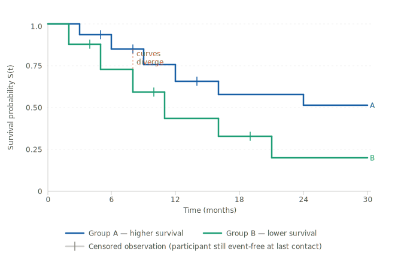

# Survival Analysis

!!! abstract "The three-layer take"

    **Expert:** Survival analysis models time-to-event outcomes using the survival function S(t), estimated nonparametrically via the Kaplan-Meier (KM) estimator, compared across groups with the log-rank test, and adjusted for covariates with Cox proportional hazards regression — a semiparametric model that estimates hazard ratios (exp(β)) while leaving the baseline hazard h₀(t) unspecified.

    **Textbook:** A family of methods for analyzing data where the outcome is *how long until something happens* — readmission, relapse, death, recovery. Two complications make ordinary methods fail: some participants never experience the event during the study window (*censoring*), and time-to-event data is almost never bell-shaped. KM, the log-rank test, and Cox PH all handle these complications correctly.

    **Plain language:** Imagine you're tracking 200 heart failure patients after discharge. Some are readmitted at 3 months, some at 11, some are still doing fine when the study ends. Survival analysis is the toolkit that makes sense of that messy, incomplete timing data — and lets you ask "did the patients who got the care coordination program stay out of the hospital longer than those who got usual care?"

---

## The core problem: time-to-event data

Most statistics you've studied ask *whether* something happened. Survival analysis asks *when*.

The outcome variable is **time to event** — where "event" can be readmission, disease onset, death, recovery, or any clearly defined endpoint. This creates two complications that ordinary methods can't handle:

**1. Censoring.** Some participants never experience the event during the study window. In our readmission trial, maybe 40 patients are still event-free when funding runs out after 20 months. They didn't avoid readmission forever — they just ran out of observation time. Dropping them would bias your results toward the patients who *did* get readmitted. Survival analysis keeps them in the analysis up to their last known observation, then lets them go. A censored participant contributes real information: "this person was event-free for at least X months."

**2. Non-normal distributions.** Time-to-event data is almost always right-skewed — many events cluster early, with a long tail of late ones. T-tests and linear regression assume normality. They don't apply here.

!!! note "Also called"
    Time-to-event analysis · Event history analysis · Failure time analysis (engineering contexts)

---

## The survival function S(t)

The survival function answers: *what fraction of the population has NOT yet experienced the event by time t?*

**Formula:**

$$S(t) = P(T > t)$$

**Plain-language translation:** S(t) is the probability that a randomly selected person avoids the event past time t. Greek letter T (capital) represents the true (unknown) event time for a person; little t is the specific time point you're asking about.

**Reading a specific value:** If S(12) = 0.72 in the care coordination group, that means 72% of patients in that group are still readmission-free at month 12. The other 28% have already been readmitted.

**Two rules the curve always follows:**

- S(0) = 1.0 — everyone is event-free at the start
- S(t) can only stay flat or decrease — it never goes back up, because people can't "un-experience" an event

A steep early drop means many events happen soon after follow-up begins. A long flat tail means a subset of the population takes much longer to experience the event — or never does during observation.

!!! warning "Why students miss this"
    S(t) is the probability of *not* having the event. Students frequently flip this and read S(12) = 0.72 as "72% were readmitted by month 12." That's 1 − S(12) = 0.28, the *cumulative incidence* — the opposite of survival probability.

---

## Kaplan-Meier estimation

The **Kaplan-Meier (KM) estimator** is the standard nonparametric method for estimating S(t) directly from your data. It produces the step-function curves you'll see in almost every clinical paper with a time-to-event outcome.

**How it works:** Every time an event occurs, the survival probability drops by a calculated amount. Between events, the curve stays flat. Censored observations (tick marks on the curve) contribute to the denominator up to their censoring time, then drop out.

**Formula at each event time t_i:**

$$\hat{S}(t_i) = \hat{S}(t_{i-1}) \times \left(1 - \frac{d_i}{n_i}\right)$$

where d_i (delta, lowercase) = number of events at time t_i, and n_i = number of people still at risk (event-free and uncensored) just before t_i.

**Plain-language translation:** At each moment when someone experiences the event, multiply the *previous* survival probability by the fraction of people still at risk who *didn't* have the event. Carry that updated probability forward until the next event. The curve can only move when an event actually occurs — hence the staircase shape.

**A worked step:** Suppose 85 patients are still at risk at month 4, and 6 experience readmission. The survival probability drops by a factor of (1 − 6/85) = 0.929. If S(t) was 1.0 just before, it becomes 0.929 after month 4.

The care coordination group (solid, terracotta) stays higher throughout follow-up — meaning more patients remain readmission-free at every time point. The usual-care group (dashed, teal) drops more steeply. The tick marks on each curve are censored observations: patients who were still event-free at their last contact. The dashed reference lines show that the **median survival time** for the usual-care group — the month at which S(t) first crosses 0.50 — is approximately month 8.

To test whether the separation between curves is statistically significant, use the log-rank test.

---

## The log-rank test

The **log-rank test** is a hypothesis test for comparing survival curves between two or more groups.

- **H₀:** The survival functions are the same in both groups — the curves are identical in the population
- **H₁:** At least one group has a different survival experience

**How it works:** At each event time, the test compares the *observed* number of events in each group to the *expected* number under H₀ (that is, if group membership didn't matter). Those observed-vs-expected discrepancies are summed across all event times and converted to a chi-square (χ²) statistic. The p-value tells you whether the discrepancies are larger than chance would produce.

**When to use it:** Any time you have two or more groups and want to know if their time-to-event outcomes differ, *without* adjusting for other variables. The log-rank test gives you the p-value. The KM plot gives you the picture.

**Limitation:** The log-rank test tells you *whether* the groups differ — not by *how much*. For magnitude, you need a hazard ratio.

!!! warning "Why students miss this"
    A non-significant log-rank test does not mean survival is identical in both groups. It means your sample didn't provide enough evidence to rule out chance — especially a problem with small samples where even large visual gaps between KM curves can fail to reach significance.

---

## The hazard ratio

Before Cox regression, you need the concept it produces: the **hazard ratio (HR)**.

**Hazard h(t)** (lowercase h) is the instantaneous rate at which events are occurring among people still at risk at time t. Think of it as "how dangerous is this moment, given you've survived to reach it?" It's not a probability — it can exceed 1.0 if events are happening very fast.

**Hazard ratio:** The ratio of the hazard in one group to the hazard in another.

| HR value | What it means |
|----------|---------------|
| HR = 1.0 | No difference in event rate between groups |
| HR = 0.5 | Treatment group has half the event rate of the control group |
| HR = 2.0 | Treatment group has twice the event rate of the control group |

**Plain-language translation:** In our readmission trial, an HR of 0.60 for care coordination means that at any given moment during follow-up, patients in the care coordination group are being readmitted at 60% the rate of usual-care patients — a 40% reduction in readmission risk at any point in time.

!!! warning "Direction matters — students flip this constantly"
    HR < 1 means the group in the numerator has a *lower* event rate (protective). HR > 1 means a *higher* event rate (harmful). Always confirm which group is in the numerator before interpreting. A "significant" HR of 0.4 is good news if your group is in the numerator — the event rate dropped by 60%.

---

## Cox proportional hazards regression

The **Cox proportional hazards model** (Cox PH) is to survival analysis what multiple linear regression is to continuous outcomes. It lets you examine the relationship between time-to-event and multiple predictors simultaneously — testing care coordination while adjusting for age, comorbidities, and prior admission history all at once.

**The model:**

$$h(t) = h_0(t) \times e^{\beta_1 X_1 + \beta_2 X_2 + \cdots + \beta_k X_k}$$

**Plain-language translation:** Your hazard at time t equals the baseline hazard h₀(t) — the event rate for someone with all predictors at zero — multiplied by an exponential function of your predictor variables. The β (beta) coefficients work like regression coefficients: each one tells you how much the log-hazard changes per one-unit increase in that predictor.

What's unusual: you never actually estimate h₀(t). Cox PH leaves it unspecified — that's what "semiparametric" means. You get valid hazard ratios without needing to know the underlying event rate shape.

**What you report from Cox output:**

| Output | What it is |
|--------|-----------|
| exp(β) | Hazard ratio for that predictor, adjusted for all others |
| 95% CI for exp(β) | If it contains 1.0, the predictor is not significant |
| p-value | For each coefficient |

**The proportional hazards assumption:** The ratio of hazards between any two individuals must stay *constant* over time. If Group A has twice the hazard of Group B at month 1, it must have twice the hazard at month 12. This assumption can be violated — KM curves that cross each other are a visual red flag that it likely is.

---

## JMP walkthrough

### Kaplan-Meier curves and log-rank test

**Analyze → Reliability/Survival → Survival**

1. Cast your **time variable** into the *Time to Event* role
2. Cast your **event indicator** (1 = event occurred, 0 = censored) into the *Censor Code* role — then click the censor code button and specify which value means censored (typically 0)
3. Cast your **grouping variable** (care coordination vs. usual care) into the *Grouping* role
4. Click **OK**

JMP produces KM curves for each group with censoring tick marks, plus a "Tests Between Groups" table. The **Log-Rank** row in that table gives your test statistic and p-value. Median survival time for each group appears directly on the output panel.

!!! tip "What to look for"
    Check whether the curves cross. If they do, the proportional hazards assumption is likely violated, and the log-rank p-value should be interpreted with caution — the test assumes a *consistent* direction of difference across all time points.

### Cox proportional hazards regression

**Analyze → Reliability/Survival → Fit Proportional Hazards**

1. Cast your **time variable** into *Time to Event*
2. Cast your **event indicator** into *Censor Code* (specify censored value as above)
3. Cast covariates into *Add* for continuous predictors, or use the Construct Model Effects area for categorical predictors
4. Click **Run**

JMP produces parameter estimates (the β coefficients), hazard ratios (exp(β)) with 95% CIs, and a likelihood ratio test for overall model fit.

**To check the proportional hazards assumption:** After running the model, click the **red triangle** next to "Fit Proportional Hazards" and select **Diagnostics → Log-Minus-Log Plot**. Parallel lines = assumption holds. Crossing lines = assumption is violated.

!!! tip "What to look for"
    The column labeled "Hazard Ratio" in JMP's output is exp(β) — that's your primary interpretable result, not the raw β coefficient. A hazard ratio of 0.61 means a 39% reduction in the event rate per unit increase in that predictor, adjusted for all others.

---

## Why students miss this

**Censoring ≠ dropout.** A censored observation is not a lost participant — it's real information. That person was event-free up to their censoring time. Removing censored participants from the analysis systematically underestimates survival time and biases every result. KM and Cox handle censoring correctly *if* you code the censor indicator properly: typically 1 = event occurred, 0 = censored. Swapping those codes in JMP silently produces backwards results — JMP will not warn you.

**The hazard ratio direction.** exp(β) < 1 means the predictor *reduces* the hazard. Students frequently read a significant HR of 0.4 as bad news because it's less than 1. Check your reference group, check which group is in the numerator, then interpret.

**Crossed KM curves are a red flag.** If your KM curves for two groups cross, the proportional hazards assumption is likely violated — Cox PH is the wrong model for that comparison. JMP will still run it. You have to catch it yourself with the log-minus-log plot.

**Median survival, not mean.** Because survival data is right-skewed, the mean survival time is misleading. Always report *median* survival time — the point where S(t) first reaches 0.50. If the KM curve never drops below 0.50 during your follow-up period, the median is undefined for your data: more than half the sample was still event-free at the end of observation.

**S(t) is the probability of NOT having the event.** A curve that drops steeply represents poor survival — not good survival. Students who memorize "higher is better" without understanding the direction occasionally misread the results for studies where the "event" is something positive (like recovery).

**The event indicator coding matters.** In JMP's Reliability/Survival platform, the Censor Code dialog asks you which value represents *censored* (not the event). If your data uses 1 = censored and 0 = event — a less common but valid coding — make sure you specify 1 as the censored value. Failing to specify this correctly inverts your entire analysis.

---

## Vocabulary

| Term | Plain-language definition |
|------|--------------------------|
| **Time-to-event** | The outcome variable — how long until the event occurred |
| **Event** | The defined endpoint: readmission, death, relapse, recovery |
| **Censoring** | The event didn't occur during observation; the participant's last known event-free time is recorded |
| **S(t)** | Survival function — probability of not yet having the event by time t |
| **Kaplan-Meier (KM)** | Nonparametric method for estimating S(t) from data; produces step-function curves |
| **Median survival** | Time at which S(t) first reaches 0.50; undefined if the curve never drops that far |
| **Log-rank test** | Chi-square test comparing KM curves between groups |
| **Hazard h(t)** | Instantaneous event rate among those still at risk at time t |
| **Hazard ratio (HR)** | Ratio of hazards between two groups; exp(β) in Cox output |
| **Cox PH** | Semiparametric regression model for time-to-event outcomes with covariates |
| **Proportional hazards assumption** | The HR between groups remains constant over time — required for valid Cox PH results |
| **Actuarial method** | An older alternative to KM for estimating survival; uses fixed time intervals rather than event times. Sullivan Ch. 11 covers both; KM is standard in modern practice |

---

## What's next

- [Decision Helper: Which Hypothesis Test?](../../decision-helpers/which-test/) — where survival tests fit in the broader testing landscape
- [Multivariable Methods](../ch9-multivariable/) — Cox PH is survival analysis's answer to multiple regression; the logic of adjustment carries directly over
- [Quantifying Disease](../../track-1-studies-and-data/ch3-disease-extent/) — hazard ratios connect back to relative risk and odds ratios from Ch. 3
