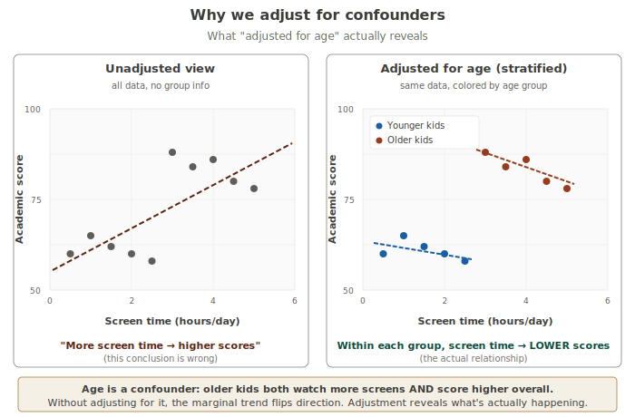
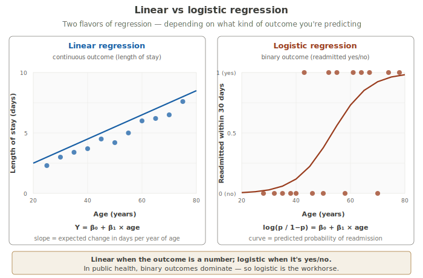
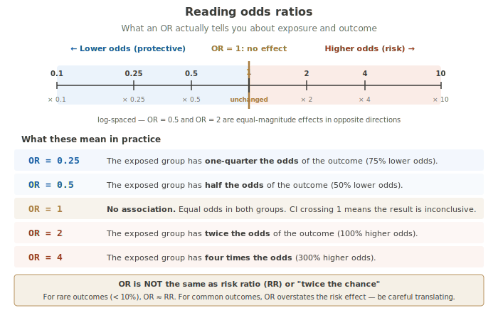

# Multivariable Methods

!!! abstract "The three-layer take"
    **Expert:** Multivariable regression models extend univariate inference by simultaneously estimating the effect of multiple predictors on an outcome. Linear regression (Y = β₀ + Σβᵢxᵢ + ε) handles continuous outcomes; logistic regression (logit(p) = β₀ + Σβᵢxᵢ) handles binary outcomes through the logit link function. Coefficients represent partial effects — the change in outcome (or log-odds) associated with a one-unit change in the predictor, conditional on all other predictors held constant. Adjustment controls for *measured* confounders but does not eliminate residual confounding from unmeasured variables, and the resulting estimates retain associational rather than causal status absent additional design.

    **Textbook:** Multivariable regression lets you study the relationship between an outcome and several predictors at the same time. There are two main flavors: **linear regression** when the outcome is continuous (length of stay, blood pressure, cost), and **logistic regression** when the outcome is binary (readmitted/not, diseased/not). Both work by estimating coefficients (one for each predictor) that tell you how much the outcome changes for each unit increase in that predictor, *while holding the other predictors fixed*. This "holding constant" property is what makes multivariable regression so useful: it lets you isolate the effect of one variable while controlling for the others. Logistic regression reports its results as odds ratios — multiplicative changes in the odds of the outcome per unit of the predictor.

    **Plain language:** Real-world health outcomes depend on lots of things at once — age, weight, sex, what diseases you have, what medications you take. If you only look at one variable at a time, you'll get fooled by all the OTHER stuff that came along for the ride. Multivariable regression is the tool that lets you ask "yes, but what's the effect of THIS variable, after we account for the others?" The most common version in public health is logistic regression, which works on yes/no outcomes and gives you answers as odds ratios — numbers like "2.3" meaning "this group has 2.3 times the odds of the outcome compared to the reference group."

---

## Why one variable isn't enough

Earlier cards looked at one predictor at a time. Two-sample t-tests compare two groups. Simple regression fits one outcome to one variable. These are honest tools for honest questions — *when* there's really only one variable that matters.

In real public health work, there's almost never only one variable that matters. People differ in dozens of ways at the same time. If you study a single variable in isolation, you're not just missing the other variables — you might be getting *misled* by them.

Here's a famous version of the problem. Imagine you're studying the relationship between children's screen time and academic performance. You collect data, plot it, and find a clear pattern:



Without thinking about age, you'd conclude: *more screen time → higher scores*. Maybe screens are educational after all? Time to celebrate.

But look at what happens when you split the data by age group. Within younger kids, more screen time → LOWER scores. Within older kids, same thing — more screen time → LOWER scores. Within every age group, screen time has a negative effect. The positive pattern in the combined data was an illusion created by mixing groups.

What happened? **Age is a confounder.** Older kids have more screens AND tend to score higher (for reasons that have nothing to do with screens — they're older, they've been in school longer, the test was age-normed badly, whatever). When you ignore age, you smear those two things together and get a pattern that goes the wrong way.

This is called **Simpson's paradox** when the direction actually reverses, and **confounding** more generally when a third variable distorts a relationship — by changing its magnitude, its direction, or both.

The fix is multivariable regression. You include age as a predictor alongside screen time, and the regression untangles them. The screen time coefficient now estimates the effect of screen time *holding age constant* — which is what you actually wanted to know.

---

## Multiple linear regression

Multiple linear regression is the simplest extension of the regression line you've already seen. Where simple regression fits:

```
Y = β₀ + β₁X + ε
```

Multiple regression fits:

```
Y = β₀ + β₁X₁ + β₂X₂ + β₃X₃ + ... + ε
```

If the equation looks intimidating, here's the plain version: **a regression model is a recipe.** It takes in a few facts about someone and gives back a predicted outcome. The Greek letters are placeholders for "how much each ingredient contributes."

Translating the symbols:

- **Y** is what we're trying to predict — the outcome. In our example, length of stay in days.
- **β₀** (beta-zero) is the starting point — the prediction when every variable is zero. Like a base price before any add-ons.
- **β₁, β₂, β₃, ...** are the weights — how much each variable contributes to the prediction. Each one is a number the regression calculates *from the data*.
- **X₁, X₂, X₃, ...** are the actual values for a given patient — their age, their severity score, whether they have diabetes.
- **ε** (epsilon) is the error term — the random variation the model can't explain. We rarely write about this directly; it's just there to acknowledge that real data isn't perfectly predictable.

### A worked example

Suppose your fitted model for hospital length-of-stay is:

```
LOS = 1.2 + 0.04(age) + 0.75(severity) + 1.8(diabetes)
```

Think of this as a checklist:

- **Every patient starts at 1.2 days.** That's the intercept — a baseline before any factors are added.
- **Add 0.04 days for each year of age.** A 60-year-old contributes 0.04 × 60 = 2.4 days.
- **Add 0.75 days for each severity point.** A patient at severity 5 contributes 0.75 × 5 = 3.75 days.
- **Add 1.8 days if the patient has diabetes** (diabetes is coded 1 for yes, 0 for no). A diabetic contributes 1.8 × 1 = 1.8 days; a non-diabetic contributes 1.8 × 0 = 0.

Now plug in a specific patient. A 60-year-old with severity 5 and diabetes:

```
LOS = 1.2 + 0.04(60) + 0.75(5) + 1.8(1)
    = 1.2 + 2.4 + 3.75 + 1.8
    = 9.15 days
```

Compare to a younger, healthier, non-diabetic patient — age 30, severity 2, no diabetes:

```
LOS = 1.2 + 0.04(30) + 0.75(2) + 1.8(0)
    = 1.2 + 1.2 + 1.5 + 0
    = 3.9 days
```

The model predicts the second patient stays about 5 days less than the first. That difference is the result of *all* the differences between them being added up — older AND sicker AND diabetic.

### Reading the coefficients

- **Intercept (1.2):** the model's predicted LOS for a hypothetical patient with age = 0, severity = 0, no diabetes. Not realistic — just an anchor that makes the math work.
- **β_age = 0.04:** each additional year of age is associated with about 0.04 more days of stay, *holding severity and diabetes constant*.
- **β_severity = 0.75:** each additional severity point is associated with 0.75 more days of stay, holding age and diabetes constant.
- **β_diabetes = 1.8:** diabetic patients stay 1.8 days longer than non-diabetic patients, holding age and severity constant.

The crucial phrase is *holding the other variables constant*. That's what multivariable regression buys you over running separate single-variable analyses. Each coefficient is a **partial effect** — the effect of moving that one variable while everything else stays put.

---

## What "adjusted for" actually means

This is the single concept students misunderstand most often. So slow down here.

When a paper says "the effect of diabetes on length of stay, adjusted for age and severity, was 1.8 days," what does that actually mean?

It does NOT mean: *"we removed the effect of age and severity from the data."*

It does NOT mean: *"we filtered out patients with diabetes."*

It does NOT mean: *"we accounted for everything."*

What it MEANS is this: *compare two patients who are identical on age and severity, but one has diabetes and one doesn't. The expected difference in their length of stay is 1.8 days.*

The adjustment isn't removing anything. It's a **comparison between hypothetical matched patients**. The regression coefficient estimates the average difference between two otherwise-identical people who differ only on the variable of interest.

This is why multivariable regression is useful and also why it has real limits. It works perfectly when the variables you've adjusted for are the ones that actually need adjusting. It can't help with variables you didn't measure — those still slip past the test. We'll come back to that.

!!! tip "A useful way to phrase it in a paper"
    Instead of writing *"after adjusting for age, diabetes increased LOS by 1.8 days,"* try *"among patients of similar age and severity, those with diabetes stayed an average of 1.8 days longer."* The second version describes what the math actually does.

---

## Logistic regression

Linear regression assumes the outcome is a continuous number. Things break down when the outcome is binary — yes/no, alive/dead, readmitted/not.

Why does it break? Because you can predict negative probabilities or probabilities above 1. If your model says "predicted probability of readmission = 1.4," that's nonsense. Probabilities have to live between 0 and 1.

Logistic regression solves this by fitting an S-shaped curve that smoothly approaches 0 at one end and 1 at the other. No matter how extreme your predictors get, the predicted probability stays in the valid range.



The model is:

```
log(p / (1−p)) = β₀ + β₁X₁ + β₂X₂ + ...
```

Compare this to the linear regression equation. The right side is exactly the same recipe structure — a baseline plus a weighted contribution from each variable. What changed is the LEFT side: instead of predicting Y directly, logistic regression predicts the **log-odds** of the outcome.

Why the weird transformation? Because probabilities have a problem.

When the outcome is binary, what we really want to predict is the *probability* that the outcome equals 1 (readmitted, infected, dead — whatever yes/no question you started with). Probabilities are bounded: they can only live between 0 and 1. But the recipe on the right side could in principle add up to anything — 5, −2, 100, −0.3. If we tried to predict probability directly, the model would happily output a "predicted probability" of 1.4, which is nonsense.

The log-odds transformation fixes this. Log-odds can be any number, from negative infinity to positive infinity. So the linear recipe and the log-odds scale match up perfectly: the equation can produce any number, and that number is always a valid log-odds. After the model is fit, we can always translate back from log-odds to a sensible 0-to-1 probability — software does this for us when it draws the S-curve.

**You don't actually work with log-odds when reading results.** When you exponentiate a logistic regression coefficient (raise the number *e* to that power), you get an **odds ratio** — the multiplicative change in the odds of the outcome per one-unit increase in that variable. That's the number you'll see in published papers, the number you'll quote in a report, and the number that actually answers the practical question:  *"How much does diabetes change the odds of readmission, holding age and severity constant?"*

The log-odds equation is the engine. The odds ratios are the dashboard you actually read.

---

## Odds ratios

In logistic regression, the most useful way to report a coefficient is to **exponentiate it**:

```
OR = exp(β)
```

That exp(β) is the **odds ratio** — the multiplicative change in the odds of the outcome for a one-unit change in the predictor.

So if your fitted logistic regression for 30-day readmission has:

- β_diabetes = 0.742 → OR = exp(0.742) = **2.1**

You'd report: *"Adjusted for age and severity, diabetic patients had 2.1 times the odds of 30-day readmission compared to non-diabetic patients."*

Reading odds ratios properly is its own skill. Here's a reference:



A few critical points:

**OR = 1 means no effect.** The exposed and unexposed groups have the same odds. When the 95% confidence interval on an OR includes 1, you can't rule out "no association."

**OR is symmetric on the log scale, not the linear scale.** OR = 0.5 and OR = 2 are equal-magnitude effects in opposite directions — both represent doubling/halving. This is why the scale above is log-spaced.

**OR is NOT the same as risk ratio (RR).** This is the most common misinterpretation:

- *"My OR is 2, so the exposed group has twice the chance of the outcome."* This is wrong, or at least imprecise.

What's true: the exposed group has twice the **odds**. Odds and probability are different concepts. Odds = p / (1 − p). For very rare outcomes (less than about 10%), odds ≈ probability, so OR ≈ RR. For common outcomes, OR overstates the size of the risk difference.

Example: if the unexposed group has a 50% chance of the outcome (odds = 1), and the exposed has 67% chance (odds = 2), the OR is 2 but the *risk ratio* is just 1.33. People who don't understand this distinction routinely report OR=2 as "twice the risk," which it isn't.

For now, treat the OR as what it literally is: the multiplicative change in odds. When you need a risk ratio, compute one separately.

---

## Confounding vs. effect modification

These two are genuinely different and routinely conflated. Both involve a third variable Z that's somehow in the relationship between X (exposure) and Y (outcome), but they describe different problems.

**Confounding** is a *bias*. A confounder is a variable that's associated with both X and Y, and ignoring it distorts the apparent effect of X on Y. The screen-time/age/score example was confounding. The fix is to **adjust for** the confounder by including it as a predictor in your regression. The adjusted estimate is then closer to the true effect of X.

**Effect modification** (also called **interaction**) is a *real feature of the world*. An effect modifier is a variable that *changes how strongly X affects Y*. For instance: smoking might increase the odds of cardiovascular disease by 50% in people with normal blood pressure, but by 300% in people with hypertension. The effect of smoking isn't the same in both groups. The fix is to either **report results stratified by the modifier**, or to **include an interaction term** in your model (in JMP: drag both variables in, then drag the cross-term).

Quick way to keep them apart:

| | Confounding | Effect modification |
|---|---|---|
| What is it? | A bias to correct | A feature to describe |
| What do you do? | Adjust it away | Report it explicitly |
| What does it tell you? | The effect of X is X' | The effect of X depends on Z |

The same variable can be a confounder AND an effect modifier at the same time. They're not mutually exclusive.

---

## Reading a JMP regression output

When you run a logistic regression in JMP, you'll get several sections of output. Here's how to navigate them.

**Whole Model Test.** This tests whether your model as a whole explains anything. JMP reports a likelihood ratio chi-square statistic and a p-value. If this p-value is small (< 0.05), at least one of your predictors is associated with the outcome. If it's large, none of them is, and you don't have much of a model.

**Parameter Estimates.** This is the heart of the output. Each row gives the coefficient (β), its standard error, and a test of whether it's different from zero. The "Estimate" column is the β on the log-odds scale (for logistic) or the raw scale (for linear).

**Odds Ratios.** Click the red triangle next to the model header and choose "Odds Ratios" if they're not already shown. JMP reports adjusted ORs with 95% confidence intervals for each predictor. This is what you'll quote in a paper or report.

**Effect Likelihood Ratio Tests.** This tests whether each predictor significantly improves the model, accounting for all the others. For a categorical predictor with multiple levels (like "hospital site: A/B/C/D"), this is the right test to use — it pools the levels into one test of whether site matters at all.

A common rookie mistake: looking only at p-values in the Parameter Estimates table. With a categorical predictor that has multiple levels, JMP will show a coefficient for each level — but the proper test of "does this variable matter overall" is the effect test, not any single level's p-value.

---

## What multivariable methods CAN'T do

Multivariable regression is powerful. It is not magic. Some honest limits:

**It does not establish causation.** Adjusting for measured confounders gives you a better association estimate, but association still isn't causation. You need study design (randomization, longitudinal follow-up, mechanistic plausibility) to make causal claims.

**It cannot adjust for unmeasured confounders.** If a variable you didn't measure (say, socioeconomic status) is confounding your association, no amount of regression will fix it. This is called **residual confounding**, and it's the reason observational studies have to be read with care even when they look statistically clean.

**It cannot fix selection bias.** If your sample was systematically different from the population you want to generalize to, regression won't repair that. Adjustment can only do so much.

**It assumes a functional form.** Linear regression assumes the relationship is linear (or that you've explicitly transformed it to be). Logistic regression assumes the relationship is linear on the log-odds scale. Real relationships sometimes aren't, and a model that assumes linearity can be misleading when the true relationship is curved.

**It needs enough data per predictor.** A rule of thumb for logistic regression: at least 10 events per predictor variable. If you have only 30 readmissions in your sample, you can responsibly model maybe 3 predictors. More predictors than that, and the model starts overfitting — it'll look great on your data and fail on new data.

**It is sensitive to multicollinearity.** When two predictors are highly correlated with each other (say, age and years since menopause), the regression can't tell which one is driving the effect, and the individual coefficients get unstable and untrustworthy. The combined effect is still estimated fine, but the individual contributions are not.

---

## JMP walkthroughs

Both linear and logistic regression go through the same JMP dialog. JMP picks which model to fit based on the type of your outcome variable.

### Linear regression (continuous outcome)

1. **Analyze → Fit Model**
2. Drop the **continuous outcome** into the **Y** role (e.g., length of stay)
3. Drop each predictor (continuous or categorical) into **Construct Model Effects**
4. Click **Run**
5. Read the **Parameter Estimates** table, the **Effect Tests** for categorical predictors, and the **R²** value at the top for overall fit

### Logistic regression (binary outcome)

1. Make sure your outcome variable is set as **Nominal** (not Continuous) with exactly two levels. Check this in the column properties.
2. **Analyze → Fit Model**
3. Drop the **nominal binary outcome** into the **Y** role (e.g., Readmitted Y/N)
4. Drop predictors into **Construct Model Effects**
5. Click **Run** — JMP auto-detects the nominal Y and fits a nominal logistic regression
6. By default, JMP picks one level of Y as the "event" (it picks the alphabetically lower one — so "No" is the event unless you change it). To set the event level explicitly: **right-click the Y column → Column Properties → Value Ordering → put your "event" level first**
7. From the model output, click the **red triangle → Odds Ratios** to add the OR table if it's not already shown
8. Read **Whole Model Test**, **Parameter Estimates**, **Effect Likelihood Ratio Tests**, and **Odds Ratios** (95% CI included)

!!! warning "Reference level matters"
    JMP's default reference level can flip your odds ratios. If you expected an OR > 1 and you see OR < 1 (or vice versa), check which level JMP is treating as the "event." Setting Value Ordering explicitly is the safe habit.

### Adding an interaction term

1. In the **Construct Model Effects** box, select two variables (Ctrl-click or Cmd-click)
2. Click the **Cross** button
3. This adds the interaction term (e.g., `Diabetes*Age`) to the model
4. After running, a significant interaction effect means the effect of one variable depends on the other — that's effect modification

---

## Why students miss this

**"Adjusted means we removed the effect."** No. It means we're comparing people who are *identical on the adjusted variables*. The variable's effect is still there in the data — we're just looking at the partial effect of the predictor in question.

**"Multivariable regression proves causation."** Multivariable regression handles measured confounding. It does NOT handle unmeasured confounders, doesn't address reverse causality, and doesn't fix selection bias. Association after adjustment is still association.

**"OR = 2 means twice the risk."** OR = 2 means twice the *odds*. For rare outcomes that's approximately twice the risk; for common outcomes it's an overstatement. Always check whether your outcome is common before equating OR to RR.

**"If the coefficient's p-value is < 0.05, the variable matters."** Statistical significance and practical importance aren't the same. With large samples, tiny effects can reach p < 0.05. Always look at the magnitude of the coefficient (or the OR) and ask "is this effect big enough to matter in my field?"

**"More predictors is always better."** No. Each predictor uses up degrees of freedom. With insufficient data per predictor (rule of thumb: <10 outcome events per predictor for logistic regression), models overfit. Pick predictors thoughtfully — based on prior knowledge and the question you're answering — not by throwing everything in.

**"Confounding and effect modification are the same."** They aren't. Confounding is a bias you adjust away. Effect modification is a real feature you describe (often by stratifying or including an interaction term). Different problems, different fixes.

**"If two of my predictors are correlated, I should remove one."** Maybe, maybe not. If they're both substantively important, you might keep both and accept that the individual coefficients will be unstable (the combined effect is still estimated correctly). If they measure the same underlying thing, drop one. This is a judgment call, not a rule.

---

## Vocabulary recap

**Multivariable regression** — A regression model with multiple predictors estimating their joint effect on a single outcome. *Not* the same as multivariate (which means multiple outcomes).

**Coefficient (β)** — The estimated change in the outcome (or log-odds, for logistic) per one-unit increase in a predictor, holding the other predictors constant. The partial effect.

**Intercept (β₀)** — The model's predicted outcome when all predictors are zero. Often not interpretable substantively; mostly a math anchor.

**Odds ratio (OR)** — The multiplicative change in the odds of the outcome per one-unit increase in the predictor. For logistic regression: OR = exp(β). An OR of 1 means no association; >1 means higher odds; <1 means lower odds.

**Adjusted estimate** — A coefficient or OR estimated while other predictors in the model are held constant. Compare to **crude** (or unadjusted) estimate, which doesn't account for the others.

**Confounder** — A variable associated with both the exposure and the outcome that distorts the apparent relationship between them. Fix: include it in the model.

**Effect modifier (interaction)** — A variable that changes the magnitude or direction of the relationship between an exposure and an outcome. Fix: report stratified results, or include an interaction term.

**Multicollinearity** — High correlation between predictors. Doesn't bias the model overall but destabilizes the individual coefficients of the correlated variables.

**Residual confounding** — Confounding from variables you didn't measure. Cannot be fixed by adjusting for the variables you did measure.

**Logit (log-odds)** — log(p / (1−p)). The link function that lets logistic regression map probabilities (bounded 0 to 1) onto an unbounded scale for linear modeling.

**Likelihood ratio test** — A test comparing nested models, used in logistic regression to test whether a variable significantly improves fit. JMP reports these as "Effect Likelihood Ratio Tests."